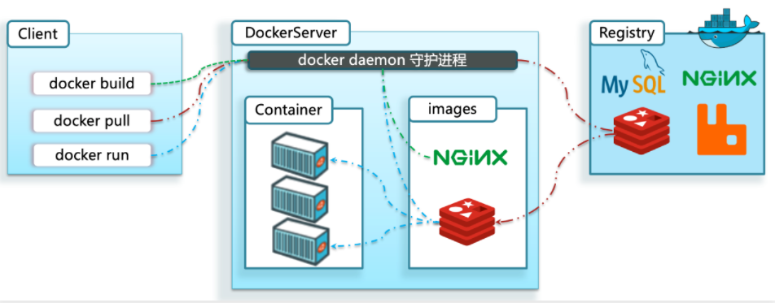
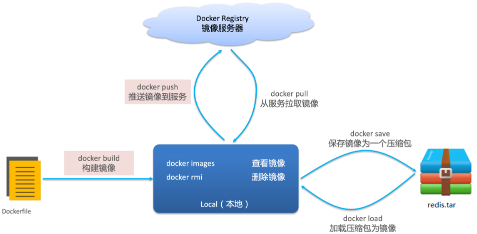
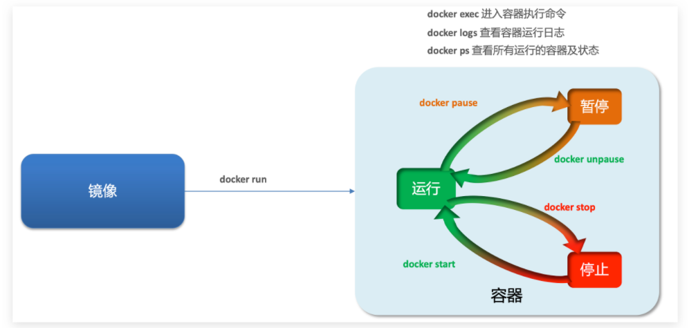
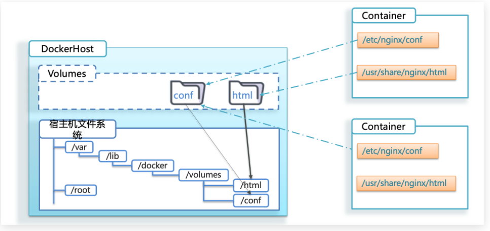

# Docker

在一个项目中，可能需要部署mysql、redis、MQ等，这些服务部署时所需要的函数库和依赖各不相同，甚至会有冲突，给部署带来了极大的困难。而Docker解决了上述依赖的兼容性问题。

Docker为了解决依赖的兼容性问题采取了以下手段：

- 将应用的函数库、依赖、配置和应用一起打包
- 将每个应用放到一个隔离容器中去运行，避免互相干扰。

Docker如何解决不同系统环境的问题：

- Docker将用户程序与所需要调用的系统(比如Ubuntu)函数库一起打包
- Docker运行到不同操作系统时，直接基于打包的函数库，借助于操作系统的Linux内核来运行

## 1. Docker和虚拟机的区别

- **虚拟机**是在操作系统中**模拟**硬件设备，然后运行另一个操作系统，而**Docker**仅仅是封装函数库，并没有模拟完整的操作系统
- docker体积小、启动速度快、性能好；虚拟机体积大、启动速度慢、性能一般

## 2. Docker架构

Docker是一个CS架构的程序，由两部分组成：

- 服务端(server)：Docker守护进程，负责处理Docker指令，管理镜像、容器等

- 客户端(client)：通过命令或RestAPI向Docker服务端发送指令。可以在本地或远程向服务端发送指令。

## 3. 镜像和容器

**镜像（Image）**：Docker将应用程序及其所需的依赖、函数库、环境、配置等文件打包在一起，称为镜像。

**容器（Container）**：镜像中的应用程序运行后形成的进程就是**容器**，Docker会给容器进程做隔离，对外不可见。

## 4. Docker基本操作

### 4.1 镜像

镜像名称一般分两部分组成：**[repository]:[tag]**。

常见的镜像命令如下图所示：

拉取镜像：`docker pull [镜像名称]`

查看拉取到的镜像：`docker images`

保存镜像到磁盘：`docker save -o [保存的目标文件名称] [镜像名称]`

加载镜像：`docker load -i [保存的目标文件名称]`

### 4.2 容器

容器保护三个状态：

- 运行：进程正常运行
- 暂停：进程暂停，CPU不再运行，并不释放内存
- 停止：进程终止，回收进程占用的内存、CPU等资源

其中：

- docker run：创建并运行一个容器，处于运行状态
- docker pause：让一个运行的容器暂停
- docker unpause：让一个容器从暂停状态恢复运行
- docker stop：停止一个运行的容器
- docker start：让一个停止的容器再次运行
- docker rm：删除一个容器
- docker exec：进入容器

`docker exec -it [容器名称] bash`

- docker exec ：进入容器内部，执行一个命令
- -it : 给当前进入的容器创建一个标准输入、输出终端，允许我们与容器交互
- bash：进入容器后执行的命令，bash是一个linux终端交互命令

### 4.3 数据卷

**数据卷（volume）**是一个虚拟目录，指向宿主机文件系统中的某个目录。

一旦完成数据卷挂载，对容器的一切操作都会作用在数据卷对应的宿主机目录了。

这样，我们操作宿主机的/var/lib/docker/volumes/html目录，就等于操作容器内的/usr/share/nginx/html目录了。

数据卷的作用：

- 将容器与数据分离，解耦合，方便操作容器内数据，保证数据安全

数据卷操作：

- docker volume create [数据卷名称]：创建数据卷
- docker volume ls：查看所有数据卷
- docker volume inspect [数据卷名称]：查看数据卷详细信息，包括关联的宿主机目录位置
- docker volume rm [数据卷名称]：删除指定数据卷
- docker volume prune：删除所有未使用的数据卷

容器不仅仅可以挂载数据卷，也可以直接挂载到宿主机目录上。关联关系如下：

- 带数据卷模式：宿主机目录 --> 数据卷 ---> 容器内目录
- 直接挂载模式：宿主机目录 ---> 容器内目录

docker run的命令中通过 -v 参数挂载文件或目录到容器中：

- -v volume名称:容器内目录
- -v 宿主机文件:容器内文件
- -v 宿主机目录:容器内目录

数据卷挂载与目录直接挂载的

- 数据卷挂载耦合度低，由docker来管理目录，但是目录较深，不好找
- 目录挂载耦合度高，需要我们自己管理目录，不过目录容易寻找查看

## 5. Dockerfile自定义镜像

## 6. Docker-Compose

Docker Compose可以基于Compose文件帮我们快速的部署分布式应用，而无需手动一个个创建和运行容器

## 6. Docker镜像仓库

