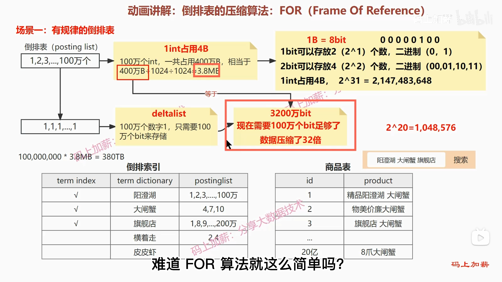
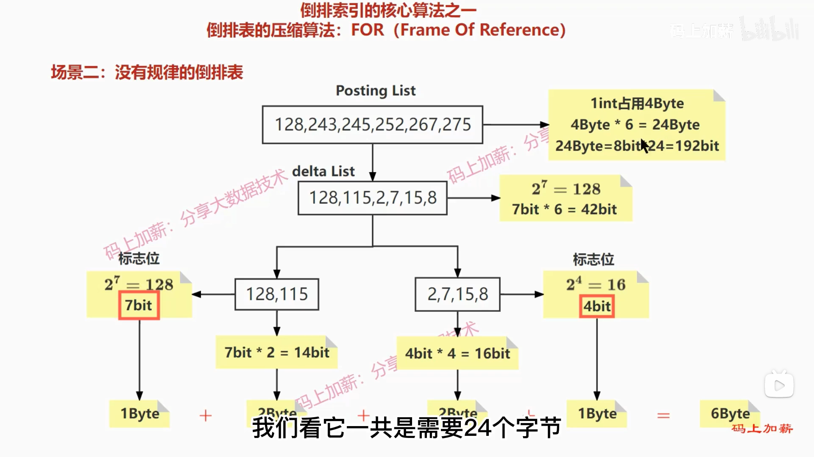

# 1. ElasticSearch

ES是一个开源的分布式搜索和分析引擎，可以用来实现搜索、日志统计、分析、系统监控等功能，使用倒排索引。

# 2. 倒排表的压缩算法：

## 2.1 FOR(Frame Of Reference)

FOR算法的核心思想是用减法来削减数值大小，从而达到降低空间存储的目的。即存储的是后一位减去前一位的差值。存储是也不再按照int来计算了，而是看这个数组的最大值需要占用多少bit来计算。

标志位占1字节，存储每个数占用的bit数。

**不能把数组拆分的过细的原因：**

- 每个数组都要存储一个标志位，标志位也要占存储空间。
- 数据压缩后，如果要使用还要做解压缩，压缩的越深，解码越耗时。

所以拆分的粒度要取一个合适的值，这个合适的值要通过计算机动态计算，主要取决于数组的长度。

FOR算法流程：

（1）数组元素值为与前一位的差值V(n)=V(n)-V(n-1)，n=2,3,4…
（2）计算数组中最大值所需占用的大小
（3）计算数组是否需要拆分，计算拆分后每组的最大值所需占用的大小并记录

## 2.2 RBM算法（Roaring Bit Map）

当数值很大时，减法能够达到的效果是不明显的。

RBM算法的核心是通过除法削减数值大小。

