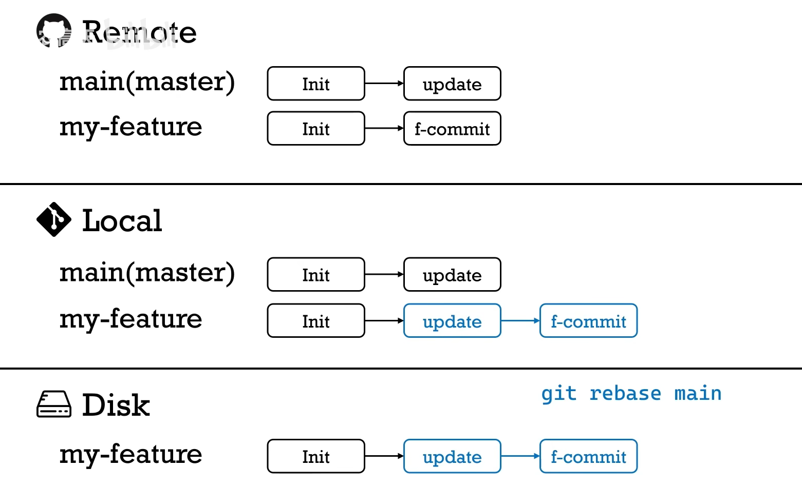

# 1. 工程上如何使用git

## 如果远端github上代码没有发生改变

1.git clone // 到本地
2.git checkout -b xxx 切换至新分支xxx
（相当于复制了remote的仓库到本地的xxx分支上
3.修改或者添加本地代码（部署在硬盘的源文件上）
4.git diff 查看自己对代码做出的改变
5.git add 上传更新后的代码至暂存区
6.git commit 可以将暂存区里更新后的代码更新到本地git
7.git push origin xxx 将本地的xxxgit分支上传至github上的git

## 如果在写自己的代码过程中发现远端GitHub上代码出现改变
1.git checkout main 切换回main分支
2.git pull origin master(main) 将远端修改过的代码再更新到本地
3.git checkout xxx 回到xxx分支
4.git rebase main 我在xxx分支上，先把main移过来，然后根据我的commit来修改成新的内容
（中途可能会出现，rebase conflict -----》手动选择保留哪段代码）
5.git push -f origin xxx 把rebase后并且更新过的代码再push到远端github上
（-f ---》强行）
6.原项目主人采用pull request 中的 squash and merge 合并所有不同的commit

## 远端完成更新后
1.git branch -d xxx 删除本地的git分支
2.git pull origin master 再把远端的最新代码拉至本地



# 2. git push报错

可以检查是不是代理的问题

```git
git config --global --get http.proxy
git config --global --get https.proxy
```

如果有代理，可以先尝试取消代理

``` git
git config --global --unset http.proxy
git config --global --unset https.proxy
```

如果提示某个代理有多个值的问题，可以使用以下命令删除所有代理

```
git config --global --unset-all http.proxy
git config --global --unset-all https.proxy
```

再次尝试是否可以push，如果还不行再考虑配置代理