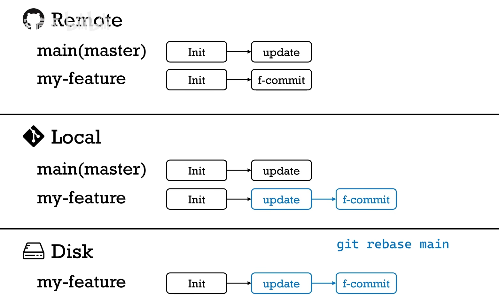

# 1 commit

## 1.1 commit的三种方式

```bash
# 这种方式适用于提交文件的一部分修改
git add some-file
git commit -m "changes to some-file"
```

```bash
# 将工作目录树中的所有修改提交到版本库中
# 只会把已纳入Git版本控制的文件添加到版本库中,而不会添加尚未被跟踪的文件
git commit -m "changes to some-file" -a
```

```bash
# 适用于修改了多个文件且需要提交其中的一个文件
git commit -m "changes to some-file" some-file
```

# 2 branch

## 2.1 基本操作

```bash
# 检出分支
git checkout -b <分支名> [源分支]
# 如果源分支参数不存在,那么从当前分支检出
```

## 2.2 合并修改

### 2.2.1 直接合并

将一条分支直接合并到另一条分支

```bash
git merge <将被合并的分支>
```

### 2.2.2 压合合并

将一条分支上的所有历史提交压合成一个提交,提交到另一条分支上.

```bash
git merge --squash <将被合并的分支>
```

### 2.2.3 拣选合并

拣选一个提交并将它添加到当前分支的末梢.

```bash
git cherry-pick <提交哈希>
# 该命令自动提交
```

```bash
git cherry-pick -n <提交哈希>
# -n拣选多个提交,在Git创建提交前要连续进行合并操作

git commit
# commit不加-m参数,编辑器会使用刚刚拣选的提交的提交留言作为现在的提交留言
```

# 3 工程上如何使用git和github

## 3.1 如果远端github上代码没有发生改变

1.git clone // 到本地
2.git checkout -b xxx 切换至新分支xxx
（相当于复制了remote的仓库到本地的xxx分支上
3.修改或者添加本地代码（部署在硬盘的源文件上）
4.git diff 查看自己对代码做出的改变
5.git add 上传更新后的代码至暂存区
6.git commit 可以将暂存区里更新后的代码更新到本地git
7.git push origin xxx 将本地的xxxgit分支上传至github上的git

## 3.2 如果在写自己的代码过程中发现远端GitHub上代码出现改变

1.git checkout main 切换回main分支
2.git pull origin master(main) 将远端修改过的代码再更新到本地
3.git checkout xxx 回到xxx分支
4.git rebase main 我在xxx分支上，先把main移过来，然后根据我的commit来修改成新的内容
（中途可能会出现，rebase conflict -----》手动选择保留哪段代码）
5.git push -f origin xxx 把rebase后并且更新过的代码再push到远端github上
（-f ---》强行）
6.原项目主人采用pull request 中的 squash and merge 合并所有不同的commit

## 3.3 远端完成更新后

1.git branch -d xxx 删除本地的git分支
2.git pull origin master 再把远端的最新代码拉至本地



# 4. git push报错

可以检查是不是代理的问题

```git
git config --global --get http.proxy
git config --global --get https.proxy
```

如果有代理，可以先尝试取消代理

``` git
git config --global --unset http.proxy
git config --global --unset https.proxy
```

如果提示某个代理有多个值的问题，可以使用以下命令删除所有代理

```
git config --global --unset-all http.proxy
git config --global --unset-all https.proxy
```

再次尝试是否可以push，如果还不行再考虑配置代理

# 5 LICENSE for Github

