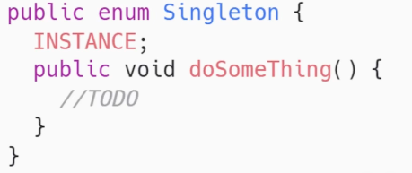

# 1. 面向对象编程

**面向对象的三大特性**：

1. 继承：继承是一种由已存在的类型创建一个或者多个子类型的机制，即在现有类的基础上构建子类，子类具有父类的实例域和方法。
2. 封装：就是把对象的属性和行为结合成为一个独立的整体，并尽可能隐藏对象的内部实现细节，对外部提供接口。
3. 多态：在对象变量上调用覆盖方法时，具体调用的是子类中的方法还是父类中的方法，由**运行时动态绑定**决定，不是由声明对象变量时的类型决定。

**方法的动态绑定**：在程序的运行期间判断对象变量所引用的对象的实际类型，根据其实际类型调用相应的方法，也叫延迟绑定。

## 1.1 多态

Java实现多态的三个必要条件：**继承、重写、向上转型**

1. 继承：在多态中必须存在有继承关系的子类和父类。
2. 重写：子类对父类中的某些方法进行重定义，在调用这些方法时就会调用子类的方法。
3. 向上转型：父类的对象变量引用子类的对象。

### 1.1.1  编译时多态和运行时多态

编译时多态是静态的，主要指方法的重载。

运行时多态是动态的，通过动态绑定来实现，也就是我们常说的多态。

### 1.1.2  多态的实现形式

1. 子类继承父类
2. 类实现接口

# 4. 反射

反射是指程序可以访问、检测和修改它本身状态或行为的一种能力。通过反射，我们能够在需要时完成创建实例、调用方法以及访问字段的工作。

## 4.1 反射使用的场景

1. 动态代理，使用动态生成的代理类来提升代码的复用性
2. Spring框架，用反射实例化Bean对象等

# 5. 对象的创建过程

- JVM使用类加载器加载目标类
- JVM初始化静态变量
- JVM堆内存中分配空间，把普通成员变量初始化为0或null
- JVM设置对象头，包括GC分代年龄、hashcode、锁标记等
- Java执行对象内部的init方法，init方法即将构造块、变量初始化、调用父类构造器等操作组织到一起的实例构造器

# 6. 代理

当一个对象不能直接使用，可以在客户端和目标对象中间创建一个中介，这个中介就是代理。


**作用：**

- 功能增强：在原有功能的基础上增加新的功能。
- 控制访问：将想对外公布的属性的访问和控制权交给代理类来操作，保留不想对外公布的属性的访问或控制权

## 6.1 静态代理

静态代理相当于是多写了一个代理类。在调用的时候调用代理类，在代理类中的处理还是原生的处理逻辑，不过在前后添加上需要添加的代码。多线程中实现一个接口Runnable使用的就是”静态代理”的思想

### 6.1.1 特点

- 代理类需要手动创建java类	
- 代理的目标类确定
- 代理角色和真实角色需要实现同一个接口

### 6.1.2 原理

在代理类中包含⼀个⽬标类的对象引⽤，在代理类所代理的方法中通过目标类对象的引用调用目标类的方法，实现通过代理调用目标类方法的效果

### 6.1.3 缺点

- 代理类数量过多
- 接口中功能增加或者修改会影响到实现类

## 6.2 动态代理

JDK动态代理的实现原理是通过反射机制生成目标类的代理对象，代理对象可以拦截目标方法的调用并进行增强处理，从而实现AOP编程。

### 6.2.1 特点

- 代理类数量很少
- 修改接口中的方法不会影响代理类

### 6.2.2 实现

1. 定义一个接口，接口中定义了我们需要增强的方法，创建该接口的代理对象
2. 创建一个InvocationHandler实现类，InvocationHandler是JDK动态代理中的核心接口，它定义了一个invoke方法，用于拦截目标方法的调用。在invoke方法中，我们可以对目标方法进行增强处理，并返回处理结果。
3. 通过Proxy类的newProxyInstance方法创建代理对象

```
public class CustomInvocationHandler implements MyInvocationHandler {
	// 目标对象的引用
    private ProductService target;
	// 创建代理对象
    public Object getInstance(ProductService target){
        this.target = target;
        Class clazz = this.target.getClass();
        // 参数1：被代理类的类加载器 参数2:被代理类的接口 参数3：InvocationHandler对象
        // 参数1用于加载代理对象，参数2获取代理类的接口，参数3拦截目标方法调用并进行增强处理
        return MyProxy.newProxyInstance(new MyClassLoader(),
                clazz.getInterfaces(),
                this);
    }
    public Object invoke(Object proxy, Method method, Object[] args) throws Throwable {
        // 功能增强
        return method.invoke(this.target,args);
    }
}
```

4. 调用代理对象的方法

**为什么动态代理只能代理接口而不能代理实现类：**JDK动态代理会在程序运行期间动态生成一个代理类**$Proxy0**，这个代理类会继承java.lang.reflect.Proxy类，同时实现被代理类的接口。Java不支持多继承，而代理类已经继承了Proxy类，所以只能实现被代理类的接口。

# 7. 接口

Java8的接口中，静态方法和默认方法可以有方法体。默认方法可以被实现该接口的子类直接调用或者重写，而静态方法可以直接通过接口名调用，不需要实例化接口的实现类。

在java9之后，接口中可以定义私有方法来复用某些代码逻辑。

# 8. 单例

实现单例的方法：

1. 通过双重检查锁的方式，这是一种线程安全并且是延迟实例化的方式，但是由于加锁，所以会有一些性能上的影响。


2. 通过静态内部类的方式来实现，这也是一种延迟实例化的方式，由于是静态内部类，所以只会在使用的时候被加载一次，不存在线程安全问题。（静态内部类只会在使用时被加载一次）


3. 通过枚举类的方式实现，它既是线程安全的，又能防止反序列化导致破坏单例的问题。



多线程、克隆、反序列化、反射都可能会造成单例破坏，而枚举类能避免上述问题。