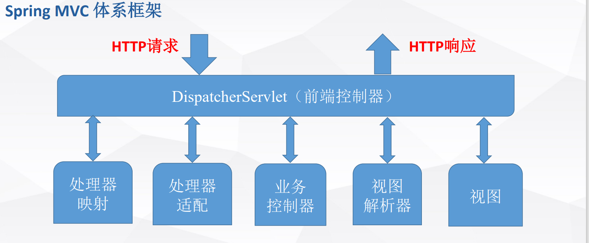
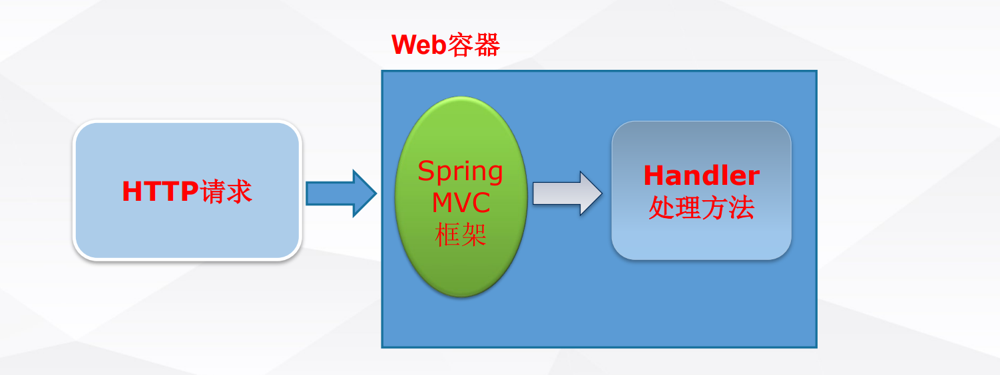
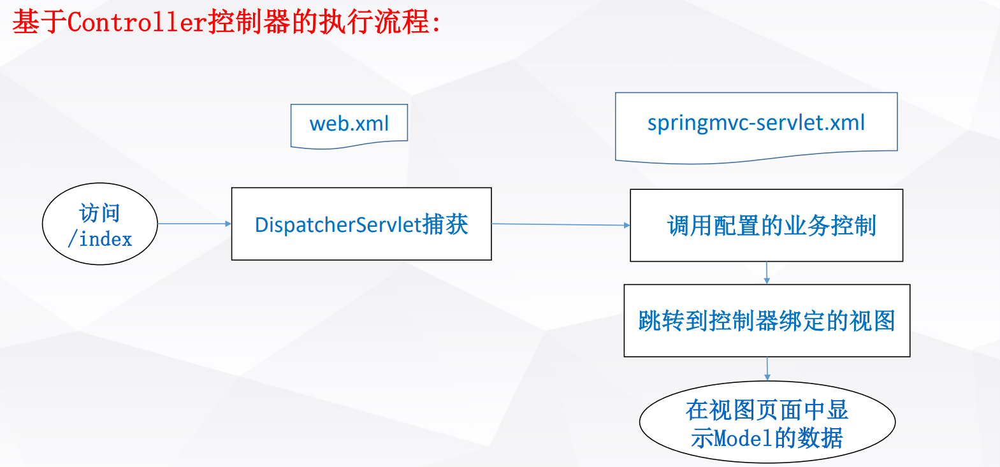

# 1 SpringMVC

## 1.1 SpringMVC体系结构

- **模型**是Model或ModelAndView封装的Map，模型中的数据可来自于程序、数据库、文件、外部服务等。
- **控制器**
- **视图**由多种，如JSP等

## 1.2 SpringMVC工作原理

### 1.2.1 基于Controller控制器的执行流程：

### 1.2.2 SpringMVC工作原理

1. 客户端（浏览器）发送请求，直接请求到 `DispatcherServlet`。
2. `DispatcherServlet` 根据请求信息调用 `HandlerMapping`，解析请求对应的 `Handler`。
3. 解析到对应的 `Handler`（也就是我们平常说的 `Controller` 控制器）后，开始由 `HandlerAdapter` 适配器处理。
4. `HandlerAdapter` 会根据 `Handler`来调用真正的处理器开处理请求，并处理相应的业务逻辑。
5. 处理器处理完业务后，会返回一个 `ModelAndView` 对象，`Model` 是返回的数据对象，`View` 是个逻辑上的 `View`。
6. `ViewResolver` 会根据逻辑 `View` 查找实际的 `View`。
7. `DispaterServlet` 把返回的 `Model` 传给 `View`（视图渲染）。
8. 把 `View` 返回给请求者（浏览器）

# 2 Spring

## 2.1 Spring核心机制：依赖注入

## 2.2 Spirng核心接口与基本原理

### 2.2.1 BeanFactory

### 2.2.2 ApplicationContext

# 3 SpringBoot

## 3.1 SpringBoot项目的构造

- Maven创建
- Spring Initializr创建

## 3.2 自动配置

## 3.3 执行流程

