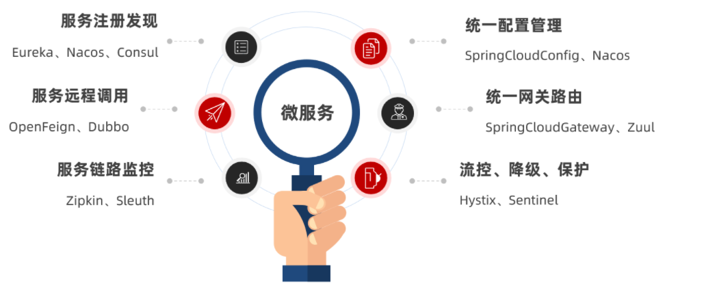

# SpringCloud

SpringCloud是Spring官方推出的一套微服务的解决方案，SpringCloud更像是对微服务架构里面出现的各种技术场景定义的一套标准规范，GateWay实现网关，LoadBalancer、Ribbon实现负载均衡，Dubbo实现rpc通信，nacos实现服务注册与发现以及动态配置中心，Setntinel实现服务限流和降级等。

## 1. Nacos注册中心

### 功能

1. **服务发现**
2. **服务注册**
3. 服务分级存储：一个服务可以有多个**集群**，一个集群可以有多个**实例**。

4. 权重配置：Nacos提供了权重配置来控制访问频率，权重越大则访问频率越高。

5. 环境隔离：Nacos提供了namespace来实现环境隔离功能。nacos中可以有多个namespace，namespace下可以有group、service等，不同namespace之间相互隔离，例如不同namespace的服务互相不可见。

6. **配置管理**

### Nacos和Eureka的共同点：

- 都支持服务注册和服务拉取
- 都支持服务提供者心跳方式做健康检测

### Nacos和Eureka的区别：

- Nacos支持服务端主动检测提供者状态：临时实例采用心跳模式，非临时实例采用主动检测模式
- 临时实例心跳不正常会被剔除，非临时实例则不会被剔除
- Nacos支持服务列表变更的消息推送模式，服务列表更新更及时
- Nacos集群默认采用AP（可用性和分区容错）方式，当集群中存在非临时实例时，采用CP（一致性和分区容错）模式；Eureka采用AP方式

## 2. Feign远程调用

Feign的作用就是帮助我们实现微服务的远程调用。

## 3. Gateway服务网关

Gateway网关是所有微服务的统一入口。

### 架构图

### 网关的**核心功能特性**

1. **权限控制**：网关作为微服务入口，需要校验用户是是否有请求资格，如果没有则进行拦截。

2. **路由和负载均衡**：一切请求都必须先经过gateway，但网关不处理业务，而是根据某种规则，把请求转发到某个微服务，这个过程叫做路由。当然路由的目标服务有多个时，还需要做负载均衡。

3. **限流**：当请求流量过高时，在网关中按照下流的微服务能够接受的速度来放行请求，避免服务压力过大。

### 网关路由流程图

### 跨域问题

跨域：域名不一致就是跨域，主要包括：

- 域名不同： www.taobao.com 和 www.taobao.org 和 www.jd.com 和 miaosha.jd.com

- 域名相同，端口不同：localhost:8080和localhost8081

跨域问题：浏览器禁止请求的发起者与服务端发生跨域ajax请求，请求被浏览器拦截的问题

## 4. Sentinel

Sentinel是阿里巴巴开源的一款微服务流量控制组件。官网地址：https://sentinelguard.io/zh-cn/index.html

### 4.1 雪崩问题

在微服务中，服务之间的调用关系很复杂，一个微服务往往依赖于多个其它微服务。如果某个服务发生了故障，那么依赖于该服务的所有业务都会被阻塞，用户得不到响应，则tomcat的这个线程不会释放，于是越来越多的请求到来，越来越多的请求被阻塞。而服务器支持的线程和并发数是有限的，请求一直阻塞，会导致服务器资源耗尽，从而导致其他服务都不可用，形成级联失败，雪崩就发生了。

### 4.2 解决雪崩问题的常见方式

1. 超时处理：设定超时时间，请求超过一定时间没有响应就返回错误信息，不会无休止等待。
2. 舱壁模式：限定每个业务能够使用的线程数，避免耗尽整个tomcat的资源，也叫线程隔离
3. 断路器：由断路器统计业务执行的异常比例，如果超出阈值则会熔断该业务，拦截访问该业务的一切请求
4. 限流：限制业务访问的QPS（每秒的请求数），避免服务因为流量的突增而故障。

**限流**是对服务的保护，避免因瞬间高并发流量而导致服务故障，进而避免雪崩。是一种**预防**措施。

**超时处理、线程隔离、降级熔断**是在部分服务故障时，将故障控制在一定范围，避免雪崩。是一种**补救**措施。

### 4.3 流量控制

#### 4.3.1 簇点链路

当请求进入微服务时，首先会访问DispatcherServlet，然后进入Controller、Service、Mapper，这样的一个调用链就叫做**簇点链路**。簇点链路中被监控的每一个接口就是一个**资源**。

默认情况下sentinel会监控SpringMVC的每一个端点（Endpoint，也就是controller中的方法），因此SpringMVC的每一个端点就是调用链路中的一个资源。

#### 4.3.2 流控模式

- 直接：统计当前资源的请求，触发阈值时对当前资源直接限流，也是默认的模式
- 关联：统计与当前资源相关的另一个资源，触发阈值时，对当前资源限流
- 链路：统计从指定链路访问到本资源的请求，触发阈值时，对指定链路限流

#### 4.3.3 流控效果

流控效果是指请求达到流控阈值时应该采取的措施，包括三种：

- 快速失败：达到阈值后，新的请求会被立即拒绝并抛出FlowException异常。是默认的处理方式。

- warm up：预热模式，对超出阈值的请求同样是拒绝并抛出异常。但这种模式阈值会动态变化，从一个较小值逐渐增加到最大阈值。

- 排队等待：让所有的请求按照先后次序排队执行，两个请求的间隔不能小于指定时长

##### 4.3.3.1 warm up

阈值一般是一个微服务能承担的最大QPS，但是一个服务刚刚启动时，一切资源尚未初始化（**冷启动**），如果直接将QPS跑到最大值，可能导致服务瞬间宕机。

warm up也叫**预热模式**，是应对服务冷启动的一种方案。请求阈值初始值是 maxThreshold / coldFactor，持续指定时长后，逐渐提高到maxThreshold值。而coldFactor的默认值是3.

##### 4.3.3.2 排队等待

当请求超过QPS阈值时，快速失败和warm up会拒绝新的请求并抛出异常。

而排队等待则是让所有请求进入一个队列中，然后按照阈值允许的时间间隔依次执行。后来的请求必须等待前面执行完成，如果请求预期的等待时间超出最大时长，则会被拒绝。

#### 4.3.4 热点参数限流

热点参数限流是**分别统计参数值相同的请求**，判断是否超过QPS阈值。包括**全局参数限流**和**热点参数限流**。

**全局参数限流**对某个参数做限流，QPS都设为某个值，而**热点参数限流**可以针对某个参数的某个具体值做限流。

### 4.4 隔离和降级

限流是一种预防措施，虽然限流可以尽量避免因高并发而引起的服务故障，但服务还会因为其它原因而故障。而要将这些故障控制在一定范围，避免雪崩，就要靠**线程隔离**（舱壁模式）和**熔断降级**手段了。

**线程隔离**之前讲到过：给每个服务分配独立线程池，出现故障时，最多消耗这个线程池内资源，避免把调用者的所有资源耗尽。

**熔断降级**：是在调用方这边加入断路器，统计对服务提供者的调用，如果调用的失败比例过高，则熔断该业务，不允许访问该服务的提供者了。

不管是线程隔离还是熔断降级，都是对**客户端**（调用方）的保护。需要在**调用方**发起远程调用时做线程隔离、或者服务熔断。

而微服务远程调用都是基于Feign来完成的，因此需要将Feign与Sentinel整合，在Feign里面实现线程隔离和服务熔断。

#### 4.4.1 线程隔离（舱壁模式）

线程隔离有两种方式实现：

- 线程池隔离
- 信号量隔离（Sentinel默认采用）

**线程池隔离**：给每个服务分配一个线程池，利用线程池本身实现隔离效果，有额外开销，但隔离控制更强

**信号量隔离**：不创建线程池，而是计数器模式，记录业务使用的线程数量，达到信号量上限时，禁止新的请求，简单，开销小

#### 4.4.2 熔断降级

断路器控制熔断和放行是通过状态机来完成的：

状态机包括三个状态：

- closed：关闭状态，断路器放行所有请求，并开始统计异常比例、慢请求比例。超过阈值则切换到open状态
- open：打开状态，服务调用被**熔断**，访问被熔断服务的请求会被拒绝，快速失败，直接走降级逻辑。Open状态5秒后会进入half-open状态
- half-open：半开状态，放行一次请求，根据执行结果来判断接下来的操作。
  - 请求成功：则切换到closed状态
  - 请求失败：则切换到open状态

断路器熔断策略有三种：慢调用、异常比例、异常数

##### 4.4.2.1 慢调用

业务的响应时长（RT）大于指定时长的请求认定为慢调用请求。在指定时间内，如果请求数量超过设定的最小数量，慢调用比例大于设定的阈值，则触发熔断。

##### 4.4.2.2 异常比例、异常数

**异常比例或异常数**：统计指定时间内的调用，如果调用次数超过指定请求数，并且出现异常的比例达到设定的比例阈值（或超过指定异常数），则触发熔断。

### 4.5 授权规则

授权规则可以对请求方来源做判断和控制。

#### 4.5.1 基本规则

授权规则可以对调用方的来源做控制，有白名单和黑名单两种方式。

- 白名单：来源（origin）在白名单内的调用者允许访问

- 黑名单：来源（origin）在黑名单内的调用者不允许访问

#### 4.5.2 如何获取来源

Sentinel是通过RequestOriginParser这个接口的parseOrigin来获取请求的来源的。尝试从request-header中获取origin值。

#### 4.5.3 给网关添加请求头

既然获取请求origin的方式是从reques-header中获取origin值，我们必须让**所有从gateway路由到微服务的请求都带上origin头**。

这个需要利用之前学习的一个GatewayFilter来实现，AddRequestHeaderGatewayFilter。

#### 4.5.4 配置授权规则

添加一个授权规则，放行origin值为gateway的请求。

#### 4.5.5 自定义异常结果

默认情况下，发生限流、降级、授权拦截时，都会抛出异常到调用方。异常结果都是flow limmiting（限流）。这样不够友好，无法得知是限流还是降级还是授权拦截。

### 4.6 规则持久化

现在，sentinel的所有规则都是内存存储，重启后所有规则都会丢失。在生产环境下，我们必须确保这些规则的持久化，避免丢失。

规则是否能持久化，取决于规则管理模式，sentinel支持三种规则管理模式：

- 原始模式：Sentinel的默认模式，将规则保存在内存，重启服务会丢失。
- pull模式
- push模式

#### 4.6.1 pull模式

pull模式：控制台将配置的规则推送到Sentinel客户端，而客户端会将配置规则保存在本地文件或数据库中。以后会定时去本地文件或数据库中查询，更新本地规则。

#### 4.6.2 push模式

push模式：控制台将配置规则推送到远程配置中心，例如Nacos。Sentinel客户端监听Nacos，获取配置变更的推送消息，完成本地配置更新。

