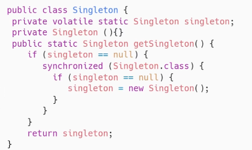
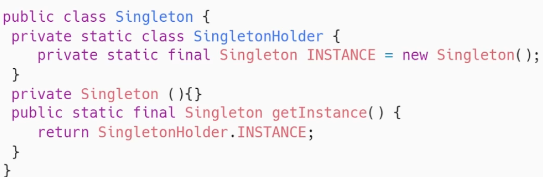
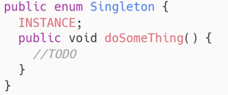

# 1. 继承、多态和封装

1. 继承：继承就是子类继承父类的特征和行为，使得子类对象（实例）具有父类的实例域和方法，或子类从父类继承方法，使得子类具有父类相同的行为。
2. 封装：就是把对象的属性和行为结合成为一个独立的整体，并尽可能隐藏对象的内部实现细节，对外部提供接口。
3. 多态：在对象变量上调用覆盖方法时，具体调用的是子类中的方法还是父类中的方法，由**运行时动态绑定**决定，不是由声明对象变量时的类型决定。

**方法的动态绑定**：在程序的运行期间判断对象变量所引用的对象的实际类型，根据其实际类型调用相应的方法，也叫延迟绑定。

1. 一个引用变量会指向哪个类的实例对象，这个引用变量调用的方法是哪个类中实现的方法，必须在由程序运行期间才能确定。因为在程序运行时才确定具体的类，这样不用修改源程序代码，就可以让引用变量绑定到各种不同的类实现上，从而导致该引用调用的具体方法随之改变。即不修改程序代码就可以改变程序运行时所绑定的具体代码，让程序可以选择多个运行状态，这就是多态性。

# 2. 多态的实现条件

Java实现多态有三个必要条件：**继承、重写、向上转型**

1. 继承：在多态中必须存在有继承关系的子类和父类。
2. 重写：子类对父类中的某些方法进行重定义，在调用这些方法时就会调用子类的方法。
3. 向上转型：在多态中需要将子类的引用赋给父类对象，只有这样该引用才能调用父类的方法和子类的方法。

封装可以隐藏实现细节，使得代码模块化。继承可以扩展已存在的代码模块（类）。它们的目的都是为了**代码重用**。而多态除了代码的复用性外，还可以解决项目中紧偶合的问题,提高程序的可扩展性。派生类的功能可以被基类的方法或引用变量所调用，这叫向后兼容，可以提高可扩充性和可维护性。

通过继承相同的父类，初始化子类时，父类会调用不同子类的不同重写方法，从而实现多态性。	

## 2.1 编译时多态和运行时多态

编译时多态是静态的，主要指方法的重载。

运行时多态是动态的，通过动态绑定来实现，也就是我们常说的多态。

## 2.2 多态的实现形式

1. 子类继承父类
2. 类实现接口

## 2.3 注意事项

子类是继承父类的，父类所有非private的方法子类都可以调用。

父类引用能够调用子类重写父类的方法，但是子类自定义和重载的方法是获取不到的。

# 3. ArrayList

ArrayList是一个数组结构的存储容器。

ArrayList()会使用长度为0的数组，ArrayList(int initialCapacity)会使用指定容量的数组。

add(Object o)首次扩容为10，再次扩容为上次容量的1.5倍。

addAll(Collection c)没有元素时，扩容为Math.max(10,实际元素个数)，有元素时扩容为Math.max(原容量1.5倍,实际元素个数)

# 4. 反射

反射是Java语言比较重要的一个特性，它能够在程序运行的过程中去构造任意一个类对象，并且可以获取任意一个类的成员变量、成员方法和属性，以及调用任意一个对象方法，通过反射可以让java语言支持动态获取程序的信息，以及动态调用方法的能力。

java.lang.reflect包可以实现反射相关的一些类库，包括Construct、Filed、Method等等这样一些类，分别用来去获取类的构造方法、成员变量和方法信息

## 4.1 反射使用的场景

1. 动态代理，使用动态生成的代理类来提升代码的复用性
2. Spring框架，用反射实例化Bean对象等

## 4.2 Java反射的优点

1. 增加程序的灵活性，可以在程序运行的过程中动态对类进行修改和操作
2. 提高代码的复用率，比如动态代理，就是用到了反射来实现
3. 可以在运行时轻松获取任意一个类的方法、属性，并且还可以通过反射动态调用

## 4.3 单例

实现单例的方法：

1. 通过双重检查锁的方式，这是一种线程安全并且是延迟实例化的方式，但是由于加锁，所以会有一些性能上的影响。



2. 通过静态内部类的方式来实现，这也是一种延迟实例化的方式，由于是静态内部类，所以只会在使用的时候被加载一次，不存在线程安全问题。（静态内部类只会在使用时被加载一次）



3. 通过枚举类的方式实现，它既是线程安全的，又能防止反序列化导致破坏单例的问题。



多线程、克隆、反序列化、反射都可能会造成单例破坏，而枚举类能避免上述问题。

## 4.4 HashMap和HashTable

HashMap和HashTable都是基于hash表实现K-V结构的集合。

区别：

1. HashTable是线程安全的，它给所有的数据访问方法都加上了一个Synchronized同步锁，而HashMap是线程不安全的
2. HashTable内部采用数据+链表来实现，链表用来解决hash冲突的问题，而HashMap采用数组+链表+红黑树实现，当链表长度>8且数组长度>64的时候，就会把链表转换为红黑树，当链表长度>8而数组长度<64时数组会进行扩容。
3. HashMap的key可以为null，而HashTable的key不可以为null，在HashMap中会把null作为0存储。
4. key使用的散列算法不同，HashTable直接使用key的hashcode对数组长度取模，而HashMap对key的hashcode做了二次散列，从而避免key分布不均匀影响到查询性能。

# 5. 对象的创建过程

在实例化一个对象的时候，JVM首先会检查目标对象是否已经被加载并初始化，如果没有，JVM需要立刻去加载目标类，调用目标类的构造器去完成初始化，目标类的加载是通过类加载器实现的，主要时将类加载到内存中，然后是初始化的过程，这个过程主要是对目标类的静态变量、成员变量、静态代码块进行初始化，当目标类被初始化以后，就可以从常量池中找到对应的类元信息了，并且目标对象的大小在类加载完成之后就已经确定了。所以这个时候就需要根据目标对象的大小去为新创建的对象在堆内存中分配内存空间，接下来JVM会把普通成员变量初始化为0或null，这一步是为了保证对象的实例字段不同初始化就可以直接使用，然后JVM还需要对目标对象的对象头做一些设置包括对象所属的类元信息、GC的分代年龄、hashcode、锁标记等，完成这些步骤以后，对JVM来说新对象的创建工作就已经完成了，下面是Java工作。

下面执行目标对象内部生成的init方法，初始化成员变量的值、执行构造块，最后调用目标对象的构造方法完成对象的创建。init方法是Java文件编译之后在字节码文件里面生成的，它是一个实例构造器，会把构造块、变量初始化、调用父类构造器等操作组织到一起。

- JVM使用类加载器加载目标类
- JVM初始化静态变量
- JVM堆内存中分配空间，把普通成员变量初始化为0或null
- JVM设置对象头，包括GC粉黛年两、hashcode、锁标记等
- Java执行对象内部的init方法，init方法即将构造块、变量初始化、调用父类构造器等操作组织到一起的实例构造器

## 5.1 什么时候进行垃圾回收


# 6. 代理

当一个对象不能直接使用，可以在客户端和目标对象中间创建一个中介，这个中介就是代理。


**作用：**

- 功能增强：在原有功能的基础上增加新的功能。
- 控制访问：将想对外公布的属性的访问和控制权交给代理类来操作，保留不想对外公布的属性的访问或控制权

## 6.1 静态代理

静态代理相当于是多写了一个代理类。在调用的时候调用代理类，在代理类中的处理还是原生的处理逻辑，不过在前后添加上需要添加的代码。多线程中实现一个接口Runnable使用的就是”静态代理”的思想

### 6.1.1 特点

- 代理类需要手动创建java类	
- 代理的目标类确定
- 代理角色和真实角色需要实现同一个接口

### 6.1.2 原理

在代理类中包含⼀个⽬标类的对象引⽤，在代理类所代理的方法中通过目标类对象的引用调用目标类的方法，实现通过代理调用目标类方法的效果

### 6.1.3 缺点

- 代理类数量过多
- 接口中功能增加或者修改会影响到实现类

## 6.2 动态代理

JDK动态代理的实现原理是通过反射机制生成目标类的代理对象，代理对象可以拦截目标方法的调用并进行增强处理，从而实现AOP编程。

### 6.2.1 特点

- 代理类数量很少
- 修改接口中的方法不会影响代理类

### 6.2.2 实现

1. 定义一个接口，接口中定义了我们需要增强的方法，创建该接口的代理对象
2. 创建一个InvocationHandler实现类，InvocationHandler是JDK动态代理中的核心接口，它定义了一个invoke方法，用于拦截目标方法的调用。在invoke方法中，我们可以对目标方法进行增强处理，并返回处理结果。
3. 通过Proxy类的newProxyInstance方法创建代理对象

```
public class CustomInvocationHandler implements MyInvocationHandler {
	// 目标对象的引用
    private ProductService target;
	// 创建代理对象
    public Object getInstance(ProductService target){
        this.target = target;
        Class clazz = this.target.getClass();
        // 参数1：被代理类的类加载器 参数2:被代理类的接口 参数3：InvocationHandler对象
        // 参数1用于加载代理对象，参数2获取代理类的接口，参数3拦截目标方法调用并进行增强处理
        return MyProxy.newProxyInstance(new MyClassLoader(),
                clazz.getInterfaces(),
                this);
    }
    public Object invoke(Object proxy, Method method, Object[] args) throws Throwable {
        // 功能增强
        return method.invoke(this.target,args);
    }
}
```

4. 调用代理对象的方法

**为什么动态代理只能代理接口而不能代理实现类：**JDK动态代理会在程序运行期间动态生成一个代理类**$Proxy0**，这个代理类会继承java.lang.reflect.Proxy类，同时实现被代理类的接口。Java不支持多继承，而代理类已经继承了Proxy类，所以只能实现被代理类的接口。

# 7. 接口

Java8的接口中，静态方法和默认方法可以有方法体。默认方法可以被实现该接口的子类直接调用或者重写，而静态方法可以直接通过接口名调用，不需要实例化接口的实现类。

在java9之后，接口中可以定义私有方法来复用某些代码逻辑。