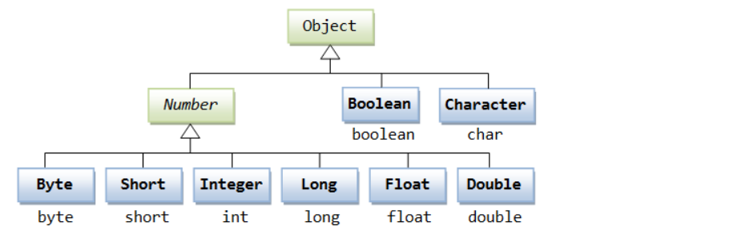
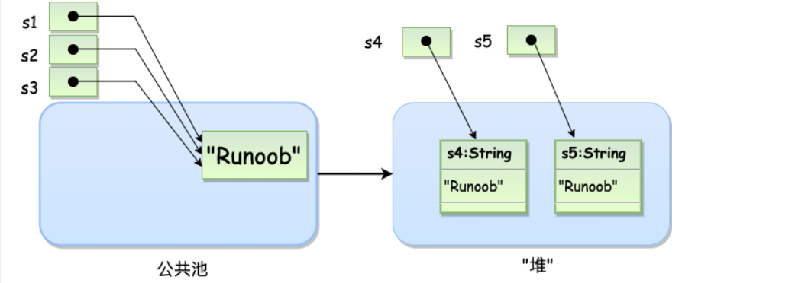

# 1. Number类和Math类



```java
float b = 1.2f;
long a = 123132132L;
```

Math 的方法都被定义为 static 形式，通过 Math 类可以在主函数中直接调用。

```java
正弦函数：Math.sin()
PI转角度：Math.toDegrees()
PI：Math.PI常用方法：
```

```java
equals()
compareTo()
valueOf()
parseInt()
abs()
pow()
sqrt()
```

# 2. Character类

```java
isLetter()
isDigit()
isWhitespace()
isUpperCase()
isLowerCase()
toUpperCase()
toLowerCase()
```

# 3. String类

String a = “s1”存储在公共池中，String b = new String("s2")创建的字符串对象在堆上;



``` java
char charAt(int index) 返回指定索引处的值
```

