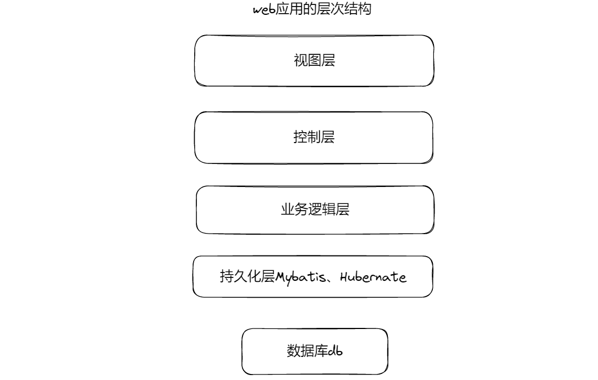
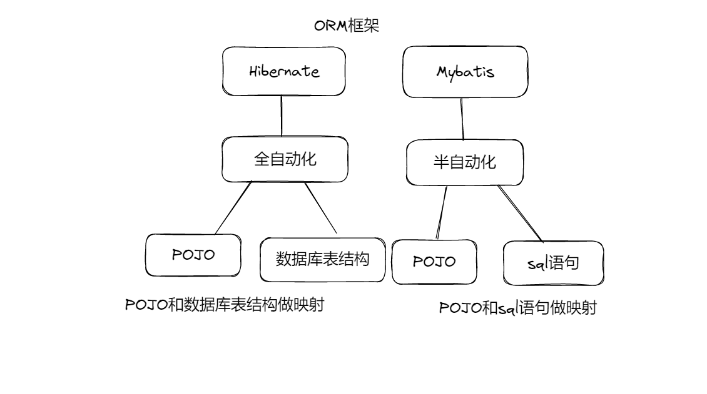
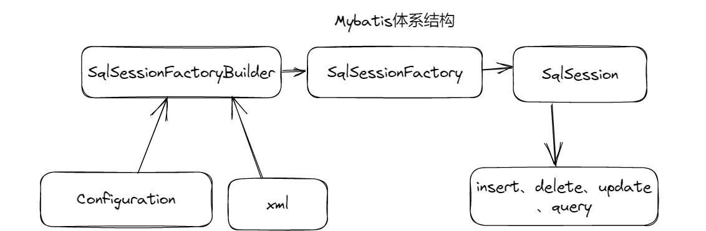
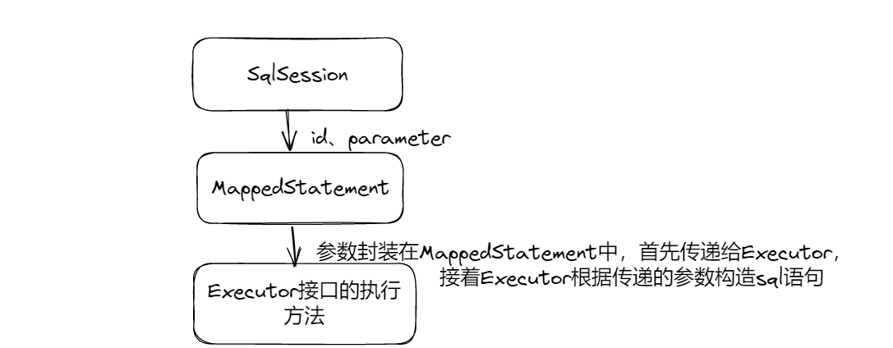

# 1 ORM框架

**对象关系映射（Object-Relation Mapping，简称ORM）是用于将对象与对象之间的关系对应到数据库表与表之间关系的一种模式**。ORM通过使用描述对象和数据库之间映射的元数据，将Java程序中的对象自动持久化到关系数据库中。

在程序中，对象和关系数据是业务实现的两种表现形式，业务实体在内存中表现为对象，在数据库中则表现为关系数据。

ORM系统一般以中间件的形式存在，主要实现程序对象到关系数据库表的映射。

## 1.1 web应用的层级结构

## 1.2 Hibernate

Hibernate是全自动ORM框架，对于数据库操作，Hibernate自动生成SQL语句。

# 2 Mybatis简介

Mybatis是一款优秀的持久层框架，支持定制化SQL、存储过程和高级映射。Mybatis可以使用简单的XML或者注解来配置和映射原生信息，将接口和Java的POJO（Plain Old Java Object，普通Java对象）

Mybatis的前身为iBatis，iBatis由...开发，之后捐给了Apache基金会，Apache随后将其开源。Mybatis和Mybatis-plus是目前大型互联网项目首选的数据持久化框架。

## 2.1 Mybatis与传统JDBC相比：

减少代码量，sql语句复用，架构级性能提升等

## 2.2 Mybatis和Hibernate对比

- Mybatis是一个半自动映射框架，需要用户手工匹配POJO、SQL和映射关系，而Hibernate的全表映射能够自动生成对应的SQL语句。

- Mybatis可以通过配置动态sql并优化sql语句来优化数据库操作性能，它还支持存储过程，而Hibernate无法做到。

- Mybatis是以第三方包的形势提供，不像Hibernate本身集成在MyEclipse环境中，所以Mybatis只能以jar包的形势引入项目来使用。

# 3 Mybatis体系结构

## 3.1 Mybatis工作流程

- Mybatis读取配置文件mybatis-config.xml（核心配置文件）
- 加载映射文件*Mapper.xml，每个映射文件对应着数据库中的一张表
- 构建会话工厂SqlSessionFactory（核心对象）
- 创建会话对象SqlSession（**单线程**的核心会话对象，其中包含了执行SQL的所有方法）
- 调用执行器Executor，Executor是Mybatis框架底层定义的操作数据库的接口，Executor根据SqlSession传递过来的参数动态生成需要执行的Sql语句。
- 传递映射参数，在Executor的接口中包含一个MappedStatement类型的参数，该参数是映射信息的封装，用于存储要映射的SQL语句的id、参数等。**将传递的参数封装到MappedStatement中**。
- 输入参数映射，Executor执行器在执行sql前将输入的Java对象映射到SQL语句中。**将MappedStatement中封装的参数映射为数据库中要执行的参数**。
- 输出结果映射，执行完SQL语句后，MappedStatement会对sql执行输出的结果进行定义，Executor执行器将输出结果映射到java对象中。

