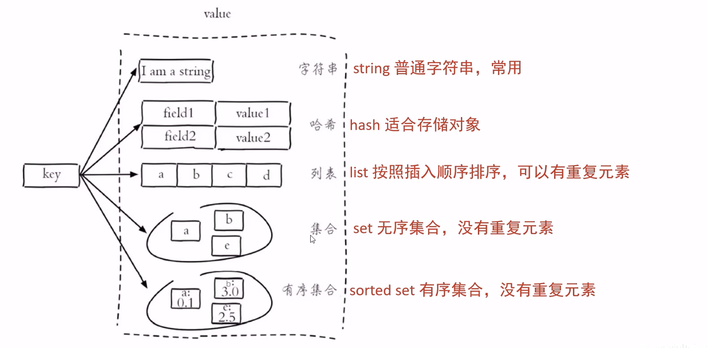
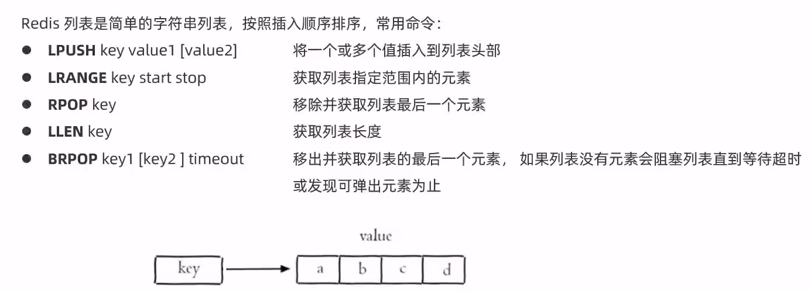
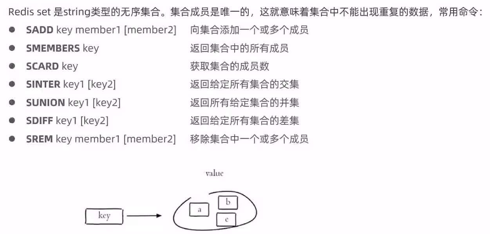
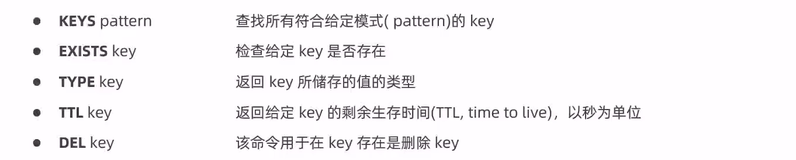

# 1. Redis常用命令

Redis是一个基于内存的key-value存储结构的跨平台的非关系型数据库，它提供了5种常用的数据类型：String，Hash，List，Set，Sorted Set。

Redis是基于内存存储的，而且不存在表之间的关联查询的一些问题，IO的性能会比较好。

在实际应用中，我们把它用在应用和数据库中的一个分布式缓存中间件。在企业应用中可以实现主从复制+哨兵以及集群的方式实现高可用，通过Hash槽的方式实现了数据的分片。

NoSQL(Not Only SQL)，泛指非关系型数据库，没有表的概念，也没有外键等，数据与数据之间没有关系。

**Redis的应用场景：**

1. 缓存
2. 任务队列
3. 消息队列
4. 分布式锁

## 1.1 String操作命令

- SET key value：设置指定key的值
- GET key：获取指定key的value
- SETEX key seconds value：设置指定key的值，并将key的过期时间设为seconds秒
- SETNX key value：只有在key不存在时设置key的值

## 1.2 Hash操作命令

- HSET key field value：将哈希表key的字段field的值设为value
- HGET key field：获取存储在哈希表中指定字段的值
- HDEL key field：删除存储在哈希表中的指定字段
- HKEYS key：获取哈希表中所有字段
- HVALS key：获取哈希表中所有值
- HGETALL key：获取哈希表中指定key的所有字段和值

## 1.3 列表List操作命令

## 1.4 集合Set常用命令

## 1.5 通用命令

