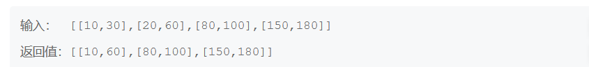
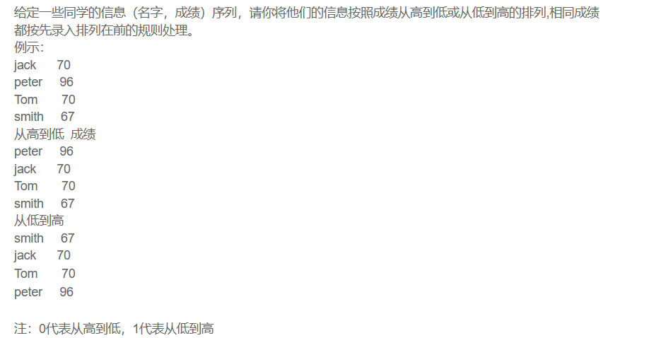

## 2023-4-4

### 1. 十六进制数转十进制

```java
// 定义进制
public static final BASE = 16;
// 将0-9a-fA-F存储到HashMap中
Map<Character, Integer> map = new HashMap<>();
map.put('0',0);
-----------
map.put('a',10);
----------------
map.put('A',10);
----------------
// 计算
int res = 0;
for (char c : number.toCharArray()) {
    res = res * BASE + map.get(c);
}
```

### 2. 给出一定数量的整数，剔除重复值并排序，升序输出

```java
// 使用TreeSet
Set set = new TreeSet();
----------------------
for(int i = 0; i < num; i++){
    set.add(in.nextInt());
}
Iterator iterator = set.iterator();
while(iterator.hasNext()){
	System.out.println(iterator.next());
}
```

### 3. 一个字符串包含的不重复字符数

```java
// 使用set集合
Scanner in = new Scanner(System.in);
String s = in.nextLine();
char[] c = s.toCharArray();
Set<Character> set = new HashSet<>();
for (char ch : c) {
	if(ch >= 0 && ch <= 127 && !set.contains(ch)){
    set.add(ch);
	}
}
System.out.println(set.size());
```

### 4. 给定一个target和一个数组，求数组中两数之和等于target的数组下标

```java
// 使用hash的方式解决问题
if(map.containsKey(target - numbers[i]))
	return new int[]{map.get(target - numbers[i])+1, i+1};
else
	map.put(numbers[i], i);
// 时间复杂度为O(1)而空间复杂度为O(n)
```

## 2023-4-5

### 1. 删除字符串中出现最少的字符

```java
public static String delete(String str){
    // Map记录每个字母的次数
    Map<Character, Integer> map = new HashMap<>();
    for (char c : str.toCharArray()) {
        map.put(c, map.getOrDefault(c, 0) + 1);
    }
    // 快速找出最少次数
    int min = Integer.MAX_VALUE;
    for(int times : map.values()){
        min = Math.min(min, times);
    }
    // 遍历字符数组，判断每个字符在hashmap中的值是否等于min
    StringBuilder res = new StringBuilder();
    for(char c : str.toCharArray()){
        if(map.get(c) != min){
            res.append(c);
        }
    }
	return res.toString();
}
```

### 2. 10进制转IP地址和IP地址转10进制

```java
	private static final int N = 4;
    public static String convert(String str){
        // ipv4 -> int
        if(str.contains(".")){
            String[] fields = str.split("\\.");
            long result = 0;
            for(int i = 0; i < N; i++){
                result = result * 256 + Integer.parseInt(fields[i]);
            }
            return "" + result;
        }
        // int -> ipv4
        else{
            long ipv4 = Long.parseLong(str);
            String result = "";
            for(int i = 0; i < N; i++){
                result = ipv4 % 256 + "." + result;
                ipv4 /= 256;
            }
            return result.substring(0, result.length() -1);
        }
    }
```

## 2023-4-6

### 1. 字符串逆序

```java
	while(in.hasNextLine()){
        String s = in.nextLine();
        StringBuilder sb = new StringBuilder(s);
        System.out.println(sb.reverse().toString());
    }
```

### 2. 字符串排序

```java
	String[] array = new String[n];
    for(int i = 0; i < n; i++){
        array[i] = in.next();
    }
    Arrays.sort(array);
```

### 3. 合并区间



```java
		 Collections.sort(intervals, (v1, v2)->v1.start - v2.start);
         ArrayList<Interval> res = new ArrayList<>();
         int index = -1;
         for (Interval interval : intervals) {
             if(index == -1 || interval.start > res.get(index).end){
                 res.add(interval);
                 index++;
             }else{
                 res.get(index).end = Math.max(interval.end, res.get(index).end);
             }
         }
```

### 4. 成绩排序



```java
		Scanner in = new Scanner(System.in);
        HashMap<Integer, String> map = new HashMap<>();
        while(in.hasNextLine()){
            int n = in.nextInt();
            int flag = in.nextInt();
            int[][] score = new int[n][2];
            for(int i = 0; i < n; i++){
                String[] nameAndScore = in.nextLine().split(" ");
                score[i][0] = i;
                score[i][1] = Integer.parseInt(nameAndScore[1]);
                map.put(i,nameAndScore[0]);
            }
            Arrays.sort(score,(o1,o2)->{
                if(flag == 0){
                    return o2[1] - o1[1];   // 按照第二列降序排列，如果相等返回0，顺序不变
                }else {
                    return o1[1] - o2[1];
                }
            });
            for(int i = 0; i < n; i++){
                System.out.println(map.get(score[i][0]));
            }
        }
```

