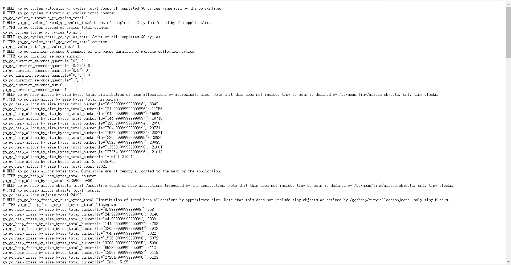
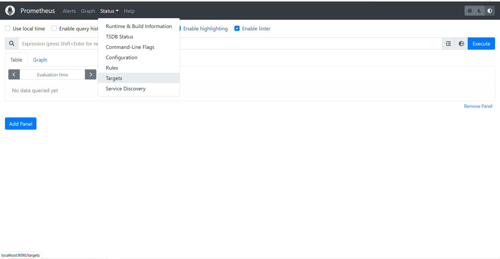
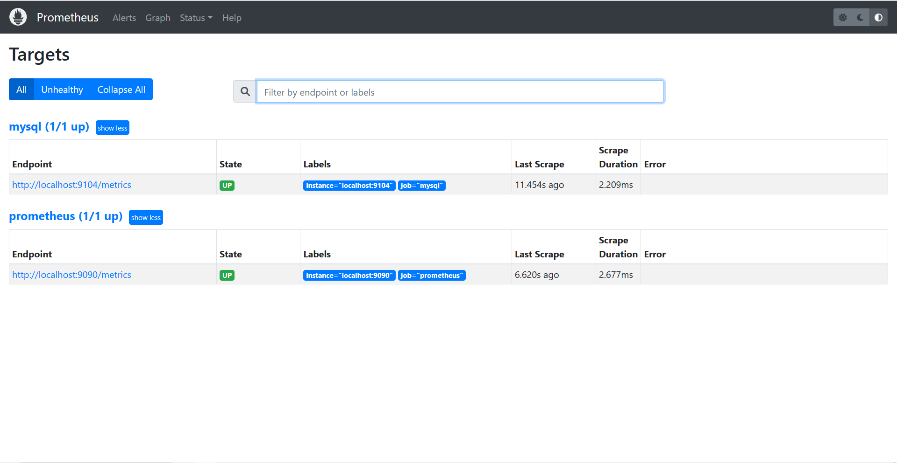
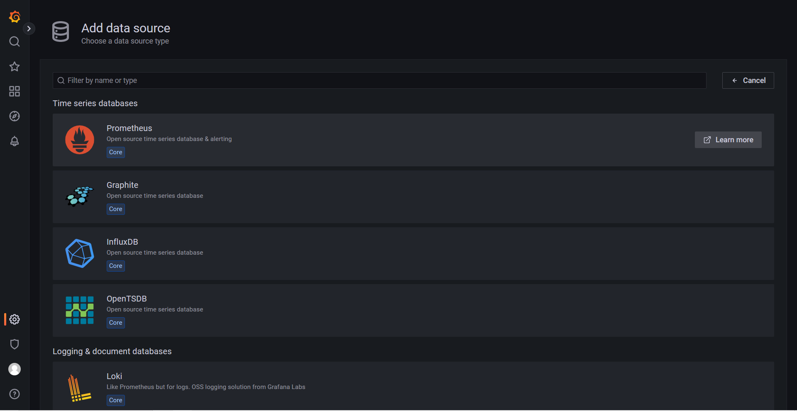
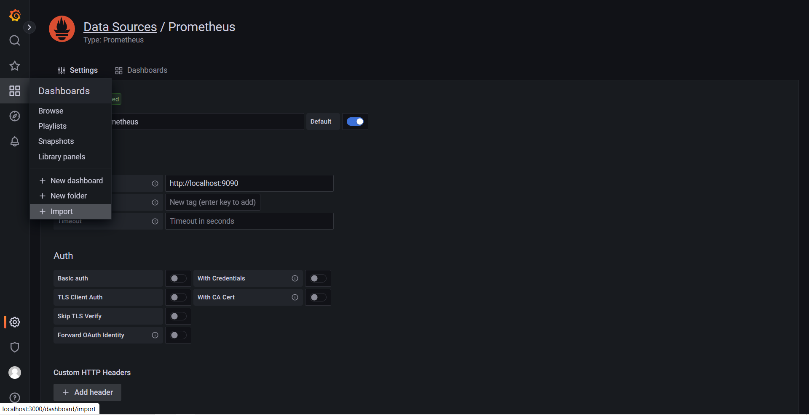
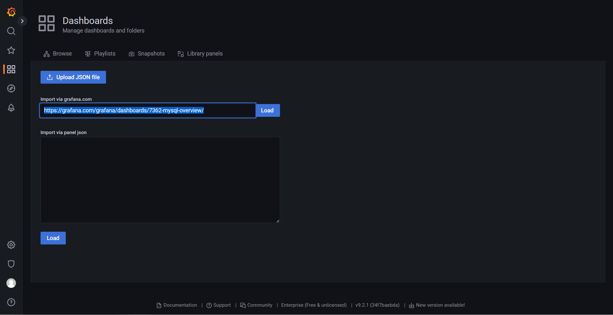
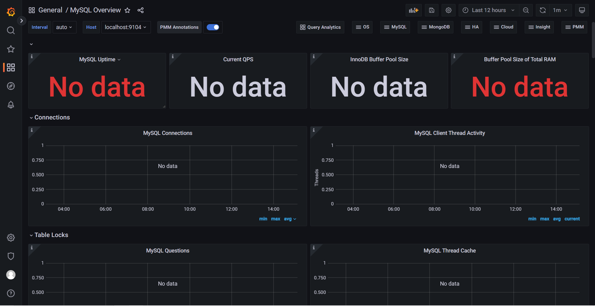

## 1. 配置exporter

MySQL Exporter是一种基于Prometheus的监控工具，可以用于从MySQL数据库中收集各种性能指标数据，并将其导出为Prometheus所支持的格式。MySQL Exporter可以与Prometheus结合使用，通过Prometheus的查询语言和可视化工具来实现监控和告警。

https://github.com/prometheus/mysqld_exporter/releases/download/v0.14.0/mysqld_exporter-0.14.0.windows-amd64.zip

### 1.1 在安装目录(/mysqld_exporter-0.14.0.windows-amd64/)创建my.cnf文件，并写入以下信息

```
[client]
user=【mysql用户名】
password=【mysql密码】
host=【ip地址】
port=3306
```

### 1.2 在安装目录下运行以下命令，开启服务

```
./mysqld_exporter.exe --config.my-cnf=./my.cnf
```

### 1.3 访问localhost:9104并点击Metrics

进入Metric后可以看到各种指标信息，可以搜索mysql查看mysql的指标信息。



## 2.  配置普罗米修斯

普罗米修斯（Prometheus）是一种开源的监控系统和时间序列数据库，可以用于收集、存储和查询各种类型的指标数据，包括应用程序、系统、网络等方面的指标。它支持多种数据模型、查询语言和可视化方式，可以帮助用户更好地了解系统运行状况、故障排查和性能优化等工作。

https://github.com/prometheus/prometheus/releases/download/v2.39.1/prometheus-2.39.1.windows-amd64.zip

### 2.1 修改prometheus.yml

在最后添加以下内容（注意缩进一致）：

```
 - job_name: "mysql"

    # metrics_path defaults to '/metrics'
    # scheme defaults to 'http'.

    static_configs:
      - targets: ["localhost:9104"]
```

### 2.2 访问

打开prometheus.exe，浏览器访问``localhost:9090``



点击Status的Targets，可以看到已经采集到了mysql的指标信息



## 3. 安装Grafana

Grafana是一款开源的数据可视化和监控工具，它可以将各种数据源的指标数据转化为美观、交互式的图表和面板。Grafana支持多种数据源，包括Prometheus、InfluxDB、Elasticsearch、MySQL等，可以用于监控和分析各种类型的系统和应用程序。

https://dl.grafana.com/enterprise/release/grafana-enterprise-9.2.1.windows-amd64.msi

### 3.1 访问和配置

访问``localhost:3000``，输入账户和密码（都是admin），然后修改密码。

点击configuration->Add DataSource->Prometheus。



URL填``http://localhost:9090``，点击save&test。接着选择Dashboards中的import。



输入``https://grafana.com/grafana/dashboards/7362-mysql-overview/``后点击load，接着直接导入。



导入成功！

