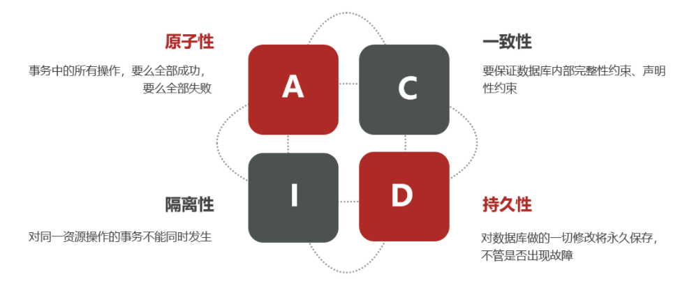
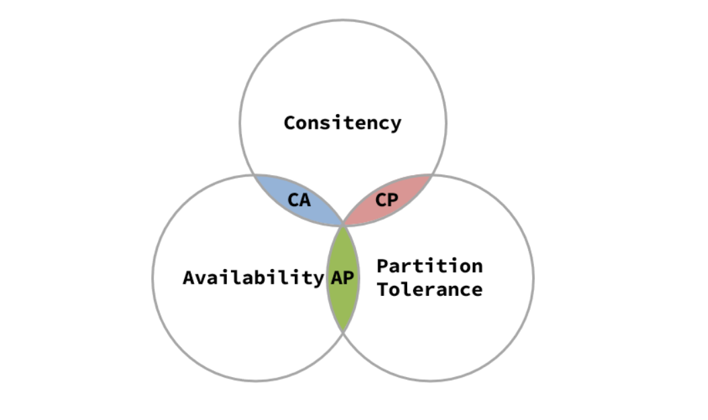
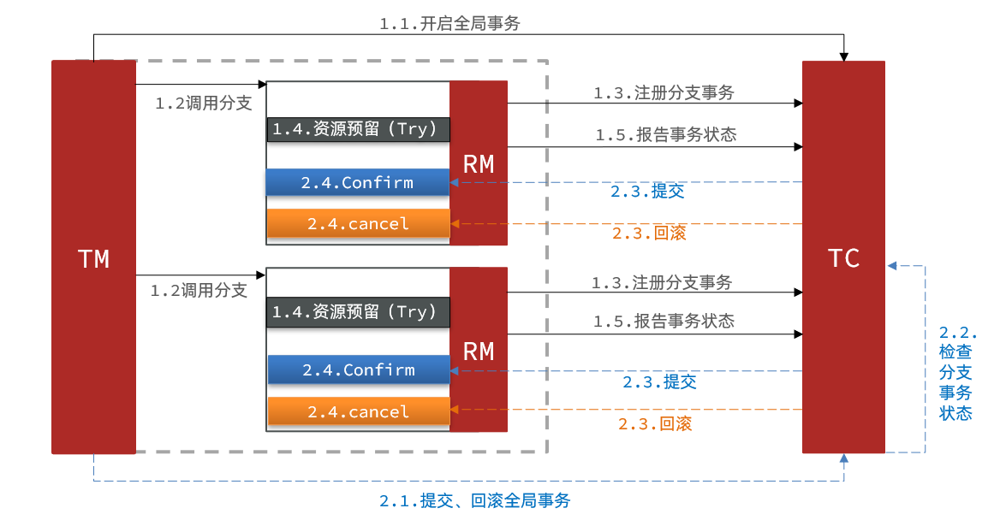

# 1. 分布式事务问题

## 1.1 本地事务

本地事务，也就是传统的**单机事务**。在传统数据库事务中，必须要满足四个原则：

## 1.2 分布式事务

**分布式事务**，就是指不是在单个服务或单个数据库架构下产生的事务，例如跨数据源的分布式事务和跨服务的分布式事务等。

# 2. 理论基础

## 2.1 CAP定理

1998年，加州大学的计算机科学家 Eric Brewer 提出，分布式系统有三个指标。

> - Consistency（一致性）
> - Availability（可用性）
> - Partition tolerance （分区容错性）

它们的第一个字母分别是 C、A、P。

Eric Brewer 说，这三个指标不可能同时做到。这个结论就叫做 CAP 定理。

### 2.1.1 一致性Consistency

用户访问分布式系统的任意节点，得到的数据必须一致。

### 2.1.2 可用性Availability

用户访问集群中的任意健康节点，必须得到响应，而不是超时或拒绝。

如果部分节点无法访问，代表节点不可用。

### 2.1.3 分区容错

**Partition（分区）**：因为网络故障或其它原因导致分布式系统中的部分节点与其它节点失去连接，形成独立分区。

**Tolerance（容错）**：在集群出现分区时，整个系统也要持续对外提供服务。

### 2.1.4 矛盾

在分布式系统中，系统间的网络不能100%保证健康，一定会有故障的时候，而服务有必须对外保证服务。因此Partition Tolerance不可避免。

如果此时要保证**一致性**，就必须等待网络恢复，完成数据同步后，整个集群才对外提供服务，服务处于阻塞状态，不可用。

如果此时要保证**可用性**，就不能等待网络恢复，节点之间就会出现数据不一致。

也就是说，在P一定会出现的情况下，A和C之间只能实现一个。

## 2.2 BASE理论

BASE理论是对CAP的一种解决思路，包含三个思想

- **Basically Available** **（基本可用）**：分布式系统在出现故障时，允许损失部分可用性，即保证核心可用。
- **Soft State（软状态）：**在一定时间内，允许出现中间状态，比如临时的不一致状态。
- **Eventually Consistent（最终一致性）**：虽然无法保证强一致性，但是在软状态结束后，最终达到数据一致。

## 2.3.解决分布式事务的思路

分布式事务最大的问题是各个子事务的一致性问题，因此可以借鉴CAP定理和BASE理论，有两种解决思路：

- AP模式：各子事务分别执行和提交，允许出现结果不一致，然后采用弥补措施恢复数据即可，实现最终一致。

- CP模式：各个子事务执行后互相等待，同时提交，同时回滚，达成强一致。但事务等待过程中，处于弱可用状态。

但不管是哪一种模式，都需要在子系统事务之间互相通讯，协调事务状态，也就是需要一个**事务协调者(TC)**：

这里的子系统事务，称为**分支事务**；有关联的各个分支事务在一起称为**全局事务**。

# 3. Seata

Seata是 2019 年 1 月份蚂蚁金服和阿里巴巴共同开源的分布式事务解决方案。致力于提供高性能和简单易用的分布式事务服务，为用户打造一站式的分布式解决方案。

## 3.1 Seata的架构

Seata事务管理中有三个重要的角色：

- **TC (Transaction Coordinator) -** **事务协调者：**维护全局和分支事务的状态，协调全局事务提交或回滚。

- **TM (Transaction Manager) -** **事务管理器：**定义全局事务的范围、开始全局事务、提交或回滚全局事务。

- **RM (Resource Manager) -** **资源管理器：**管理分支事务处理的资源，与TC交谈以注册分支事务和报告分支事务的状态，并驱动分支事务提交或回滚。

整体的架构如图：

Seata基于上述架构提供了四种不同的分布式事务解决方案：

- XA模式：强一致性分阶段事务模式，牺牲了一定的可用性，无业务侵入
- TCC模式：最终一致的分阶段事务模式，有业务侵入
- AT模式：最终一致的分阶段事务模式，无业务侵入，也是Seata的默认模式
- SAGA模式：长事务模式，有业务侵入

无论哪种方案，都离不开TC，也就是事务的协调者。

## 3.2 XA模式

XA规范是X/Open组织定义的分布式事务处理（DTP，Distributed Transaction Processing）标准，XA规范描述了全局的TM与局部的RM之间的接口，几乎所有主流的数据库都对XA规范提供了支持。

### 3.2.1 两阶段提交

XA是规范，目前主流数据库都实现了这种规范，实现的原理都是基于两阶段提交。

一阶段：

- 事务协调者通知每个事物参与者执行本地事务
- 本地事务执行完成后报告事务执行状态给事务协调者，此时事务不提交，继续持有数据库锁

二阶段：

- 事务协调者基于一阶段的报告来判断下一步操作
  - 如果一阶段都成功，则通知所有事务参与者，提交事务
  - 如果一阶段任意一个参与者失败，则通知所有事务参与者回滚事务

### 3.2.2 Seata的XA模型

Seata对原始的XA模式做了简单的封装和改造，以适应自己的事务模型，基本架构如图：

RM一阶段的工作：

​	① 注册分支事务到TC

​	② 执行分支业务sql但不提交

​	③ 报告执行状态到TC

TC二阶段的工作：

- TC检测各分支事务执行状态

  a.如果都成功，通知所有RM提交事务

  b.如果有失败，通知所有RM回滚事务

RM二阶段的工作：

- 接收TC指令，提交或回滚事务

### 3.2.3 优缺点

XA模式的优点：

- 事务的强一致性，满足ACID原则。
- 常用数据库都支持，实现简单，并且没有代码侵入

XA模式的缺点：

- 因为一阶段需要锁定数据库资源，等待二阶段结束才释放，性能较差
- 依赖关系型数据库实现事务

## 3.3 AT模式

AT模式同样是分阶段提交的事务模型，不过缺弥补了XA模型中资源锁定周期过长的缺陷。

### 3.3.1 Seata的AT模型

基本流程图：

阶段一RM的工作：

- 注册分支事务
- 记录undo-log（数据快照）
- 执行业务sql并提交
- 报告事务状态

阶段二提交时RM的工作：

- 删除undo-log即可

阶段二回滚时RM的工作：

- 根据undo-log恢复数据到更新前

### 3.3.2 AT与XA的区别

- XA模式一阶段不提交事务，锁定资源；AT模式一阶段直接提交，不锁定资源。
- XA模式依赖数据库机制实现回滚；AT模式利用数据快照实现数据回滚。
- XA模式强一致；AT模式最终一致

### 3.3.3 脏写问题

在多线程并发访问AT模式的分布式事务时，有可能出现脏写问题，如图：

解决思路就是引入了全局锁的概念。在释放DB锁之前，先拿到全局锁。避免同一时刻有另外一个事务来操作当前数据。

### 3.3.4 优缺点

AT模式的优点：

- 一阶段完成直接提交事务，释放数据库资源，性能比较好
- 利用全局锁实现读写隔离
- 没有代码侵入，框架自动完成回滚和提交

AT模式的缺点：

- 两阶段之间属于软状态，属于最终一致
- 框架的快照功能会影响性能，但比XA模式要好很多

## 3.4 TCC模式

TCC模式与AT模式非常相似，每阶段都是独立事务，不同的是TCC通过人工编码来实现数据恢复。需要实现三个方法：

- Try：资源的检测和预留； 

- Confirm：完成资源操作业务；要求 Try 成功 Confirm 一定要能成功。

- Cancel：预留资源释放，可以理解为try的反向操作。

### 3.4.1 流程分析

举例，一个扣减用户余额的业务。假设账户A原来余额是100，需要余额扣减30元。

- **阶段一（ Try ）**：检查余额是否充足，如果充足则冻结金额增加30元，可用余额扣除30

初识余额：

余额充足，可以冻结：

此时，总金额 = 冻结金额 + 可用金额，数量依然是100不变。事务直接提交无需等待其它事务。

- **阶段二（Confirm)**：假如要提交（Confirm），则冻结金额扣减30

确认可以提交，不过之前可用金额已经扣减过了，这里只要清除冻结金额就好了：

此时，总金额 = 冻结金额 + 可用金额 = 0 + 70  = 70元

- **阶段二(Canncel)**：如果要回滚（Cancel），则冻结金额扣减30，可用余额增加30

需要回滚，那么就要释放冻结金额，恢复可用金额：

### 3.4.2 Seata的TCC模型

Seata中的TCC模型依然延续之前的事务架构，如图：

### 3.4.3 优缺点

TCC模式的每个阶段是做什么的？

- Try：资源检查和预留
- Confirm：业务执行和提交
- Cancel：预留资源的释放

TCC的优点是什么？

- 一阶段完成直接提交事务，释放数据库资源，性能好
- 相比AT模型，无需生成快照，无需使用全局锁，性能最强
- 不依赖数据库事务，而是依赖补偿操作，可以用于非事务型数据库

TCC的缺点是什么？

- 有代码侵入，需要人为编写try、Confirm和Cancel接口，太麻烦
- 软状态，事务是最终一致
- 需要考虑Confirm和Cancel的失败情况，做好幂等处理

幂等性就是无论接口调用多少次，返回的结果应该具有一致性。

### 3.3.4 事务悬挂和空回滚

#### 3.3.4.1 空回滚

当某分支事务的try阶段**阻塞**时，可能导致全局事务超时而触发二阶段的cancel操作。在未执行try操作时先执行了cancel操作，这时cancel不能做回滚，就是**空回滚**，也就是说返回一个正常状态，且不报错.

如图：

执行cancel操作时，应当判断try是否已经执行，如果尚未执行，则应该空回滚。

#### 3.3.4.2 业务悬挂

对于已经空回滚的业务，之前被阻塞的try操作恢复，继续执行try，就永远不可能confirm或cancel ，事务一直处于中间状态，这就是**业务悬挂**，即cancel操作已经执行后，try操作恢复锁定了资源。

执行try操作时，应当判断cancel是否已经执行过了，如果已经执行，应当阻止空回滚后的try操作，避免悬挂

## 3.5 SAGA模式

Saga 模式是 Seata 即将开源的长事务解决方案，将由蚂蚁金服主要贡献。它的思想是允许分布式事务在全部提交前提前释放占用的某些资源。

### 3.5.1 原理

在 Saga 模式下，分布式事务内有多个参与者，每一个参与者都是一个冲正补偿服务，需要用户根据业务场景实现其正向操作和逆向回滚操作。

分布式事务执行过程中，依次执行各参与者的正向操作，如果所有正向操作均执行成功，那么分布式事务提交。如果任何一个正向操作执行失败，那么分布式事务会去退回去执行前面各参与者的逆向回滚操作，回滚已提交的参与者，使分布式事务回到初始状态。

Saga也分为两个阶段：

- 一阶段：直接提交本地事务
- 二阶段：成功则什么都不做；失败则通过编写补偿业务来回滚

### 3.5.2 优缺点

优点：

- 事务参与者可以基于事件驱动实现异步调用，吞吐高
- 一阶段直接提交事务，无锁，性能好
- 不用编写TCC中的三个阶段，实现简单

缺点：

- 软状态持续时间不确定，时效性差
- 没有锁，没有事务隔离，会有脏写

## 3.6 四种模式对比

我们从以下几个方面来对比四种实现：

- 一致性：能否保证事务的一致性？强一致还是最终一致？
- 隔离性：事务之间的隔离性如何？
- 代码侵入：是否需要对业务代码改造？
- 性能：有无性能损耗？
- 场景：常见的业务场景

如图：

