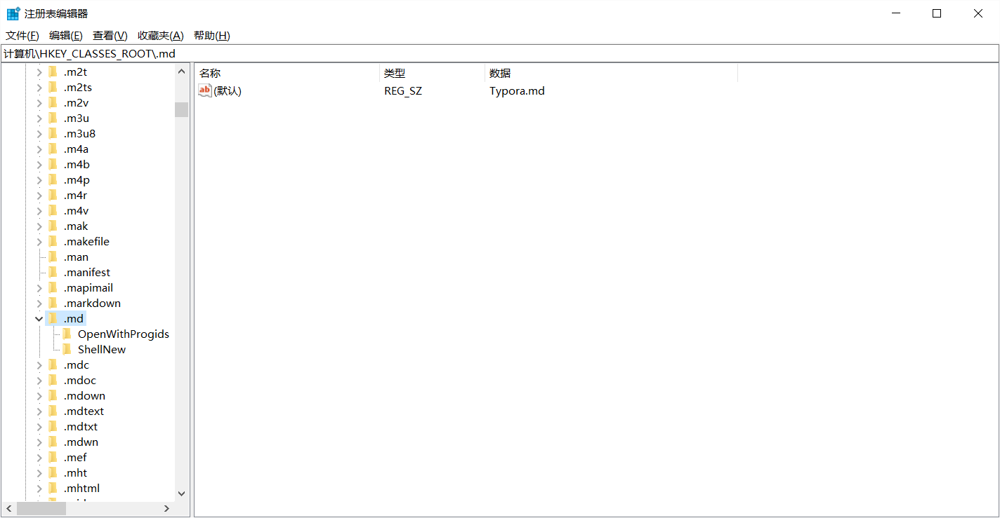
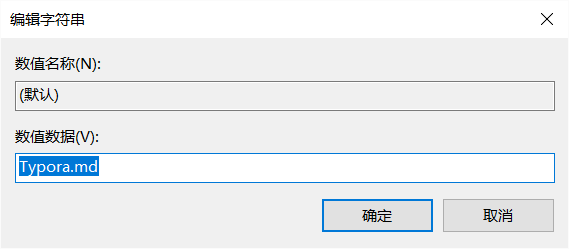
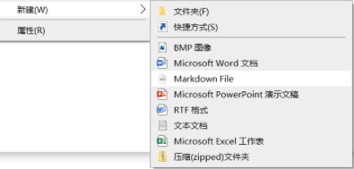

- 安装一个md文件编辑器(以大部人最常用的typora为例)
- "win + R"，输入regedit，回车
- 定位到HKEY_CLASSES_ROOT




- 点击.md文件夹, 双击右侧(默认)项编辑字符串
- 将数值数据改为Typora.md（视自己使用的md文件编辑器而定）



- 右键.md文件夹 => 新建 => 项
- 把新建的项命名为ShellNew
- 右键ShellNew => 新建 => 字符串项
- 把新建的字符串项的名称改为NullFile

- 任意位置新建一个文本文档写入以下代码

```
Windows Registry Editor Version 5.00

[HKEY_CLASSES_ROOT.md]

@="Typora.md"

"Content Type"="text/markdown"

"PerceivedType"="text"

[HKEY_CLASSES_ROOT.mdShellNew]

"NullFile"=""
```

- 保存，修改后缀名为.reg，点击运行，运行成功完成后，之后这个文件可以删除

- 显示添加---------中包含的项和值已成功添加到注册表中即成功

