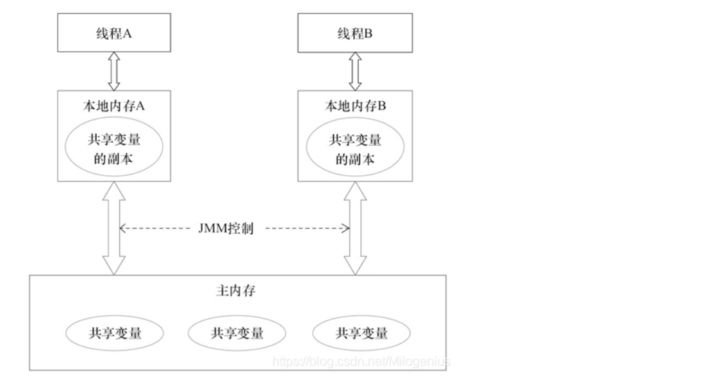
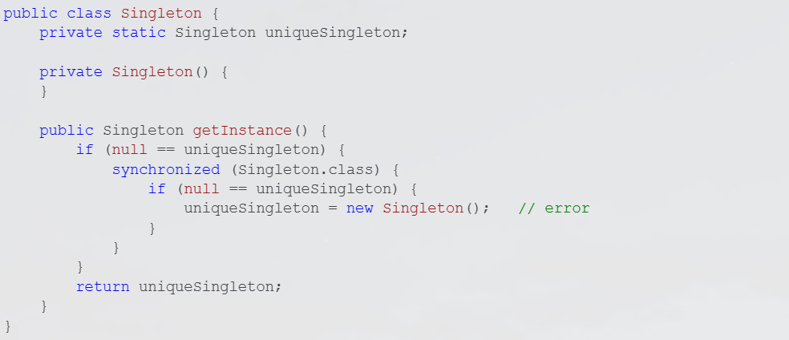
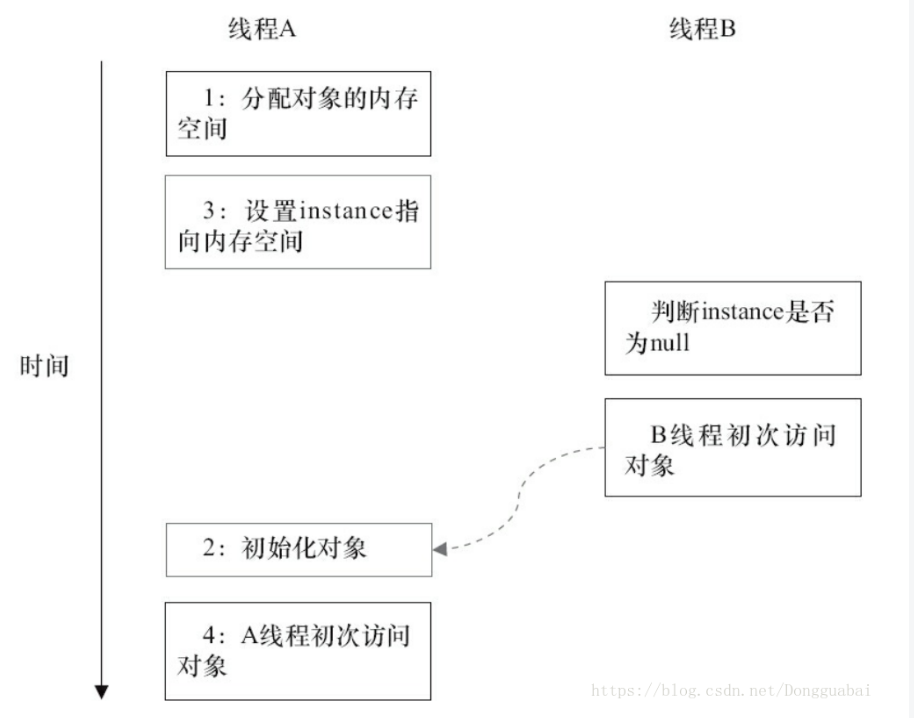
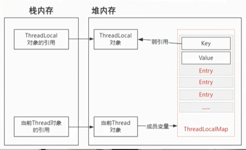

# 1. Java并发机制的底层实现原理

原子性：简单的读取、赋值（而且必须是将数字赋值给某个变量，变量之间的互相赋值不是原子操作）才是原子操作，**JMM仅保证了基本读取和赋值是原子操作**

## 1.1 volatile

volatile是轻量级的synchronized，它在多处理器并发中保证了共享变量的**可见性**。可见性的意思是，当一个线程修改一个共享变量时，另外一个线程能够读到这个修改的值。

### 1.1.1 缓存一致性问题

一个变量在多个CPU中都存在缓存，就可能出现缓存不一致的问题。

**解决方法（都是在硬件上实现的）：**

- 总线锁
- 缓存一致性协议：例如Intel的MESI协议，该协议**保证每个缓存中使用的共享变量的副本是一致的**。其思想是：当CPU写数据时，如果发现操作的变量是共享变量（即在其他CPU中也存在该变量的副本），**会发出信号通知其他CPU将该变量的缓存行置为无效状态**，因此当其他CPU需要读取这个变量时，发现自己缓存中缓存该变量的缓存行是无效的，那么它就会从内存重新读取。

### 1.1.2 写缓冲区

处理器在执行内存写操作的时候，**先将数据写入其写缓冲器中，而不是直接写入高速缓冲器**。处理器的写缓冲器的内容无法被其他处理器读取，因此写线程必须**确保其对volatile变量所做的更新以及其更新volatile变量前对其他变量所做的更新到达高速缓存**（而不是停留在写缓冲区）。只有这样，写线程的更新**通过缓存一致性协议被其他处理器上的线程读取**才成为可能。为此，JMM会在volatile变量写操作之后插入一个StoreLoad内存屏障，这个内存屏障的其中一个作用就是将其处理器的写缓冲区的当前内容写入高速缓存，并将高速缓存的内容写回主存。

### 1.1.3 无效化队列

在MESI协议中，当一个处理器将一个缓存行标记为修改状态（M）时，需要向其他处理器发送无效化消息（Invalidate）来通知其他处理器将对应的缓存行标记为无效（I）状态。同时，该处理器还会将该缓存行的数据写回主存，并将缓存行状态标记为 Exclusive（E）状态。因此，在进行这些操作期间，需要等待其他处理器响应并处理相应的无效化消息，才能继续执行下一条指令。

为了避免等待时间过长，MESI协议中通常使用无效化队列来缓存待处理的无效化消息。当一个处理器需要向其他处理器发送无效化消息时，会将消息添加到无效化队列中，并继续执行下一条指令。其他处理器在接收到无效化消息后，会将对应的缓存行标记为无效（I）状态，并从无效化队列中删除相应的无效化消息。这样，即使处理器之间的通信时间较长，也可以最大程度地减少等待时间。

需要注意的是，无效化队列并不是MESI协议中必须的，不同的实现方式可能会有所不同。有些实现可能会使用其他的方法来缓存无效化消息，例如使用缓存行来缓存无效化消息。但是，无论是哪种实现方式，都需要保证处理器之间的通信效率，以确保系统性能的高效运行。

无效化队列是**暂存无效化消息的硬件，使修改了某个共享变量之后的处理器借以通知其他处理器对共享变量的更新，以便其他处理器能够将其高速缓存中的相应缓存行置为无效**。

处理器从其高速缓存中读取到的共享变量可能是过时的，为了确保线程能够读取到共享变量最新的值，线程的执行处理器必须在读取volatile变量前确保无效化队列中的内容被应用到该处理器的高速缓存中，即**根据无效化队列中的内容将处理器中相应的缓存行置为无效，从而使写线程对共享变量所做的更新能够被反映到该处理器的高速缓存上**。

### 1.1.4 共享变量写回内存的流程

对声明了volatile的变量进行**写操作**，**JVM会向处理器发送一条Lock前缀的指令，将这个变量所在缓存行的数据写会主存**。但是，就算回到主存，还要保证其他处理器的缓存是一致的。**每个处理器通过总线嗅探机制（MESI协议、无效化队列）来检查自己的缓存值是否过期**，当处理器发现自己**缓存行对应的内存地址的数据被修改**时，就会设置当前缓存行为无效（删除）。

### 1.1.5 volatile实现的两条原则

用volatile变量修饰的共享变量在进行写操作的时候会多出一行Lock前缀的汇编代码，这条指令在多核处理器下引发两件事情：

- 将当前处理器缓存行的数据写回到系统内存
- 一个处理器的缓存回写到内存会使在其他CPU里缓存了该内存地址的数据无效

## 1.2 Synchronized

Synchronized是Java中的一个关键字，用于实现线程同步，保证多线程环境下的数据安全。

在Java中，当多个线程访问共享资源时，如果没有进行同步控制，就可能会导致数据的不一致性或不可预期的错误。因此，Java提供了Synchronized关键字来保证多个线程对同一个共享资源的访问是互斥的，即同一时刻只能有一个线程访问该共享资源。

Synchronized关键字可以修饰方法或代码块，当修饰方法时，该方法被称为同步方法；当修饰代码块时，需要指定一个对象作为锁，只有持有该对象锁的线程才能进入该代码块。在多线程环境下，只有一个线程能够持有对象锁，并执行相应的同步代码，其他线程需要等待该线程释放对象锁后才能进入同步代码块。Synchronized是Java中的一个关键字，用于实现线程同步，保证多线程环境下的数据安全。

在Java中，当多个线程访问共享资源时，如果没有进行同步控制，就可能会导致数据的不一致性或不可预期的错误。因此，Java提供了Synchronized关键字来保证多个线程对同一个共享资源的访问是互斥的，即同一时刻只能有一个线程访问该共享资源。

Synchronized关键字可以修饰方法或代码块，当修饰方法时，该方法被称为同步方法；当修饰代码块时，需要指定一个对象作为锁，只有持有该对象锁的线程才能进入该代码块。在多线程环境下，只有一个线程能够持有对象锁，并执行相应的同步代码，其他线程需要等待该线程释放对象锁后才能进入同步代码块。

### 1.2.1 实现原理

**Synchronized关键字实现同步的基础**：Java中的每个对象都可以作为锁。

- 对于普通同步方法，锁是当前实例对象

- 对于静态方法，锁是当前类的class对象

- 对于同步代码块，锁是括号里配置的对象

JVM基于进入和退出Monitor对象来实现方法同步和代码块同步。

### 1.2.2 Java对象头

synchronized用的锁是存在Java对象头中的，Java对象头中的Mark Word默认存储对象的HashCode、分代年龄和锁标记位。Mark Word中的数据会随着锁标志位的变化而变化。

### 1.2.3 锁升级

JavaSE 1.6为了减少获得锁和释放锁带来的性能消耗，引入了偏向锁和轻量级锁。锁一共有四种状态，从高到低分别为：**无锁状态、偏向锁、轻量级锁、重量级锁**。

**偏向锁**：当一个线程访问同步块并获取锁时，会在对象头和栈帧的锁记录中存储锁偏向的线程ID，以后该线程进出同步块时不需要进行CAS操作来加锁和解锁，只需测试对象头的Mark Word是否存储着该线程的偏向锁。如果成功，表示线程已经获取了锁，如果失败则需测试当前锁是否为偏向锁。若不是，则使用CAS竞争锁，若是，则尝试使用CAS将对象头的偏向锁指向当前线程。

当有多个线程竞争竞争偏向锁时，栈中的锁记录和对象头中的Mark Word可能重新偏向于其他线程，也可能升级到轻量级锁。

**轻量级锁**：线程执行同步块之前，JVM会先在当前线程的栈帧中创建用于存储锁记录的空间，并将对象头的Mark Word复制到锁记录中，官方称为Displaced Mark Word。然后线程尝试使用CAS将对象头的Mark Word替换为指向锁记录的指针。如果成功，当前线程获取锁，如果失败，表示其他线程竞争锁，当前线程使用CAS尝试获取锁。

**重量级锁**：轻量级锁解锁时，会使用CAS操作将Displaced Mark Word替换会对象头，如果成功，则表示没有竞争发生。如果失败，表示当前锁存在竞争，锁就会膨胀成为重量级锁。

## 1.3 原子操作

原子操作是不可被中断的一个或一系列操作。

### 1.3.1 处理器如何实现原子操作

- **通过总线锁保证原子性**

- **通过缓存锁保证原子性**：缓存一致性机制（缓存一致性协议MESI），当其他处理器回写已经被锁定的缓存行的数据时，会使缓存行无效。

当操作的数据不能被缓存在处理器内部，或数据跨多个缓存行，或者处理器不支持缓存锁定时，会调用总线锁定。

### 1.3.2 Java如何实现原子操作

在Java中可以通过**锁**和**循环CAS**的方式来实现原子操作

# 2. Java内存模型

在命令式编程中，线程之间的**通信**方式有两种：共享内存和**消息传递**。**通信**指线程之间以何种机制来交换信息。

**共享内存**：线程共享程序的公共状态，通过写-读内存中的公共状态进行隐式通信。

**消息传递**：线程之间没有公共状态，线程之间必须通过发送消息来进行显示通信。

Java的并发采用的是共享内存模型，Java线程之间的通信总是隐式进行，整个通信过程对程序员完全透明。

## 2.1 Java内存模型的基础知识

### 2.1.1 Java内存模型的抽象结构

在Java中，所有**实例域、静态域和数组元素**都存储在堆内存中，堆内存在线程之间共享。**局部变量、方法定义参数和异常处理器参数**不会在线程之间共享，没有内存可见性问题。

若线程A和线程B之间要通信的话，要经历两个步骤：

- 线程A把本地内存A中更新过的共享变量刷新到主内存中去
- 线程B到主内存中读取线程A之前已更新过的共享变量

这两个步骤实际上是线程A向线程B发送消息，而且这个过程必须经过主内存。

### 2.1.2 重排序

在执行程序时，为了提高性能，编译器和处理器常常会对指令做重排序。

对于**编译器**，JMM的编译器重排序规则会禁止特定类型的编译器重排序。对于处理器重排序，JMM的处理器重排序规则会要求Java编译器在生成指令序列时，插入特定类型的内存屏障。

JMM属于语言级的内存模型，它确保在不同的编译器和不同的处理器平台上，为程序员提供一致的内存可见性保证。

### 2.1.3 happens-before

在JMM中，如果一个操作执行的结果需要对另一个操作可见，那么两个操作之间必须要存在happens-before关系。

常见的happens-before规则：

- 程序顺序规则：一个线程中的每个操作，happens-before于该线程的任意后续操作
- 监视器锁规则：对一个锁的解锁，happens-before于随后对这个锁的加锁
- volatile规则：对一个volatile域的写，happens-before于任意后续对这个volatile域的读
- 传递性
- start()规则：如果线程A执行ThreadB.start()，那么A线程的ThreadB.start()操作happens-before于线程B的任意操作。**也就是A启动B线程之后B线程才能执行。**
- join()规则：若线程A执行操作ThreadB.join()并成功返回，那么线程B中任意操作happens-before于线程A从ThreadB.join()操作成功返回。**也就是B线程执行结束先于A线程。**

一个happens-before规则对应于一个或多个编译器和处理器重排序规则

## 2.2 重排序

重排序是指编译器和处理器为了优化程序性能而对指令序列进行重新排序的一种手段。

### 2.2.1 数据依赖

如果两个操作访问同一个变量，且这两个操作中有一个为写操作，这时这两个操作之间存在数据依赖性。

编译器和处理器不会改变存在数据依赖关系的两个操作的执行顺序。

### 2.2.2 as-if-serial语义

不管怎么重排序，单线程程序执行的结果不能被改变。

### 2.2.3 重排序对多线程的影响

编译器和处理器会采用猜测执行来克服控制相关性对并行度的影响。

在多线程程序中，对存在控制依赖的操作重排序，可能会改变程序的执行结果。

## 2.3 顺序一致性

### 2.3.1 数据竞争

程序未正确同步时，可能会存在数据竞争。Java内存模型规范对数据竞争的定义为：在一个线程中写一个变量，在另一个线程中读同一个变量，而且写和读没有通过同步来排序。

当代码中存在数据竞争时，程序的执行往往产生违反直觉的结果。如果一个多线程程序能够正确同步，这个程序将是一个没有数据竞争的程序。

### 2.3.2 顺序一致性内存模型

顺序一致性内存模型是一个理论参考模型，它有两大特性：

- 一个线程中的所有操作必须按照程序的顺序来执行。
- （不管程序是否同步）所有线程都只能看到一个单一的操作执行顺序。在顺序一致性内存模型中，每个操作都必须原子执行且立刻对所有线程可见。

### 2.3.3 同步程序的顺序一致性效果

在顺序一致性模型中，所有操作完全按照程序的顺序串行执行。而在JMM中，临界区内的代码可以重排序，但是不允许临界区内的代码逸出到临界区之外，这样会破坏监视器锁的语义。

### 2.3.4 未同步程序的执行特性

对于未同步或未正确同步的多线程程序，JMM只提供最小安全性：线程执行时读取到的值，要么是之前某个线程写入的值，要么是默认值（0，Null，False），JMM保证线程读取到的值不会无中生有的冒出来。

### 2.3.5 未同步程序在JMM和顺序一致性模型中的区别

- 顺序一致性模型保证单线程内的操作会按程序的顺序执行，而JMM不保证单线程内的操作会按程序的顺序执行。
- 顺序一致性模型保证所有线程只能看到一致的操作执行顺序，而JMM不保证所有线程能看到一致的操作执行顺序。
- JMM不保证对64位的long型和double型变量的写操作具有原子性，而顺序一致性模型保证对所有的内存读/写操作都具有原子性。因为JVM在32位的处理器上运行时，可能会把一个64位的long/double型变量的写操作还分成两个32位的写操作来执行。

## 2.4 volatile的内存语义

### 2.4.1 volatile的特性

- 可见性：对一个volatile变量的读，总是能看到任意线程对这个volatile变量的写。
- 原子性：对任意单个volatile变量的读/写具有原子性，但类似于volatile++的复合操作不具有原子性。

### 2.4.2 volatile写-读建立的happens-before关系

从JSR-133开始（即从JDK5开始）。volatile变量的写-读可以实现线程间的通信。

volatile写和锁的释放有相同的内存语义，volatile读与锁的获取有相同的内存语义。

### 2.4.3 volatile写-读的内存语义

**volatile写**：当写一个volatile变量时，JMM会把该线程对应的本地内存中的共享变量刷到主内存。

**volatile读**：当读一个volatile变量时，JMM会把该线程对应的本地内存置为无效，接下来从主内存读共享变量。

### 2.4.4 volatile内存语义的实现

为了实现volatile的内存语义，编译器在生成字节码时，会在指令序列中插入内存屏障来禁止特定类型的处理器重排序。

## 2.5 final域的内存语义

**写final域的重排序规则**可以确保：在对象引用为任意线程可见之前，对象的final域已经被正确初始化过了，而普通域不具有这个保证。在读线程看到对象引用时，很可能该对象还没有构造完成。

**读final域的重排序规则**可以确保：在读一个对象的final域之前，一定会先读包含这个final域的对象的引用。

## 2.6 happens-before

### 2.6.1 JSR-133对happens-before的定义

- 如果一个操作happens-before另一个操作，那么第一个操作的执行结果对第二个操作可见，而且第一个操作的执行顺序在第二个操作之前。**这是对程序员的保证。**

- 两个操作之间存在happens-before关系，并不意味着java平台的具体实现必须要按照happens-before关系指定的顺序来执行。如果重排序后的执行结果与按照happens-before关系执行的结果一致，那么这种重排序是不非法的。**这是对编译器和处理器重排序的约束规则。**

### 2.6.2 as-if-serial和happens-before

- as-if-serial语义保证单线程内程序的执行结果不被改变，happens-before关系保证正确同步的多线程程序的执行结果不被改变。
- as-if-serial创建的幻境：单线程程序是按照程序顺序来执行的。happens-before创建的幻境：正确同步的多线程程序是按happens-before指定的顺序来执行的。

## 2.7 双重检查锁定与延迟初始化

### 2.7.1 双重检查锁

若第一次检查instance不为null，那么就不需要执行下面的加锁和初始化操作。

### 2.7.2 问题根源

实例化对象可以分为三个步骤：

1. 分配对象的内存空间
2. 初始化对象
3. 将instance指向刚分配的内存地址

如果2和3重排序，那么线程B可能会访问到一个未初始化的对象。

### 2.7.3 解决方案

基于volatile的解决方案：禁止2和3重排序

基于类初始化的解决方案：允许2和3重排序，但是不允许其他线程看到这个重排序

# 3. Java中的锁

## 3.1 Lock接口

锁是用来控制多个线程访问共享资源的方式。

在Lock接口出现之前，Java靠synchronized关键字实现锁功能，而在Java SE 5之后，并发包中新增了Lock接口。

### 3.1.1 Lock接口和synchronized

- Lock接口使用时需要显示的获取和释放锁，而synchronized关键字会隐式的获取锁。
- Lock能尝试非阻塞的获取锁。
- Lock能被中断的获取锁：获取到锁的线程能够响应中断。
- Lock能够超时获取锁：在指定的时间之前获取锁，若没有获取到则返回。

## 3.2 队列同步器

队列同步器AbstractQueuedSynchronizer，是用来构建或者其他同步组件的基础框架，它使用了一个int成员变量表示同步状态，通过内置的FIFO队列来完成资源获取线程的排队工作。它的子类推荐被定义为自定义同步组件的静态内部类。

同步器是实现锁（或者任意同步组件）的关键，在锁的实现中聚合同步器，利用同步器实现锁的语义。锁是面向使用者的，而同步器是面向锁的实现者的。

### 3.3 重入锁

重入锁ReentrantLock支持一个线程对资源的重复加锁。此外，该锁还支持获取锁时的公平和非公平性选择。

synchronized关键字隐式的支持重进入，ReentrantLock显式的支持重进入（已经获取到锁的线程能偶再次调用lock()方法而不被阻塞）。

### 3.3.1 公平锁和非公平锁的区别

公平锁：锁的获取顺序符合请求的绝对时间顺序，也就是FIFO

非公平锁：无论是否有线程在竞争锁，都会尝试一次获取锁

## 3.4 读写锁

读写锁在同一时刻可以允许多个读线程访问，但是在写线程访问时，所有的读线程和其他写线程均被阻塞。读写锁维护了一对锁，一个读锁和一个写锁。

### 3.4.1 写锁的获取与释放

如果存在读锁，则写锁不能被获取。因为读写锁要确保写锁的操作对读锁可见，如果允许读锁在已被获取的情况下对写锁的获取，那么正在运行的其他读线程无法感知到当前写线程的操作。

### 3.4.2 锁降级

锁降级指把持住（当前拥有的）写锁，再获取到读锁，随后释放（先前拥有的）写锁过程。不支持锁升级。

# 4. Java并发容器和框架

## 4.1 ConcurrentHashMap

### 4.1.1 为什么使用ConcurrentHashMap

- 多线程环境下，HashMap的put操作会导致Entry链表形成环形数据结构，引起死循环，所以并发情况下不能使用HashMap。
- HashTable容器使用synchronized保证线程安全，但是在线程激烈的情况下HashTable的效率非常低下。
- ConcurrentHashMap将数据分成一段一段的存储，然后给每一段数据配一把锁，当一个线程占用锁访问其中一个数据段的时候，其他的数据也能被其他线程访问。

### 4.1.2 ConcurrentHashMap的结构

JDK1.7之前，ConcurrentHashMap由Segment数组结构和HashEntry数组结构组成。Segment是一种可重入锁，HashEntry用于存储键值对数据。采用分段锁实现线程安全。

JDK1.8之后，ConcurrentHashMap由Node数组+链表+红黑树组成。采用synchronized和CAS实现线程安全。

HashTable底层数据结构采用：数据+链表。

# 5. ThreadLocal

ThreadLocal是用来解决线程安全性问题的一个工具（仅仅解决数据隔离），它相当于让每个线程都开辟了一块内存空间，用来存储共享变量的一个副本，然后每个线程只需要去访问和操作自己的共享变量的一个副本，从而去避免多线程竞争同一个共享资源。

每一个线程都有一个成员变量ThreadLocalMap，当线程访问ThreadLocal修饰的共享变量的时候，这个线程就会在自己的成员变量ThreadLocalMap里保存一份数据副本，key指向ThreadLocal，而value保存的是共享数据的一个副本，因为每个线程都持有一份数据副本，所以线程之间就不存在对共享变量的并发操作。

key是一个弱引用关系（弱引用的特性是不管是否存在直接引用关系，当成员变量ThreadLocal没有其他强引用关系时，对象就会被GC回收），指成员变量ThreadLocal允许存在这种引用关系的时候被GC回收。一旦被回收，key的值就会变成null，那么这个内存就永远无法被访问了。

如果线程被回收，那么线程里面的成员变量会回收，但是由于实际应用中使用线程池，所以还是会存在内存泄漏的问题。

内存泄漏的两个解决办法：

1. 每次使用完ThreadLocal以后，主动调用remove()方法移除当前的数据。
2. 把ThreadLocal声明为全局变量，使得它无法被GC回收。如果后续线程不再继续访问这个key，也会导致这个内存一直被占有，不被释放，最后也会造成内存溢出的问题。

# 6. Lock和Synchronized的区别

二者都是保证线程安全性的机制。

Lock：

1. Lock是一个接口，这个接口有很多实现类，包括ReentrantLock的重入锁。
2. Lock锁的粒度是通过lock和unlock方法来实现的，包裹在这两个方法之间的代码能够保证线程安全性，而锁的作用域取决于Lock实例的声明周期。
3. Lock比Synchronized灵活性更高，Lock可以自主决定什么时候加锁，什么时候释放锁。Lock还提供了非阻塞竞争锁的方trylock，这个方法可以通过返回true或者false来告诉当前线程是否已经有其他线程是否使用锁。
4. Lock提供公平锁和非公平锁的机制。
5. Lock使用自旋锁的方式实现性能的优化。

Synchronized：

1. Synchronized是Java中的一个同步关键字。
2. Synchronized关键字可以修饰代码块和方法上，从而控制锁的粒度。
3. 通过Synchronzied加锁对象的的生命周期来控制锁的作用范围，比如锁对象是静态对象或类对象，那么锁就是全局的，如果锁对象是普通实例对象，那么锁的范围取决于这个实例的生命周期。
4. 而Synchronized关键字无法实现非阻塞竞争锁的方法。
5. Synchronized方法释放锁是被动的，当同步代码块执行完以后或者出现异常才会释放锁。
6. Synchronized引入了偏向锁、轻量级锁、重量级锁和锁升级的方式来优化加锁的性能

