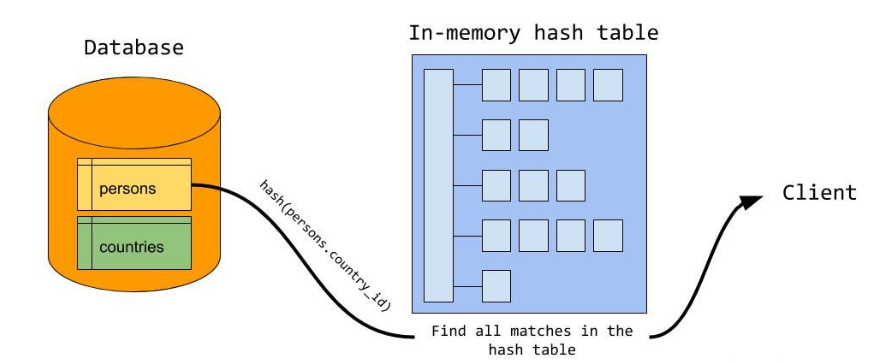

# 1. 索引

索引是一种能够帮助Mysql高效的从外部存储设备区检索数据的一种数据结构，在Mysql的InnoDB引擎中采用的是B+树的结构去实现索引和数据的存储。

优点：

1. 通过B+树的结构来存储数据，可以大大减少数据检索时的磁盘IO次数，从而提升数据查询的性能。
2. B+树索引在进行范围查找的时候，只需要找到起始结点，然后基于叶子结点的链表结构往下读取即可，查询效率较高。
3. 唯一索引保证数据的唯一性

缺点：

1. 数据的增加、修改、删除，涉及索引的维护，当数据量较大的情况下，索引的维护会带来较大的性能开销。
2. 如果字段的重复数据过多，创建索引后性能反而会降低。

## 1.1 索引类型

1. 普通索引：基于普通字段建立的索引。
2. 唯一索引：索引字段的值必须唯一，而且不能有空值。
3. 主键索引：特殊的唯一索引，不允许有空值，每个表仅允许有一个主键。
4. 复合索引：在多个列上建立的索引，可以代替多个单一索引，相比多个单一索引开销更小。

**复合索引使用注意事项：**

- 根据where条件建立索引，不要过多使用索引，不然会对更新操作有很大影响。

- 如果表已经建立了(col1, col2)，就没有必要建立(col1)。

5. 全文索引：查询操作在数据量比较少的时候，可以使用like模糊查询，但是对于大量的文本数据检索效率很低。如果使用全文索引，查询速度会比like快很多倍。

**全文索引使用注意事项：**

- 全文索引必须在字符串、文本字段上建立。
- 全文索引字段值必须在最小字符和最大字符之间的才会有效。（innodb：3-84；myisam：4-84）
- 全文索引字段值要进行切词处理，按syntax字符进行切割，例如b+aaa，切分成b和aaa
- 全文索引匹配查询，默认使用的是等值匹配，例如a匹配a，不会匹配ab,ac。如果想匹配可以在布尔模式下搜索a*

```mysql
`select * from user where match(name) against('a*' in boolean mode);`
```

## 1.2 聚集索引和非聚集索引

**聚集索引**就是基于主键创建的索引，除了聚集索引以外的索引统称为非聚集索引。在InnoDB中，一张表的数据对应的物理文件是按照B+树来组织的，聚集索引就是按照每张表的主键来构建这样的一个B+树，叶子结点中存储了这个表中的每一行数据记录。

一个表中允许存在一个聚集索引和多个非聚集索引，因为每个聚集索引就是表的一个副本，多个聚集索引会浪费存储空间，增加表的维护成本。

非聚集索引的叶子节点存储的是主键值，而聚集索引的叶子节点存储的是记录。

## 1.3 索引失效

**索引失效的场景：**

- 对索引做函数运算
- 不符合最左前缀原则
- like使用不当
- 等等

**1. 对索引做函数运算：**

假设有下面这样一个sql语句，如果我们在为name字段创建了索引，那么索引的key保存的应该是小写的值，索引是没办法根据大写的值去查找的，除非对索引的每一个字段都执行这个函数，如果这样做还不如进行全表扫描。

`select * from user where LowerToUpper(name) = 'CANAL'`

**2. 不符合最左前缀原则：**

假设我们现在有个联合索引[**name,age**],那么此时该联合索引在底层排序是首先按照[**name**]字段进行排序，如果[**name**]相等，那么再按照[**age**]进行排序。


- 单独使用age不会走索引：单独使用age的话age是无序的
- 联合索引如果有一个使用范围查询后面的索引就不能使用：假设对name进行范围查询，那么name字段是有序的，而age字段是无序的，无序自然不能使用索引

`select * from 表名 where name + 范围查找 and age = 14; `

**3. like使用不当：**

`select * from 表名 where name like %名字 and age = 1`

在上面的sql语句中，%名字相当于name使用了范围查询，所以age是无序的，所以不能使用索引。

## 1.4 B+树原理

HDD硬盘会将盘片划分为512kb的扇区，而SDD硬盘是由4kb的page组成的。

文件系统中一个块的大小为4kb。

Mysql中最小的存储单元是页，一个页的默认大小为16kb，每次IO操作会读取16kb的数据，然后将这16kb的数据放到BufferPool中，而在BufferPool中，每个ByteBuffer的大小恰好是16kb。


**程序的局部性原理**：一个数据在程序运行过程中，如果被引用过一次，那后续很有可能会再被引用到；一个数据被访问到过后，这个数据所在的位置附近的位置很有可能在程序后续运行中被访问到。

由于程序的局部性原理，磁盘在每一次发生读操作的时候，都会在找到目标数据之后连续读取4kb的数据。所以在文件系统中，即使文件只存储了一个字节，但是占用物理空间仍然为4kb。

Mysql加载一次数据，HDD要发生32次顺序读，而SDD只需要4次。


上图是一级索引的结构图。假设每条记录的大小为512B，那么一个page可以存储32条记录。假设主键ID是long型的数据，占8B，而索引指针占6B，那么一个page可以存储1170个索引。


上图是二级索引的结构图。

## 1.5 插入数据

### 1.5.1 页分裂原理

Mysql在新建一个表的时候会创建一个和其他page大小相同的根页(16KB)，这个根页中不存在任何记录和索引数据。

- 向表中插入数据时，数据首先被写到根页中
- 当根页被写满的时候，会分配一个page，将根页中的数据移动到这个page中
- 紧接着这个page做页分裂操作（即先分配一个page，然后把主键值较大的数据移动到新分配的page中）。
- 页分裂结束后，根页自动转换成一级索引，在一级索引中通过page number指向相关的数据在哪个page中。

### 1.5.2 B+树根页不动

根页不动指的是，每次访问数据都会从根页开始，也就是说根页是一个入口，即使page超过了一级索引能够覆盖的范围，根页就会转换成二级索引，访问数据还是从这个根页开始。 

### 1.5.3 插入数据

由于页分裂原理，如果插入的数据的主键不是自增的，那么每次插入数据还可能需要做数据的移动，所以主键索引最好设置成无意义自增的。

## 1.6 Mysql的内存自适应哈希索引-Adaptive Hash Index

### 1.6.1 正常查找记录过程

查找一个记录的过程（不跟据主键查询）：

- 首先将普通索引的根页加载到内存，然后顺序遍历索引
- 当找到对应的索引时，根据记录的page编号找到对应的page
- 然后将这个page加载到内存中，顺序遍历叶子节点，找到目标数据（存放的是主键值）
- 根据主键值二次遍历聚集索引
- 首先将主键索引的根页加载到内存，然后顺序遍历主键索引
- 找到对应的索引时，将对应的page加载到内存
- 遍历叶子节点，找到目标记录的完整内容、

简单来说即：**根据普通索引找到主键值，再根据主键值二次遍历聚集索引找到完整的记录**


### 1.6.2 自适应哈希索引

为了加速查询，在InnoDB的BufferPool中开辟了一块内存，这块内存就叫做自适应哈希索引。

自适应哈希索引像一个索引的索引，key是经常访问到的索引，value就是完整的记录的位置，访问频率较高的数据就会自动生成索引。它是对InnoDB的缓冲池中的page创建索引，针对的数据只是内存中的数据，所以查询效率很快。


### 1.6.3 自适应哈希索引的原理和注意事项


## 1.7 没有索引时Mysql如何查找数据

page在物理存储通过双向链表连接，page内部的记录由单项链表连接，没有索引时，Mysql做全表扫描。

# 2. 事务

事务是数据库管理系统（DBMS）执行过程中的一个逻辑单位，由一个有限的数据库操作序列构成。

## 2.1 事务的四大特性：

1. 原子性：对数据库的一系列操作，要么全部成功，要么全部失败，不可能出现部分成功的情况。
2. 一致性：对数据库的完整性约束没有被破坏，在事务执行前后都是合法的数据状态。
3. 隔离性：多个事务彼此之间完全隔离、互不干扰。
4. 持久性：只要事务提交成功，那么对数据库的修改就被永久保存下来，不可能因为任何原因回到原来的状态。

## 2.2 事务的状态

1. **活动**：当事务对应的数据库正在执行过程中，则该事务处于**活动**状态。
2. **部分提交的**：当事务中最后一个操作执行完成，但还未将变更刷新到磁盘时，则该事务处于**部分提交**状态。
3. **失败的**：当事务处于**活动**或者**部分提交**状态时，由于某些错误导致事务无法继续执行，则事务处于**失败**状态。
4. **中止的**：当事务处于**失败**状态，且回滚操作执行完毕，数据恢复到事务执行之前的状态时，该事务处于**中止**状态。
5. **提交的**：当事务处于**部分提交**状态，并且将修改过的数据都同步到磁盘之后，此时该事务处于**提交**状态。


## 2.3 事务并发执行遇到的问题

1. 脏写：一个事务修改了其他事务未提交的数据
2. 脏读：一个事务读到了其他事务未提交的数据
3. 不可重复读：一个事务执行过程中，读取到其他事务修改或者删除的数据，导致两次读取结果不一致。
4. 幻读：一个事务执行过程中，读取到其他事务新插入的数据，导致两次读取结果不一致。

脏写的问题太严重，任何隔离级别都应该避免。

## 2.4 四种隔离级别

1. Read Uncommitted：读未提交，允许读取未提交的记录
2. Read Committed：读已提交，只允许读已提交的记录
3. Repeatable Read：可重复读，InnoDB利用间隙锁禁止幻读发生
4. Serializable：串行化，事务串行执行


InnoDB支持四个隔离级别，隔离级别越高，事务的并发度就越低，InnoDB使用可重复读作为事务默认隔离级别。

### 2.4.1 隔离级别与锁的关系

- 读未提交：读操作不加锁，写操作加写锁且直到事务提交或回滚
- 读已提交：读操作加读锁，写操作加写锁且直到事务提交或回滚
- 可重复读：读操作加读锁且直到事务提交或回滚，写操作加写锁且直到事务提交或回滚
- 串行化：读操作和写操作都加写锁，且直到事务提交或回滚，粒度为表级

# 3. MVCC

MVCC(Multi Version Concurrency Control，多版本并发控制)，通过维护数据的历史版本，解决并发访问下的读一致性问题。

`MySQL`在可重复读隔离级别下可以防止幻读的问题出现，但也会出现提交覆盖的问题。

相对于传统隔离级别基于锁的实现方式，`MySQL` 是通过`MVCC`（多版本并发控制）来实现读-写并发控制，又是通过两阶段锁来实现写-写并发控制的。`MVCC`是一种无锁方案，用以解决事务读-写并发的问题，能够极大提升读-写并发操作的性能。

## 3.1 版本链

在InnoDB中，每行记录实际上都包含两个隐藏字段：事务id(**trx_id**)和回滚指针(**roll_pointer**)。

1. **trx_id**：事务id，每次修改某行记录时，都会把该事务的事务id赋值给**trx_id**隐藏列。
2. **roll_pointer**：回滚指针，每次修改某行记录时，都会把**undo**日志地址赋值给**roll_pointer**隐藏列。

由于每次变动都会先把`undo`日志记录下来，并用`roll_pointer`指向`undo`日志地址。因此可以认为，**对该条记录的修改日志串联起来就形成了一个`版本链`，版本链的头节点就是当前记录最新的值**。


## 3.2 ReadView

对于使用RU隔离级别的事务，只需要读取版本链上最新版本的记录；

对于使用串行化的事务，InnoDB使用加锁的方式来访问记录。

而`Read Committed`和`Repeatable Read`隔离级别来说，都需要读取已经提交的事务所修改的记录，也就是说如果版本链中某个版本的修改没有提交，那么该版本的记录时不能被读取的。所以需要确定在`Read Committed`和`Repeatable Read`隔离级别下，版本链中哪个版本是能被当前事务读取的。于是`ReadView`的概念被提出以解决这个问题。

`ReadView`相当于某个时刻表记录的一个**快照**，在这个快照中我们能获取到与当前记录相关的事务中，哪些事务是已提交的稳定事务，哪些是正在活跃的事务，哪些是生成快照之后才开启的事务。由此我们就能根据可见性比较算法判断出版本链中能被读取的最新版本记录。

可见性比较算法是基于事务ID的比较算法。首先我们需要知道的一个事实是：事务`id`是递增分配的。从`ReadView`中我们能获取到生成快照时刻系统中活跃的事务中最小和最大的事务`id`（最大的事务`id`实际上是系统中将要分配给下一个事务的`id`值），这样我们就得到了一个活跃事务`id`的范围，我们可称之为`ACTIVE_TRX_ID_RANGE`。那么小于这个范围的事务id对应的事务都是已提交的稳定事务，大于这个范围的事务都是在快照生成之后才开启的事务，而在`ACTIVE_TRX_ID_RANGE`范围内的事务中除了正在活跃的事务，也都是已提交的稳定事务。

有了以上信息之后，我们顺着版本链从头结点开始查找最新的可被读取的版本记录：

1、首先判断版本记录的`DB_TRX_ID`字段与生成`ReadView`的事务对应的事务ID是否相等。如果相等，那就说明该版本的记录是在当前事务中生成的，自然也就能够被当前事务读取；否则进行第2步。

2、如果版本记录的`DB_TRX_ID`字段小于范围`ACTIVE_TRX_ID_RANGE`，表明该版本记录是已提交事务修改的记录，即对当前事务可见；否则进行下一步。

3、如果版本记录的`DB_TRX_ID`字段位于范围`ACTIVE_TRX_ID_RANGE`内，如果该事务ID对应的不是活跃事务，表明该版本记录是已提交事务修改的记录，即对当前事务可见；如果该事务ID对应的是活跃事务，那么对当前事务不可见，则读取版本链中下一个版本记录，重复以上步骤，直到找到对当前事务可见的版本。

如果某个版本记录经过以上步骤判断确定其对当前事务可见，则查询结果返回此版本记录；否则读取下一个版本记录继续按照上述步骤进行判断，直到版本链的尾结点。如果遍历完版本链没有找到对当前事务可见的版本，则查询结果为空。

在`MySQL`中，`Read Committed`和`Repeatable Read`隔离级别下的区别就是它们生成`ReadView`的时机不同。

**读已提交每次执行查询语句都会生成新的`ReadView`，所以在`Read Committed`隔离级别下的事务读取到的是查询时刻表中已提交事务修改之后的数据。**

**在`Repeatable Read`隔离级别下的事务只会在第一次执行查询时生成`ReadView`，该事务中后续的查询操作都会沿用这个`ReadView`，因此此隔离级别下一个事务中多次执行同样的查询，其结果都是一样的，这样就实现了可重复读。**

## 3.3 快照读和当前读

### 3.3.1 快照读

在`Read Committed`和`Repeatable Read`隔离级别下，普通的`SELECT`查询都是读取`MVCC`版本链中的一个版本，相当于读取一个快照，因此称为快照读。这种读取方式不会加锁，因此读操作时非阻塞的，因此也叫非阻塞读。

在标准的`Repeatable Read`隔离级别下读操作会加`S锁`，直到事务结束，因此可以阻止其他事务的写操作；**但在`MySQL`的`Repeatable Read`隔离级别下读操作没有加锁，不会阻止其他事务对相同记录的写操作，因此在后续进行写操作时就有可能写入基于版本链中的旧数据计算得到的结果，这就导致了提交覆盖的问题**。想要避免此问题，就需要另外加锁来实现。

### 3.3.2 当前读

之前提到`MySQL`有两种锁定读的方式（即不普通的select语句）：

```javascript
SELECT ... LOCK IN SHARE MODE; // 读取时对记录加S锁，直到事务结束

SELECT ... FOR UPDATE; // 读取时对记录加X锁，直到事务结束
```

这种读取方式读取的是记录的当前最新版本，称为当前读。另外对于`DELETE`、`UPDATE`操作，也是需要先读取记录，获取记录的`X锁`，这个过程也是一个当前读。由于需要对记录进行加锁，会阻塞其他事务的写操作，因此也叫加锁读或阻塞读。

当前读不仅会对当前记录加行记录锁，还会对查询范围空间的数据加间隙锁（`GAP LOCK`），因此可以阻止幻读问题的出现。

## 3.4 MVCC有没有解决幻读问题

1. 如果事务A先执行select语句查询某记录，再对该语句进行修改，最后再执行select语句查询，会出现幻读问题。因为事务A的更新操作将该记录的事务id修改为事务A的id，导致该记录对事务A可见。


2. 如果事务A先执行查询某记录的操作，之后事务B再插入该记录并提交，然后事务A再执行select for update语句，那么也会产生幻读问题。


# 4. 锁

事务并发访问同一资源的情况主要分为`读-读`、`写-写`和`读-写`三种。

1. `读-读` 即并发事务同时访问同一行数据记录。由于两个事务都进行只读操作，不会对记录造成任何影响，因此并发读完全允许。
2. `写-写` 即并发事务同时修改同一行数据记录。这种情况下可能导致`脏写`问题，这是任何情况下都不允许发生的，因此只能通过`加锁`实现，也就是当一个事务需要对某行记录进行修改时，首先会先给这条记录加锁，如果加锁成功则继续执行，否则就排队等待，事务执行完成或回滚会自动释放锁。
3. `读-写` 即一个事务进行读取操作，另一个进行写入操作。这种情况下可能会产生`脏读`、`不可重复读`、`幻读`。最好的方案是**读操作利用多版本并发控制（`MVCC`），写操作进行加锁**。

## 4.1 锁的粒度

1. 行级锁：作用在数据行上
2. 表级锁：作用在整张数据表上

## 4.2 锁的分类

为了实现`读-读`之间不受影响，并且`写-写`、`读-写`之间能够相互阻塞，`Mysql`使用了`读写锁`的思路进行实现，具体来说就是分为了`共享锁`和`排它锁`：

1. `共享锁(Shared Locks)`：简称`S锁`，在事务要读取一条记录时，需要先获取该记录的`S锁`。`S锁`可以在同一时刻被多个事务同时持有。我们可以用`select ...... lock in share mode;`的方式手工加上一把`S锁`。
2. `排他锁(Exclusive Locks)`：简称`X锁`，在事务要改动一条记录时，需要先获取该记录的`X锁`。`X锁`在同一时刻最多只能被一个事务持有。`X锁`的加锁方式有两种，第一种是自动加锁，在对数据进行增删改的时候，都会默认加上一个`X锁`。还有一种是手工加锁，我们用一个`FOR UPDATE`给一行数据加上一个`X锁`。

如果一个事务已经持有了某行记录的`S锁`，另一个事务是无法为这行记录加上`X锁`的，反之亦然。

除了`共享锁(Shared Locks)`和`排他锁(Exclusive Locks)`，`Mysql`还有`意向锁(Intention Locks)`。意向锁是由数据库自己维护的，一般来说，当我们给一行数据加上共享锁之前，数据库会自动在这张表上面加一个`意向共享锁(IS锁)`；当我们给一行数据加上排他锁之前，数据库会自动在这张表上面加一个`意向排他锁(IX锁)`。**`意向锁`可以认为是`S锁`和`X锁`在数据表上的标识，通过意向锁可以快速判断表中是否有记录被上锁，从而避免通过遍历的方式来查看表中有没有记录被上锁，提升加锁效率**。例如，我们要加表级别的`X锁`，这时候数据表里面如果存在行级别的`X锁`或者`S锁`的，加锁就会失败，此时直接根据`意向锁`就能知道这张表是否有行级别的`X锁`或者`S锁`。

## 4.3 InnoDB中的表级锁

`InnoDB`中的表级锁主要包括表级别的`意向共享锁(IS锁)`和`意向排他锁(IX锁)`以及`自增锁(AUTO-INC锁)`。

系统实现自动给`AUTO_INCREMENT`修饰的列递增赋值的原理主要是两个：

1. `AUTO-INC锁`：在执行插入语句的时先加上表级别的`AUTO-INC锁`，插入执行完成后立即释放锁。**如果我们的插入语句在执行前无法确定具体要插入多少条记录，比如`INSERT ... SELECT`这种插入语句，一般采用`AUTO-INC锁`的方式**。
2. `轻量级锁`：在插入语句生成`AUTO_INCREMENT`值时先才获取这个`轻量级锁`，然后在`AUTO_INCREMENT`值生成之后就释放`轻量级锁`。**如果我们的插入语句在执行前就可以确定具体要插入多少条记录，那么一般采用轻量级锁的方式对AUTO_INCREMENT修饰的列进行赋值**。这种方式可以避免锁定表，可以提升插入性能。

> mysql默认根据实际场景自动选择加锁方式，当然也可以通过`innodb_autoinc_lock_mode`强制指定只使用其中一种。

## 4.4 **InnoDB中的行级锁**

前面说过，通过`MVCC`可以解决`脏读`、`不可重复读`、`幻读`这些读一致性问题，但实际上这**只是解决了普通`select`语句的数据读取问题**。事务利用`MVCC`进行的读取操作称之为`快照读`，所有普通的`SELECT`语句在`READ COMMITTED`、`REPEATABLE READ`隔离级别下都算是`快照读`。除了`快照读`之外，还有一种是`锁定读`，即在读取的时候给记录加锁，在`锁定读`的情况下依然要解决`脏读`、`不可重复读`、`幻读`的问题。由于都是在记录上加锁，这些锁都属于`行级锁`。

**`InnoDB`的行锁，是通过锁住索引来实现的，如果加锁查询的时候没有使用过索引，会将整个聚集索引都锁住，相当于锁表了**。根据锁定范围的不同，行锁可以使用`记录锁(Record Locks)`、`间隙锁(Gap Locks)`和`临键锁(Next-Key Locks)`的方式实现。

- 记录锁(Record Locks) 所谓记录，就是指聚集索引中真实存放的数据，比如上面的1、4、7、10都是记录。


显然，记录锁就是直接锁定某行记录。当我们使用唯一性的索引(包括唯一索引和聚集索引)进行等值查询且精准匹配到一条记录时，此时就会直接将这条记录锁定。例如`select * from t where id =4 for update;`就会将`id=4`的记录锁定。

- 间隙锁(Gap Locks) 间隙指的是两个记录之间逻辑上尚未填入数据的部分，比如上述的(1,4)、(4,7)等。


同理，间隙锁就是锁定某些间隙区间的。当我们使用用等值查询或者范围查询，并且没有命中任何一个`record`，此时就会将对应的间隙区间锁定。例如`select * from t where id =3 for update;`或者`select * from t where id > 1 and id < 4 for update;`就会将(1,4)区间锁定。

- 临键锁(Next-Key Locks) 临键指的是间隙加上它右边的记录组成的左开右闭区间。比如上述的(1,4]、(4,7]等。


临键锁就是记录锁(Record Locks)和间隙锁(Gap Locks)的结合，即除了锁住记录本身，还要再锁住索引之间的间隙。当我们使用范围查询，并且命中了部分`record`记录，此时锁住的就是临键区间。注意，临键锁锁住的区间会包含最后一个record的右边的临键区间。例如`select * from t where id > 5 and id <= 7 for update;`会锁住(4,7]、(7,+∞)。mysql默认行锁类型就是`临键锁(Next-Key Locks)`。当使用唯一性索引，等值查询匹配到一条记录的时候，临键锁(Next-Key Locks)会退化成记录锁；没有匹配到任何记录的时候，退化成间隙锁。

`间隙锁(Gap Locks)`和`临键锁(Next-Key Locks)`都是用来解决幻读问题的，在`已提交读（READ COMMITTED）`隔离级别下，`间隙锁(Gap Locks)`和`临键锁(Next-Key Locks)`都会失效！

# 5. mysql查询优化

## 5.1 定位低效

慢查询就是查询时间过长的查询，分为两种情况：

- 偶尔慢：DB在刷新脏页
- 一直慢：sql语句本身问题

慢查询优化：

- 开启mysql慢查询日志，通过慢查询日志定位到执行较慢的SQL语句。
- 利用explain关键字可以模拟优化器执行SQL查询语句，来分析SQL查询语句。 
- 通过查询的结果进行优化。

## 5.2 优化方式

- 首先分析语句，看看是否包含了额外的数据，可能是查询了多余的行并抛弃掉了，也可能是加了结果中不需要的列，要对SQL语句进行分析和重写。
- 分析优化器中索引的使用情况，修改语句使得尽可能的命中索引。
- 如果对语句的优化已经无法执行，可以考虑表中的数据是否太大，如果是的话可以横向纵向切表。

在Mysql8之前，子查询是针对外表的每一行都对子查询进行调用；而在Mysql8之后，会将子查询的结果保存为临时表，后续对子查询结果集的访问将直接通过临时表获得，整个过程子查询只需要执行一次。

## 5.3 Explain执行计划

通过explain获取执行SQL语句的信息，包括select语句执行过程中如何连接以及连接的顺序，执行计划在优化器优化完成后、执行器执行之前生成，然后执行器调用存储引擎检索数据。

**MySQL 执行计划的局限：**

- 只是计划，不是执行 SQL 语句，可以随着底层优化器输入的更改而更改
- EXPLAIN 不会告诉显示关于触发器、存储过程的信息对查询的影响情况
- EXPLAIN 不考虑各种 Cache
- EXPLAIN 不能显示 MySQL 在执行查询时的动态，因为执行计划在执行查询之前生成
- EXPALIN 部分统计信息是估算的，并非精确值
- EXPALIN 只能解释 SELECT 操作，其他操作要重写为 SELECT 后查看执行计划
- EXPLAIN PLAN 显示的是在解释语句时[数据库](https://cloud.tencent.com/solution/database?from=10680)将如何运行 SQL 语句，由于执行环境和 EXPLAIN PLAN 环境的不同，此计划可能与 SQL 语句实际的执行计划不同

explain的结果中type的含义：对表的访问方式，表示 MySQL 在表中找到所需行的方式，又称访问类型。

| type   | 含义                                                         |
| :----- | :----------------------------------------------------------- |
| ALL    | Full Table Scan，MySQL 将遍历全表以找到匹配的行，全表扫描，如果是 InnoDB 引擎是扫描聚簇索引 |
| index  | Full Index Scan，index 与 ALL 区别为 index 类型只遍历索引树  |
| range  | 索引范围扫描，常见于 between、<、> 等的查询                  |
| ref    | 非唯一性索引扫描，返回匹配某个单独值的所有记录，本质上也是一种索引访问 |
| eq_ref | 唯一性索引扫描，对于每个索引键，表中只有一条记录与之匹配，常见于主键或唯一索引扫描 |
| const  | 通过主键或者唯一索引来定位一条记录                           |
| system | system 是 const 类型的特例，当查询的表只有一行的情况下，使用 system |
| NULL   | MySQL 在优化过程中分解语句，执行时甚至不用访问表或索引       |

从上到下，性能从差到好，一般来说需要保证查询至少达到 range 级别， 最好达到 ref。

# 6. Mysql8的Hash Join算法

Mysql8中推出了一种新的join算法**Hash Join**，比**nested loop**更加高效。以下面这条SQL语句为例：

```mysql
SELECT 
  given_name,country_name
FROM 
  persons JOIN countries
  ON persons.country_id = countries.country_id;
```

hash join工作过程分为两个阶段：

- build构建阶段
- probe探测阶段

## 6.1 构建阶段

从参与join的两个表中选择占用空间小的那个表（而不是行数少的），假设选择了countries表。

首先对countries表中的join字段值进行hash计算：

```mysql
hash(countries.country_id)
```

计算后放入内存中hash table的相应位置，所有行都存放到 hash table 之后，构建阶段完成。


## 6.2 探测阶段

对persons表中的每行join字段的值进行hash计算：

```mysql
hash(persons.country_id)
```

用计算结果到内存的hash table中进行查找匹配，找到一行就发给client。这样就完成了整个join操作，每个表只扫描一次就可以，扫描时间也是恒定的，非超高效。



实际环境中，如果有比较大的表超过了可用内存时，需要溢出到磁盘。

## 6.3 溢出到磁盘

在构建阶段，如果内存满，会把表中剩余数据以多个块文件的形式写到磁盘上，Mysql保证每个块文件的大小是适合内存的。决定某一行记录写入哪个块文件也是hash决定的。

```mysql
hash_2(countries.country_id)
```


对于大表，构建分为了两步：

- 写入内存
- 写入块文件

然后是探测阶段，首先扫描一遍persons表的每一行，和内存中的hash table进行匹配。然后**把person表中的数据也写入多个块文件中**。至于怎么决定某一行记录写入哪个块文件，和构建阶段写入块文件的思路相同，这样，构建阶段的块文件和此处的块文件就是一一对应的关系了。

在正常的探测流程走完之后，就开始处理这些块文件中的内容，逐一加载构建阶段的块文件到内存中，加载过程和正常的构建过程相同，对块文件中的每行数据进行hash计算，放入内存的hash table中。

构建好一个块文件之后，选择与其对应的探测块文件开始探测，例如构建的是第0个构建块文件，那么就选择第0个探测块文件。就这样一对一对的块文件进行处理，直到全部完成。

## 6.4 小结

hash join算法先选一个小表，放入内存的 hash table，然后扫描另一个表，与 hash table 匹配出结果数据。

当表太大，无法一次放入内存时，就分而治之，写入块文件，再对每个块文件走一遍正常时的流程。
