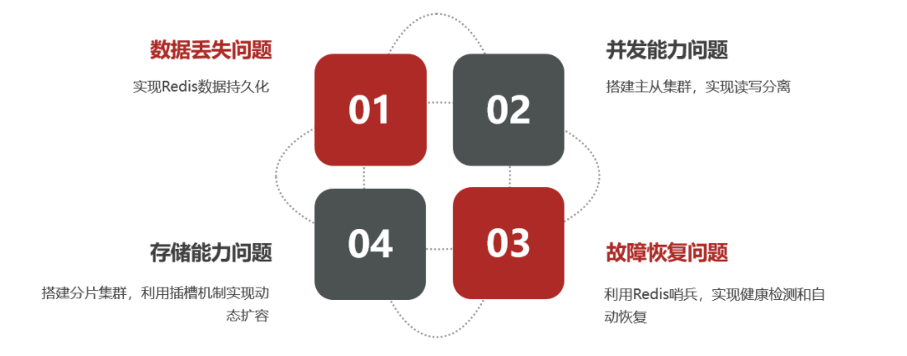
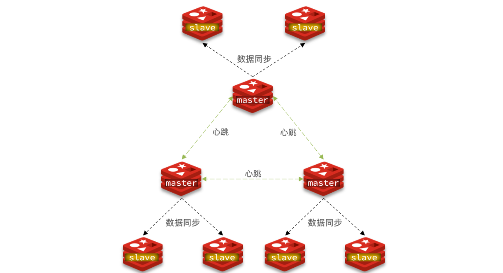

分布式缓存——基于Redis集群解决单机Redis存在的问题

单机Redis存在的问题：

# 1. Redis持久化

两种方案：

1. RDB持久化
2. AOF持久化

## 1.1 RDB持久化

RDB全称Redis DataBase Backup file（Redis数据备份文件），也被叫做Redis数据快照。简单来说就是把内存中的所有数据都记录到硬盘中。当Redis实例故障重启后，从硬盘读取快照文件，恢复数据。快照文件称为RDB文件。

### 1.1.1 执行时机

RDB持久化会在以下四种情况下执行：

- 执行save命令：由Redis主进程来执行RDB，会阻塞所有命令。
- 执行bgsave命令：开启子进程执行RDB，避免主进程受到影响。
- Redis停机时：Redis停机时会执行一次save命令，实现RDB持久化

- 触发RDB条件时：

### 1.1.2 RDB原理

bgsave开始时会fork主进程得到子进程，子进程共享主进程的内存数据。完成fork后读取内存数据并写入RDB文件。

fork采用的是copy-on-write技术：

- 当主进程执行读操作时，访问共享内存。
- 当主进程执行写操作时，会拷贝一份数据，执行写操作。

RDB方式bgsave的基本流程：

1. fork主进程得到一个子进程，共享内存空间
2. 子进程读取内存数据并写入新的RDB文件
3. 用新的RDB文件替换旧的RDB文件

## 1.2 AOF持久化

### 1.2.1 AOF原理

AOF全称为Apend Only File（追加文件）。Redis处理的每一个写命令都会记录在AOF文件，可以看作命令日志文件。

### 1.2.2 AOF文件重写

因为是记录命令，AOF文件会比RDB文件大的多。而且AOF会记录对同一个key的多次写操作，但只有最后一次写操作才有意义。通过执行bgrewriteaof命令，可以让AOF文件执行重写功能，用最少的命令达到相同效果。

### 1.2.3 AOF和RDB对比

# 2. Reids集群

## 2.1 搭建主从架构

单节点Redis的并发能力是有上限的，要进一步提高Redis的并发能力，就需要搭建主从集群，实现读写分离。

## 2.2 主从数据同步原理

### 2.2.1 全量同步

主从第一次建立连接时，会执行全量同步，将master节点的所有数据都拷贝给slave节点，流程：

master如何得知salve是第一次来连接呢？？

有几个概念，可以作为判断依据：

- **Replication Id**：简称replid，是数据集的标记，id一致则说明是同一数据集。每一个master都有唯一的replid，slave则会继承master节点的replid
- **offset**：偏移量，随着记录在repl_baklog中的数据增多而逐渐增大。slave完成同步时也会记录当前同步的offset。如果slave的offset小于master的offset，说明slave数据落后于master，需要更新。

因此slave做数据同步，必须向master声明自己的replid 和offset，master才可以判断到底需要同步哪些数据。

slave原来也是master，有自己的replid和offset，当第一次变成slave，与master建立连接时，发送的replid和offset是自己的replid和offset。

master判断slave发送来的replid与自己的不一致，说明这是一个全新的slave，就知道要做全量同步了。

master会将自己的replid和offset都发送给这个slave，slave保存这些信息。以后slave的replid就与master一致了。

因此，**master判断一个节点是否是第一次同步，就是看replid是否一致**。

### 2.2.2 增量同步

全量同步需要先做RDB，然后将RDB文件通过网络传输个slave，成本太高了。因此除了第一次做全量同步，其它大多数时候slave与master都是做**增量同步**。

增量同步就是只更新slave与master存在差异的部分数据。

### 2.2.3 repl_backlog原理

master怎么知道slave与自己的数据差异在哪里？

repl_backlog文件是一个固定大小的环形数组，**角标到达数组末尾后，会再次从0开始读写**，这样数组头部的数据会被覆盖。

repl_baklog中会记录Redis处理过的命令日志及offset，包括master当前的offset，和slave已经拷贝到的offset：

## 小结

全量同步和增量同步的区别：

- 全量同步：master将完整内存数据生成RDB，发送RDB到slave。
- 增量同步：slave提交自己的offset到master，master获取repl_backlog中的offset之后的命令给slave

什么时候执行全量同步？

- slave节点第一次连接master节点时
- repl_backlog中的offset被覆盖时

什么时候执行增量同步？

- slave节点断开又恢复，并且在repl_backlog中能找到offset时

# 3. Redis哨兵

Redis提供了哨兵（Sentinel）机制来实现主从集群的自动故障恢复。

## 3.1 哨兵原理

## 3.1.1 哨兵结构和作用

哨兵的结构如图：

哨兵的作用：

- **监控**：Sentinel会不断的检查master和slave是否按照预期工作。
- **自动故障恢复：**如果master故障，Sentinel会将一个slave提升为master。当故障实例恢复以后也以新的master为主。
- **通知：**Sentinel充当Redis客户端的服务发现来源，当集群发生故障转移时，会将最新信息推送给Redis的客户端。

### 3.1.2 集群监控原理

Sentinel基于心跳检测机制监测服务状态，每隔1s向集群的每个实例发送ping命令。

- 主观下线：如果某Sentinel节点发现某实例未在规定时间内响应，则认为该实例**主观下线**。
- 客观下线：若超过指定数量(quorum)的Sentinel都认为该实例主观下线，则该实例**客观下线**。quorum最好超过Sentinel实例数量的一半。

### 3.1.3 集群故障恢复原理

Sentinel选择新的master的依据：

- 首先判断slave节点与master节点断开时间长短，若超过指定值则会排除该slave节点。
- 然后判断slave节点的优先级，如果为0则不参与选举。
- 如果优先级相同，则判断slave节点的offset值，越大说明数据越新，优先级越高。
- 最后判断slave节点的运行id大小，越小优先级越高。

# 4. Redis分片集群

## 4.1 分片集群

主从和哨兵可以解决高可用、高并发的问题，但是还有两个问题没有解决：

- 海量数据存储
- 高并发写

使用**分片集群**可以解决上述问题：

分片集群的特征：

- 集群中有多个master，每个master保存不同数据
- 单个master都可以有多个slave节点
- master之间可以通过ping监测彼此健康状态
- 客户端请求可以访问集群任意节点，最终都会被转发到正确节点

## 4.2 散列插槽

Redis会把每一个master节点映射到0~16383共16384个插槽(hash slot)上，查看集群信息时就能看到：

数据key不是与节点绑定，而是与插槽绑定。redis会根据key的有效部分计算插槽值，分两种情况：

- key中包含"{}"，且"{}"中 至少包含1个字符，"{}"中的部分是有效部分。
- key中不包含"{}"，整个key都是有效部分。

### 4.2.1小结

Redis如何判断某个key应该在哪个实例？

- 将16384个插槽分配到不同的实例
- 根据key的有效部分计算哈希值，对16384取余
- 余数作为插槽，寻找插槽所在实例即可

如何将同一类数据固定保存在同一个Redis实例？

- 这一类数据使用相同的有效部分，例如key都以{typeId}作为前缀。

## 4.3 集群伸缩

## 4.4 故障转移

### 4.4.1 自动故障转移

### 4.4.2 手动故障转移

利用cluster failover命令可以手动让集群中的某个master宕机，切换到执行cluster failover命令的这个slave节点，实现无感知的数据迁移。

