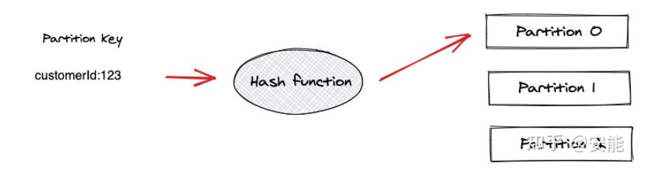

# 1. Kafka

Kafka是一个分布式的、支持分区的（partition）、多副本的（replica），（最初）基于zookeeper协调的分布式消息系统。

## 1.1 特性

- **高吞吐量、低延迟**：kafka每秒可以处理几十万条消息，它的最低延迟只有几毫秒。
- **可扩展性**：kafka集群支持热扩展
- **持久性、可靠性**：消息被持久化到本地磁盘，并且支持数据备份防止数据丢失
- **容错性**：允许集群中节点失败（若副本数量为n，则允许n-1个节点失败）
- **高并发**：支持数千个客户端同时读写

## 1.2 场景应用

- **日志收集**：可以用kafka收集各种服务的log，通过kafka以统一接口服务的方式开放给各种consumer，例如hadoop、Hbase等。
- **消息系统**：解耦和生产者和消费者、缓存消息等。
- **用户活动跟踪**
- **运营指标**
- **流式处理**
- **事件源**

## 1.3 重要思想

- **Consumergroup**：各个consumer可以组成一个组，每个消息只能被组中的一个consumer消费，如果一个消息可以被多个consumer消费的话，那么这些consumer必须在不同的组。
- **消息状态**：在Kafka中，消息的状态被保存在consumer中，broker不会关心哪个消息被消费了被谁消费了，只记录一个offset值（指向partition中下一个要被消费的消息位置），这就意味着如果consumer处理不好的话，broker上的一个消息可能会被消费多次。
- **消息持久化**：Kafka中会把消息持久化到本地文件系统中，并且保持极高的效率。
- **消息有效期**：Kafka会长久保留其中的消息，以便consumer可以多次消费，当然其中很多细节是可配置的。
- **批量发送**：Kafka支持以消息集合为单位进行批量发送，以提高push效率。
- **push-and-pull** :Kafka中的Producer和consumer采用的是push-and-pull模式，即Producer只管向broker push消息，consumer只管从broker pull消息，两者对消息的生产和消费是异步的。
- **Kafka集群中broker之间的关系**：不是主从关系，各个broker在集群中地位一样，我们可以随意的增加或删除任何一个broker节点。
- **负载均衡方面**： Kafka提供了一个 metadata API来管理broker之间的负载（对Kafka0.8.x而言，对于0.7.x主要靠zookeeper来实现负载均衡）。
- **同步异步**：Producer采用异步push方式，极大提高Kafka系统的吞吐率（可以通过参数控制是采用同步还是异步方式）。
- **分区机制partition**：Kafka的broker端支持消息分区，Producer可以决定把消息发到哪个分区，在一个分区中消息的顺序就是Producer发送消息的顺序，一个主题中可以有多个分区，具体分区的数量是可配置的。分区的意义很重大，后面的内容会逐渐体现。
- **离线数据装载**：Kafka由于对可拓展的数据持久化的支持，它也非常适合向Hadoop或者数据仓库中进行数据装载。
- **插件支持**：现在不少活跃的社区已经开发出不少插件来拓展Kafka的功能，如用来配合Storm、Hadoop、flume相关的插件。

# 2. 架构原理

Kafka是一种**高吞吐量的分布式发布订阅消息系统**。

## 2.1 名词解释

- **Producer**：Producer即生产者，消息的产生者，是消息的入口。
- **Broker**：Broker是kafka实例，每个服务器上有一个或多个kafka的实例，我们姑且认为每个broker对应一台服务器。每个kafka集群内的broker都有一个不重复的编号，如图中的broker-0、broker-1等……
- **Topic**：消息的主题，可以理解为消息的分类，kafka的数据就保存在topic。在每个broker上都可以创建多个topic。
- **Partition**：Topic的分区，每个topic可以有多个分区，分区的作用是做负载，提高kafka的吞吐量。同一个topic在不同的分区的数据是不重复的。
- **Replication**：每一个分区都有多个副本，副本的作用是做备胎。当主分区（Leader）故障的时候会选择一个备胎（Follower）上位，成为Leader。在kafka中默认副本的最大数量是10个，且副本的数量不能大于Broker的数量，follower和leader绝对是在不同的机器，同一机器对同一个分区也只可能存放一个副本（包括自己）。
- **Message**：每一条发送的消息主体。
- **Consumer**：消费者，即消息的消费方，是消息的出口。
- **Consumer Group**：我们可以将多个消费组组成一个消费者组，在kafka的设计中同一个分区的数据只能被消费者组中的某一个消费者消费。同一个消费者组的消费者可以消费同一个topic的不同分区的数据，这也是为了提高kafka的吞吐量！
- **Zookeeper**：kafka集群依赖zookeeper来保存集群的的元信息，来保证系统的可用性。

## 2.2 工作流程

**Producer在写入数据的时候永远的找leader**，不会直接将数据写入**follower**。

消息写入leader后，follower是主动的去leader进行同步的。producer采用push模式将数据发布到broker，每条消息追加到分区中，顺序写入磁盘，所以保证同一分区内的数据是有序的。

## 2.3 分区partition

kafka中Topic被分成多个Partition分区，Topic是一个逻辑概念，Partition是最小的存储单元，掌握着一个Topic的部分数据。

### 2.3.1 Offsets和消息顺序性

partition中的每条记录都会被分配一个唯一的序号，称为offset（偏移量），由kafka自动维护。当一条记录（消息）写入partition的时候，它就被追加到log文件的末尾，并被分配一个序号，作为offset。

一个partition内部的消息是有序的，而一个topic内部的消息是无序的，如果要求topic的消息有序，那么topic内部只能有一个partition。

### 2.3.2 partition给kafka提供了扩展能力

一个 Kafka集群由多个Broker 构成，每个 Broker 中含有集群的部分数据。Kafka 把 Topic 的多个 Partition 分布在多个 Broker 中。

**好处：**

- **把partition分散开，topic可以水平扩展。**若把所有partition放到一个broker上，那么这个topic的可扩展性会受限于这个broker的IO能力。
- **一个topic可以被多个consumer并行消费。**如果topic的所有partition都在一个broker中，那么支持的consumer数量就有限，而分散之后，可以支持更多的consumer。
- 一个consumer可以有多个实例，partition分布在多个broker，consumer的多个实例就可以连接不同的broker，大大提升消息处理的能力。可以让一个consumer实例负责一个partition，这样消息处理既清晰又高效。

### 2.3.3 partition给kafka提供了数据冗余

kafka为一个partition生成多个副本，并且把它们分散在不同的broker。如果一个broker故障了，consumer可以在其他broker上找到partition的副本，继续获取消息。

### 2.3.4 写入partition

一个topic有多个partition，向一个topic中发送消息的时候，具体是写入哪个Partition呢？有3种写入方式。

#### 2.3.4.1 使用partition key写入特定partition

partition key可以使用任意值，它会传递给一个哈希函数，由计算结果决定写入哪个partition，有相同partition key的消息会被放到相同的partition中。

例如使用User ID作为partition key，那么此ID的消息都会在同一个partition，这样可以保证此类消息的有序性。

**热点问题**：某一个 User 产生的消息特别多，那么此用户的消息都进入同一个Partition，导致某个Partition繁忙。

#### 2.3.4.2 由kafka决定

如果没有使用 Partition Key，Kafka 就会使用轮询的方式来决定写入哪个 Partition，消息会均衡的写入各个 Partition，但这样无法确保消息的有序性。

#### 2.3.4.3 自定义规则

Kafka 支持自定义规则，一个 Producer 可以使用自己的分区指定规则。

### 2.3.5 读取partition

kafka不像普通消息队列具有发布/订阅功能，它不会向consumer推送消息，consumer必须自己从topic的partition拉取消息。

一个consumer连接到一个broker的partition，从中依次读取消息。

消息的offset就是consumer的游标，根据offset来记录消息的消费情况。读完一条消息后，consumer会推进到partition的中的下一个offset继续读取消息。

offset的推进和记录都是consumer的责任，kafka不负责。

### 2.3.6 消费组

消费组即多个consumer组团消费一个topic，同组的consumer有相同的Group ID，Consumer Group机制会保障一条消息只被组内唯一一个consumer消费，不会重复消费。

消费组可以让多个partition并行消费，大大提高了消息的消费能力，最大并行度为topic的partition的数量。

例如一个 Topic 有 3 个 Partition，你有 4 个 Consumer 负责这个 Topic，也只会有 Consumer 工作，另一个作为后补队员，当某个 Consumer 故障了，它再补上去，是一种很好的容错机制。

## 2.4 producer向kafka写入消息，如何保证消息不丢失？

通过ACK应答机制。生产者向队列写入数据的时候，可以设置参数来确定kafka是否确认接收到数据，这个参数的值可设置为0、1、all。

- 0代表生产者向集群发送数据不需要等待集群返回，不保证消息发送成功。
- 1代表只要leader应答就可以发送下一条。
- all代表所有的follower都完成从leader的同步才会发下一条。