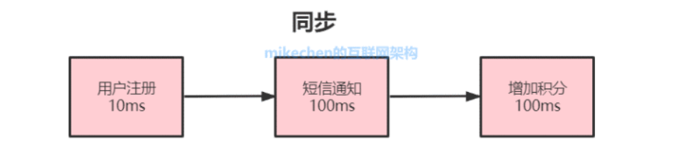
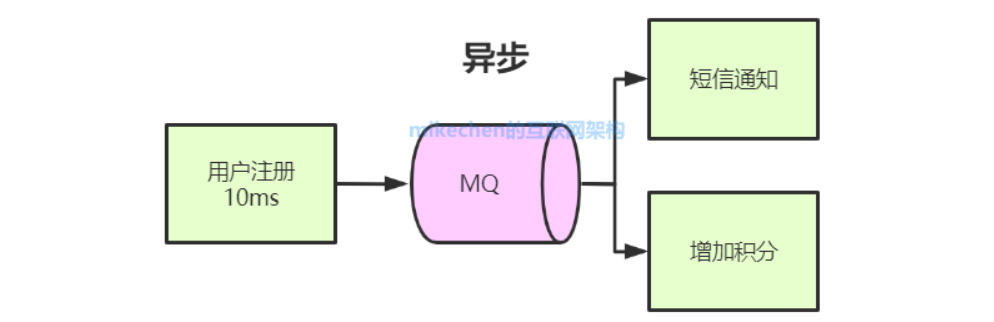
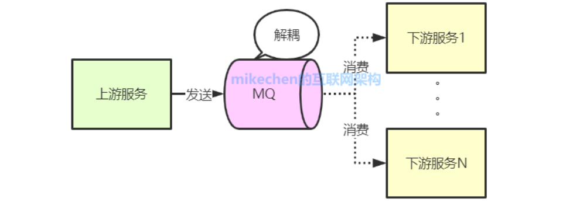
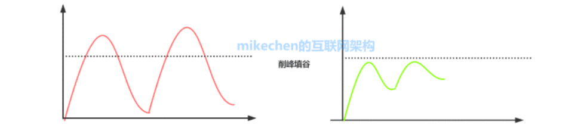
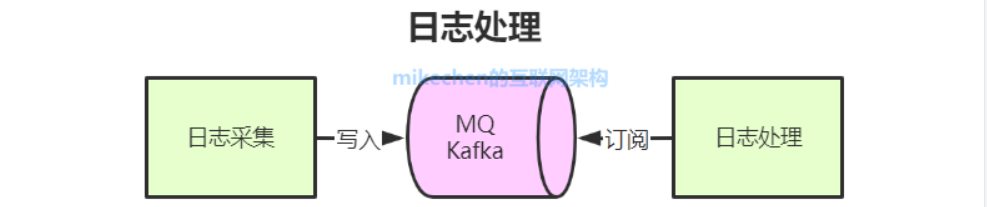
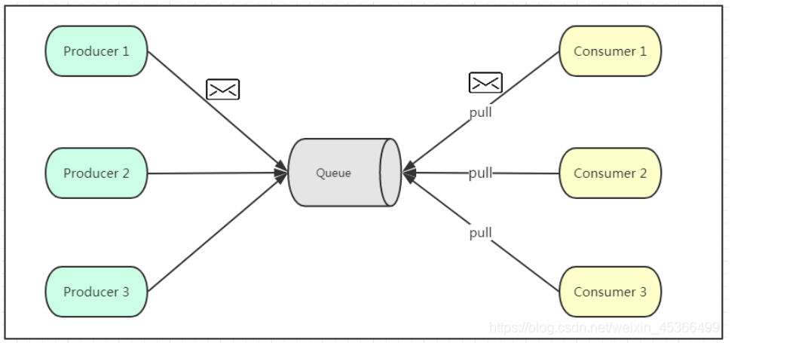
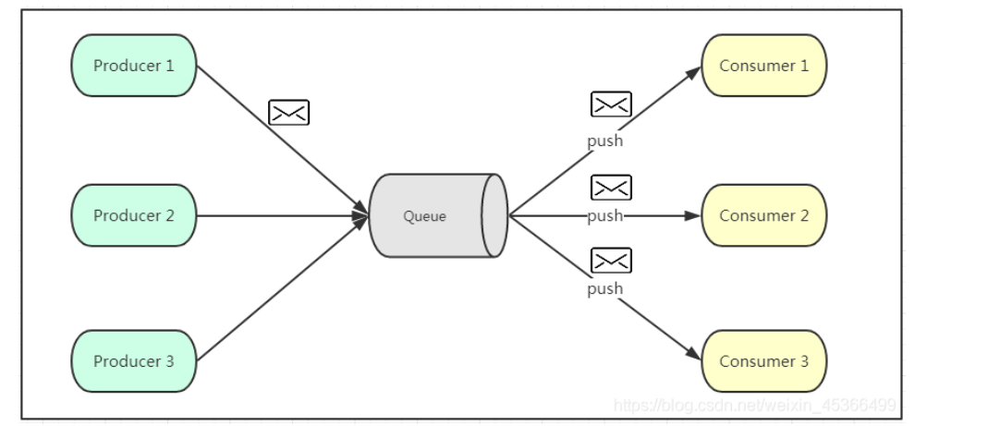
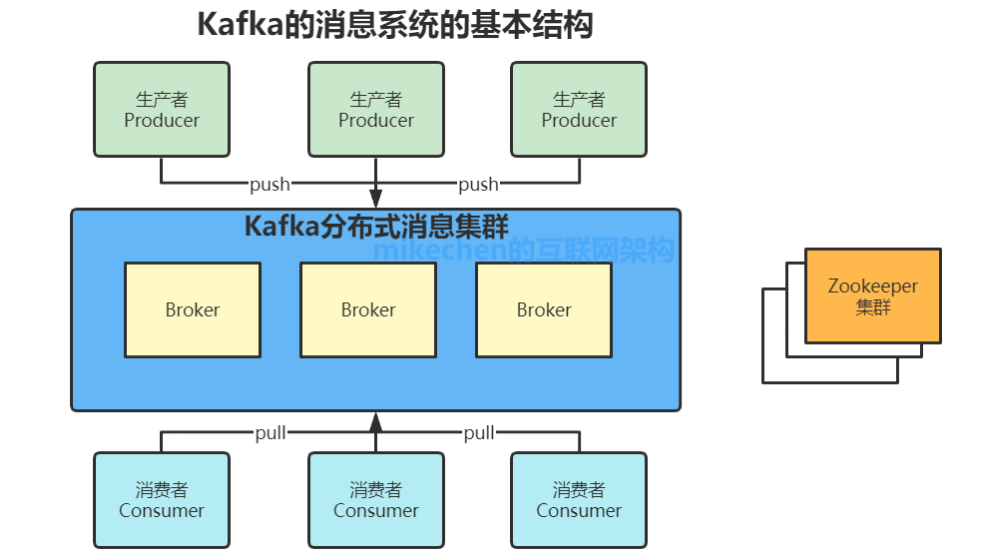
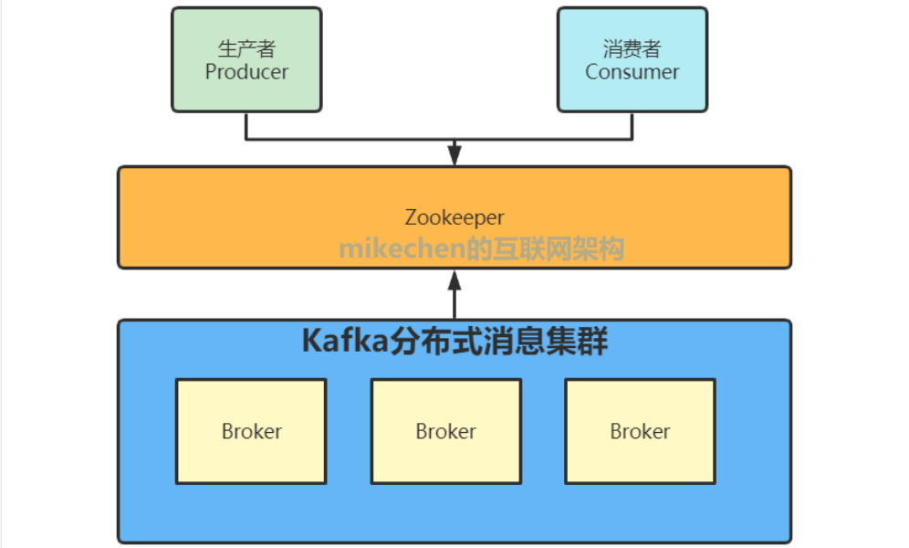

# 1. 为什么使用消息队列

消息队列（Message Queue，简述MQ），指保存消息的一个容器，本质是一个队列。

消息队列能够处理高并发业务场景的本质原因：在接收到100个用户请求后，不需要等待用户请求的服务做完返回接口，就可以给用户返回一个排队成功的消息。（本质上还是异步吧）

## 1.1 异步处理

**异步处理的主要目的**：减少请求响应时间，实现非核心流程异步化，提高系统响应性能。

**异步的典型场景**：将比较耗时而且不需要即时（同步）返回结果的操作，通过消息队列来实现异步化。

## 1.2 解耦

使用消息队列，消息的发送方和接收方不需要彼此联系，也不需要受对方影响。

## 1.3 流量削峰

**系统的峰值流量往往集中于一小段时间内，所以为了防止系统在短时间内的峰值流量冲垮，往往采用消息队列来削弱峰值流量，相当于消息队列做了一次缓冲**。

## 1.4 日志处理

将消息队列用在日志处理中，比如Kafka的应用，解决大量日志传输的问题。

# 2. 消息队列通信模式

## 2.1 点对点模式

**特点：**

- 点对点模式通常是基于拉取或者轮询的消息传送模型
- 发送到队列的消息被一个且只有一个消费者进行处理
- 生产者将消息放入消息队列后，由消费者主动的去拉取消息进行消费

**优点：**

- 消费者拉取消息的频率可以由自己控制

**缺点：**

- 消费者无法感知队列是否有消息需要消费，需要额外的线程去监控

## 2.2 发布订阅模式

**特点：**发布/订阅是一种消息范式，消息的发送者（称为发布者）不会将消息直接发送给特定的接收者（称为订阅者），而是通过消息通道广播出去，让订阅该消息主题的订阅者消费到。

**优点：**消费者被动接受推送，无需感知消费队列中是否有待消费的消息。

**缺点：**消息队列无法感知消费者的消费速度，所以推送速度是发布/订阅模型的一个问题。

# 2. Kafka

Kafka是一个分布式发布-订阅消息传递系统。

## 2.1 基本架构

**1、话题（Topic）** ：是特定类型的消息流。消息是字节的有效负载（Payload），话题是消息的分类名；

**2、生产者（Producer）** ：是能够发布消息到话题的任何对象；

**3、服务代理（Broker）** ：已发布的消息保存在一组[服务器](https://cloud.tencent.com/product/cvm?from=10680)中，它们被称为代理（Broker）或Kafka集群；

**4、消费者（Consumer）** ：可以订阅一个或多个话题，并从Broker拉数据，从而消费这些已发布的消息；

生产者将数据发送到Broker代理，Broker代理有多个话题topic，消费者从Broker获取数据。

## 2.2 zookeeper在kafka中的作用

### 2.2.1 对broker

- **状态：**zookeeper维护了一个正在运行并且属于集群的broker列表，记录了所有broker的存活状态，broker会向zookeeper发送心跳请求上报自己的状态。
- **控制器选举：**zookeeper负责从多个broker中选出控制器（leader）。kafka集群中有多个broker，其中有一个会被选举为控制器，控制器负责管理整个集群所有分区和副本的状态。
- **限额权限：**
- **记录ISR：**
- **node和topic注册：**
- **topic配置：**

### 2.2.2 对consumer

- **offset**
- **注册**
- **分区注册**

