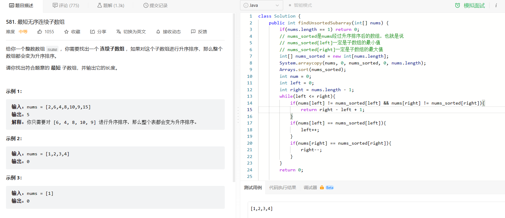

## 2023-4-4

### 1. 十六进制数转十进制

```java
// 定义进制
public static final BASE = 16;
// 将0-9a-fA-F存储到HashMap中
Map<Character, Integer> map = new HashMap<>();
map.put('0',0);
----------------
map.put('a',10);
----------------
map.put('A',10);
----------------
// 计算
int res = 0;
for (char c : number.toCharArray()) {
    res = res * BASE + map.get(c);
}
```

### 2. 给出一定数量的整数，剔除重复值并排序，升序输出

```java
// 使用TreeSet
Set set = new TreeSet();
----------------------
for(int i = 0; i < num; i++){
    set.add(in.nextInt());
}
for (Integer i : set) {
     System.out.println(i);
}
```

若需要降序排序

```java
		// 自定义Comparator实现TreeSet的降序排序（默认是升序排序）
        Set<Integer> set = new TreeSet<>(new Comparator<Integer>() {
            @Override
            public int compare(Integer o1, Integer o2) {
                return o1 - o2;
            }
        });
```

### 3. 一个字符串包含的不重复字符数

```java
// 使用set集合
Scanner in = new Scanner(System.in);
String s = in.nextLine();
char[] c = s.toCharArray();
Set<Character> set = new HashSet<>();
for (char ch : c) {
    // AISCII码在0-127范围内
	if(ch >= 0 && ch <= 127 && !set.contains(ch)){
    set.add(ch);
	}
}
System.out.println(set.size());
```

### 4. 给定一个target和一个数组，求数组中两数之和等于target的数组下标

```java
// 使用hash的方式解决问题，两数之和=target即target-num1=num2
// 所以将target-num1作为key，i作为value存到map中
if(map.containsKey(target - numbers[i]))
	return new int[]{map.get(target - numbers[i])+1, i+1};
else
	map.put(numbers[i], i);
// 时间复杂度为O(1)而空间复杂度为O(n)
```

## 2023-4-5

### 1. 删除字符串中出现最少的字符

```java
public static String delete(String str){
    // Map记录每个字母的次数
    Map<Character, Integer> map = new HashMap<>();
    for (char c : str.toCharArray()) {
        // 如果map中不存在这个c，则设为默认值0，再加1存到map中
        // 若map中存在这个c，则取出来+1存到map中
        map.put(c, map.getOrDefault(c, 0) + 1);
    }
    // 快速找出最少次数           
    int min = Integer.MAX_VALUE;
    for(int times : map.values()){
        min = Math.min(min, times);
    }
    // 遍历字符数组，判断每个字符在hashmap中的值是否等于min
    StringBuilder res = new StringBuilder();
    for(char c : str.toCharArray()){
        if(map.get(c) != min){
            res.append(c);
        }
    }
	return res.toString();
}
```

### 2. 10进制转IP地址和IP地址转10进制

```java
	private static final int N = 4;
    public static String convert(String str){
        // ipv4 -> int
        if(str.contains(".")){
            String[] fields = str.split("\\.");
            long result = 0;
            for(int i = 0; i < N; i++){
                result = result * 256 + Integer.parseInt(fields[i]);
            }
            return "" + result;
        }
        // int -> ipv4
        else{
            // ipv4的数值使用Long型数据接受
            long ipv4 = Long.parseLong(str);
            String result = "";
            for(int i = 0; i < N; i++){
                result = ipv4 % 256 + "." + result;
                ipv4 /= 256;
            }
            // 删除掉最后的"."
            return result.substring(0, result.length() -1);
        }
    }
```

## 2023-4-6

### 1. 字符串逆序

```java
	while(in.hasNextLine()){
        String s = in.nextLine();
        StringBuilder sb = new StringBuilder(s);
        System.out.println(sb.reverse().toString());
    }
```

### 2. 字符串排序

```java
	String[] array = new String[n];
    for(int i = 0; i < n; i++){
        array[i] = in.next();
    }
    Arrays.sort(array);
```

### 3. 合并区间


```java
// 对intervals升序排序		 
Collections.sort(intervals, (v1, v2)->v1.start - v2.start);
ArrayList<Interval> res = new ArrayList<>();
         int index = -1;
         for (Interval interval : intervals) {
             // 对每个interval，如果interval的左边界大于现在的边界的右边界
             if(index == -1 || interval.start > res.get(index).end){
                 // 那么将这个interval作为新的边界
                 res.add(interval);
                 // index是现在的边界的序号
                 index++;
             }else{
                 // 如果interval的左边界小于等于现在的边界的右边界，那么比较现在的右边界和interval的右边界
                 // 取最大的右边界作为现在的边界的右边界
                 res.get(index).end = Math.max(interval.end, res.get(index).end);
             }
         }
```

### 4. 成绩排序


```java
		Scanner in = new Scanner(System.in);
        HashMap<Integer, String> map = new HashMap<>();
        while(in.hasNextLine()){
            int n = in.nextInt();
            int flag = in.nextInt();
            int[][] score = new int[n][2];
            for(int i = 0; i < n; i++){
                String[] nameAndScore = in.nextLine().split(" ");
                score[i][0] = i;
                score[i][1] = Integer.parseInt(nameAndScore[1]);
                map.put(i,nameAndScore[0]);
            }
            Arrays.sort(score,(o1,o2)->{
                if(flag == 0){
                    return o2[1] - o1[1];   // 按照第二列降序排列，如果相等返回0，顺序不变
                }else {
                    return o1[1] - o2[1];
                }
            });
            for(int i = 0; i < n; i++){
                System.out.println(map.get(score[i][0]));
            }
        }
```

## 2023-4-10

### 1. 括号的最大嵌套深度

```java
		int n = s.length;
        int ans = 0;
        for(int i = 0, cnt = 0; i < n; i++){
            if(s.charAt(i) == '(') cnt++;
            else if(s.charAt(i) == ')') cnt--;
            ans = Math.max(ans, cnt);
        }
        return ans;
```

## 2023-4-19

### 1. 无重复字符串的排列组合

```java
class Solution {
    List<String> list = new ArrayList<>();
    StringBuilder path = new StringBuilder();

    public String[] permutation(String S) {
        char[] c = S.toCharArray();
        boolean[] isVisited = new boolean[S.length()];
        dfs(c,isVisited);
        String[] res = new String[list.size()];
        for(int i = 0; i < list.size(); i++){
            res[i] = list.get(i);
        }
        return res;

    }
    public void dfs(char[] c, boolean[] isVisited) {
        if(path.length() == c.length){
            list.add(new String(path.toString()));
            return;
        }
        for(int i = 0; i < c.length; i++){
            if(!isVisited[i]){
                path.append(c[i]);
                isVisited[i] = true;
                dfs(c,isVisited);
                isVisited[i] = false;
                path.deleteCharAt(path.length() - 1);
            }
        }
    }
}
```

### 2. 有重复字符串的排列组合

```java
class Solution {
    List<String> list = new ArrayList<>();
    StringBuilder path = new StringBuilder();

    public String[] permutation(String S) {
        char[] c = S.toCharArray();
        boolean[] isVisited = new boolean[S.length()];
        dfs(c,isVisited);
        String[] res = new String[list.size()];
        for(int i = 0; i < list.size(); i++){
            res[i] = list.get(i);
        }
        return res;

    }
    public void dfs(char[] c, boolean[] isVisited) {
        if(path.length() == c.length){
            list.add(new String(path.toString()));
            return;
        }
        for(int i = 0; i < c.length; i++){
            if(!isVisited[i]){
                path.append(c[i]);
                isVisited[i] = true;
                dfs(c,isVisited);
                isVisited[i] = false;
                path.deleteCharAt(path.length() - 1);
            }
        }
    }
}
```

## 2023-5-6



```java
class Solution {
    public int findUnsortedSubarray(int[] nums) {
        if(nums.length == 1) return 0;
        // nums_sorted是nums经过升序排序后的数组，也就是说
        // nums_sorted[left]一定是子数组的最小值
        // nums_sorted[right]一定是子数组的最大值
        int[] nums_sorted = new int[nums.length];
        System.arraycopy(nums, 0, nums_sorted, 0, nums.length);
        Arrays.sort(nums_sorted);
        int num = 0;
        int left = 0;
        int right = nums.length - 1;
        while(left <= right){
            if(nums[left] != nums_sorted[left] && nums[right] != nums_sorted[right]){
                return right - left + 1;
            }
            if(nums[left] == nums_sorted[left]){
                left++;
            }
            if(nums[right] == nums_sorted[right]){
                right--;
            }
        }
        return 0;

    }
}
```

