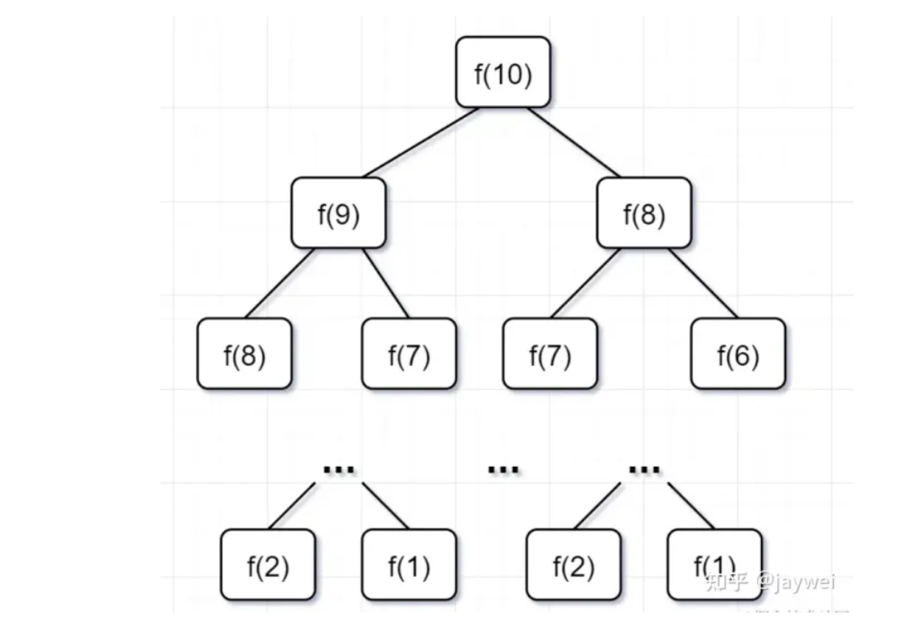
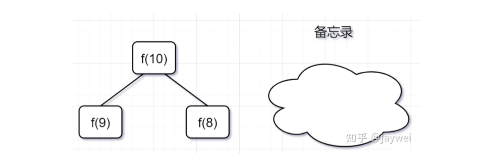
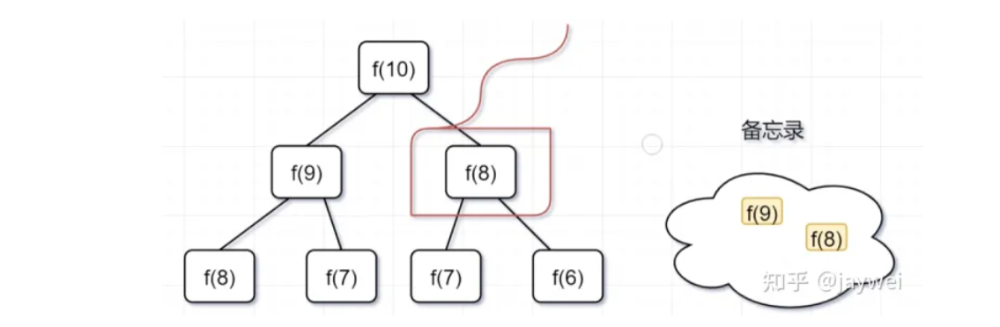
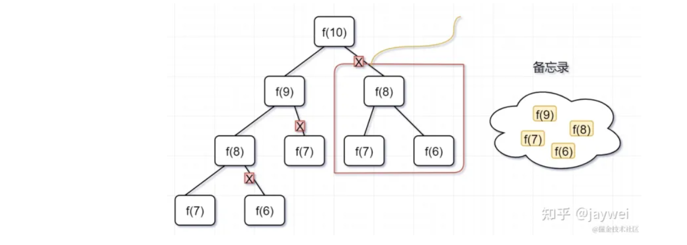
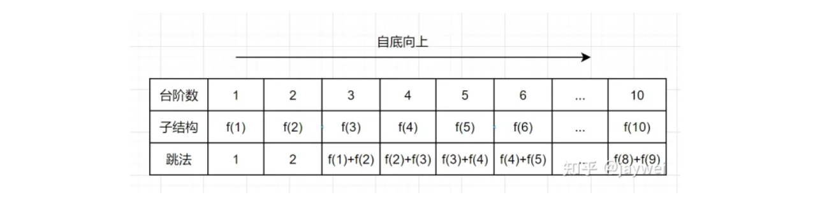
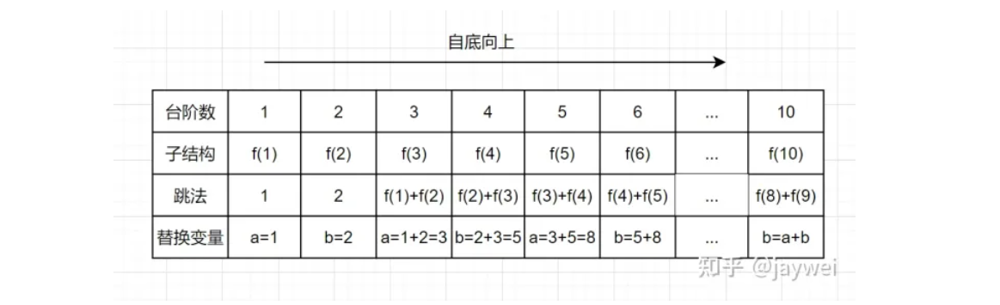
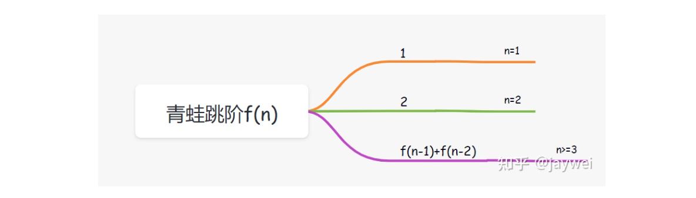
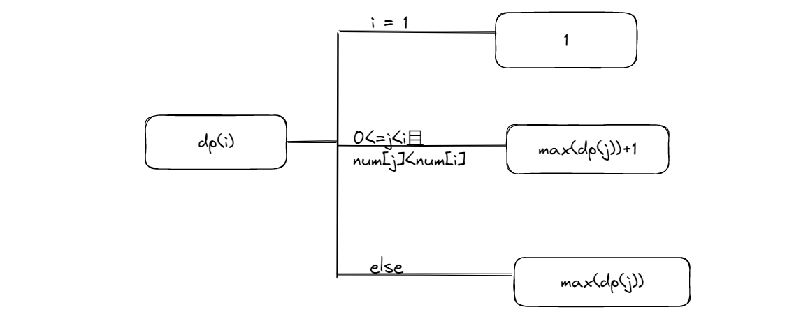

## 1 什么是动态规划

动态规划(Dynamic programming,DP)，是一种在数学、管理科学、计算机科学、经济学和生物信息学中使用的，通过把原问题分解为相对简单的子问题的方式求解复杂问题的方法。动态规划常常适用于有重叠子问题和最优子结构性质的问题。

**核心思想**：拆分子问题，记忆过往，减少重复计算

- A ： "1+1+1+1+1+1+1+1 =？"
- A ： "上面等式的值是多少"
- B ： 计算 "8"
- A : 在上面等式的左边写上 "1+" 呢？
- A : "此时等式的值为多少"
- B : 很快得出答案 "9"
- A : "你怎么这么快就知道答案了"
- A : "只要在8的基础上加1就行了"
- A : "所以你不用重新计算，因为你记住了第一个等式的值为8!动态规划算法也可以说是 '记住求过的解来节省时间'"

## 2 青蛙跳阶问题

leetcode原题：一只青蛙一次可以跳上1级台阶，也可以跳上2级台阶。求该青蛙跳上一个10级的台阶总共有多少种跳法。

假设跳到第n级台阶的跳数我们定义为f(n)，很显然就可以得出以下公式：

```
f(10) = f(9)+f(8)
f (9)  = f(8) + f(7)
f (8)  = f(7) + f(6)
...
f(3) = f(2) + f(1)

即通用公式为: f(n) = f(n-1) + f(n-2)
```

那f(2) 或者 f(1) 等于多少呢？

- 当只有2级台阶时，有两种跳法，第一种是直接跳两级，第二种是先跳一级，然后再跳一级。即f(2) = 2;
- 当只有1级台阶时，只有一种跳法，即f(1)= 1；

### 2.1 暴力递归

```
class Solution {
    public int numWays(int n) {
    if(n == 1){
        return 1;
    }
     if(n == 2){
        return 2;
    }
    return numWays(n-1) + numWays(n-2);
    }
}
```

这个递归是有很大问题的，**存在大量的重复计算**，递归树如下所示



### 2.2 带备忘录的递归(自顶向下)

一般使用一个数组或者一个哈希map充当这个**备忘录**。

- 第一步，f(10)= f(9) + f(8)，f(9) 和f(8)都需要计算出来，然后再加到备忘录中，如下：



- 第二步， f(9) = f(8)+ f(7)，f(8)= f(7)+ f(6), 因为 f(8) 已经在备忘录中啦，所以可以省掉，f(7),f(6)都需要计算出来，加到备忘录中



- 第三步， f(8) = f(7)+ f(6),发现f(8)，f(7),f(6)全部都在备忘录上了，所以都可以剪掉。



使用备忘录递归算法，递归树只有一个分支


带**备忘录**的递归算法，子问题个数=树节点数=n，解决一个子问题还是O(1),所以带**备忘录**的递归算法的时间复杂度是O(n)，代码如下：

```
public class Solution {
    //使用哈希map，充当备忘录的作用
    Map<Integer, Integer> tempMap = new HashMap();
    public int numWays(int n) {
        // n = 0 也算1种
        if (n == 0) {
            return 1;
        }
        if (n <= 2) {
            return n;
        }
        //先判断有没计算过，即看看备忘录有没有
        if (tempMap.containsKey(n)) {
            //备忘录有，即计算过，直接返回
            return tempMap.get(n);
        } else {
            // 备忘录没有，即没有计算过，执行递归计算,并且把结果保存到备忘录map中，对1000000007取余(这个是leetcode题目规定的)
            tempMap.put(n, (numWays(n - 1) + numWays(n - 2)) % 1000000007);
            return tempMap.get(n);
        }
    }
}
```

### 2.3 自底向上的动态规划

动态规划跟带备忘录的递归解法基本思想是一致的，都是减少重复计算，时间复杂度也都是差不多。

- 带备忘录的递归，是从f(10)往f(1)方向延伸求解的，所以也称为**自顶向下**的解法。
- 动态规划从较小问题的解，由交叠性质，逐步决策出较大问题的解，它是从f(1)往f(10)方向，往上推求解，所以称为**自底向上**的解法。

动态规划有几个典型特征，**最优子结构、状态转移方程、边界、重叠子问题**。在青蛙跳阶问题中：

- f(n-1)和f(n-2) 称为 f(n) 的最优子结构
- f(n)= f(n-1)+f(n-2)就称为状态转移方程
- f(1) = 1, f(2) = 2 就是边界啦
- 比如f(10)= f(9)+f(8),f(9) = f(8) + f(7) ,f(8)就是重叠子问题。



对于自底向上的带备忘录的递归解法，空间复杂度为O(n)，而动态规划的空间复杂度为O(1)



动态规划实现代码如下：

```
public class Solution {
    public int numWays(int n) {
        if (n<= 1) {
            return 1;
        }
        if (n == 2) {
            return 2;
        }
        int a = 1;
        int b = 2;
        int temp = 0;
        for (int i = 3; i <= n; i++) {
            temp = (a + b)% 1000000007;
            a = b;
            b = temp;
        }
        return temp;
    }
}
```

## 3 动态规划使用场景

如果一个问题，可以把所有可能的答案穷举出来，并且穷举出来后，发现存在重叠子问题，就可以考虑使用动态规划，

比如一些求最值的场景，如**最长递增子序列、最小编辑距离、背包问题、凑零钱问题**等等。

## 4 动态规划解题思路

动态规划的核心思想就是**拆分子问题，记住过往，减少重复计算**， 并且动态规划一般都是自底向上的，基于**青蛙跳阶**问题，动态规划的解题思路如下：

- 穷举分析
- 确定边界
- 找出规律，确定最优子结构
- 写出状态转移方程

### 4.1 穷举分析

- 当台阶数是1的时候，有一种跳法，f(1) =1
- 当只有2级台阶时，有两种跳法，第一种是直接跳两级，第二种是先跳一级，然后再跳一级。即f(2) = 2;
- 当台阶是3级时，想跳到第3级台阶，要么是先跳到第2级，然后再跳1级台阶上去，要么是先跳到第 1级，然后一次迈 2 级台阶上去。所以f(3) = f(2) + f(1) =3
- 当台阶是4级时，想跳到第3级台阶，要么是先跳到第3级，然后再跳1级台阶上去，要么是先跳到第 2级，然后一次迈 2 级台阶上去。所以f(4) = f(3) + f(2) =5
- 当台阶是5级时......

### 4.2 确定边界

通过穷举分析，我们发现，当台阶数是1的时候或者2的时候，可以明确知道青蛙跳法。f(1) =1，f(2) = 2，当台阶n>=3时，已经呈现出规律f(3) = f(2) + f(1) =3，因此f(1)=1，f(2) = 2就是青蛙跳阶的边界。

### 4.3 找规律，确定最优子结构

n>=3时，已经呈现出规律 f(n) = f(n-1) + f(n-2) ，因此，f(n-1)和f(n-2) 称为 f(n) 的最优子结构。

什么是最优子结构？

**最优子结构**：一道动态规划问题，其实就是一个递推问题。假设当前决策结果是f(n),则最优子结构就是要让 f(n-k) 最优,最优子结构性质就是能让转移到n的状态是最优的,并且与后面的决策没有关系,即让后面的决策安心地使用前面的局部最优解的一种性质。

### 4.4 写出状态转移方程



### 4.5 代码实现

动态规划框架

```
dp[0][0][...] = 边界值
for(状态1 ：所有状态1的值){
    for(状态2 ：所有状态2的值){
        for(...){
          //状态转移方程
          dp[状态1][状态2][...] = 求最值
        }
    }
}
```

## 5 leetcode案例分析

给定一个整数数组nums，找到其中最长严格递增子序列的长度。

示例1：

```
输入：nums = [10,9,2,5,3,7,101,18]
输出：4
解释：最长递增子序列是 [2,3,7,101]，因此长度为 4 。
```

示例 2：

```text
输入：nums = [0,1,0,3,2,3]
输出：4
```

### 5.1 穷举分析

这里观察规律，显然是有关系的，我们还是遵循动态规划**自底向上**的原则，基于示例1的数据，从数组只有一个元素开始分析。

- 当nums只有一个元素10时，最长递增子序列是[10],长度是1.
- 当nums需要加入一个元素9时，最长递增子序列是[10]或者[9],长度是1。
- 当nums再加入一个元素2时，最长递增子序列是[10]或者[9]或者[2],长度是1。
- 当nums再加入一个元素5时，最长递增子序列是[2,5],长度是2。
- 当nums再加入一个元素3时，最长递增子序列是[2,5]或者[2,3],长度是2。
- 当nums再加入一个元素7时，,最长递增子序列是[2,5,7]或者[2,3,7],长度是3。
- 当nums再加入一个元素101时，最长递增子序列是[2,5,7,101]或者[2,3,7,101],长度是4。
- 当nums再加入一个元素18时，最长递增子序列是[2,5,7,101]或者[2,3,7,101]或者[2,5,7,18]或者[2,3,7,18],长度是4。
- 当nums再加入一个元素7时,最长递增子序列是[2,5,7,101]或者[2,3,7,101]或者[2,5,7,18]或者[2,3,7,18],长度是4.

### 5.2 分析找规律，拆分子问题

通过上面分析，我们可以**发现一个规律**：

如果新加入一个元素nums[i], 最长递增子序列要么**是以nums[i]结尾的递增子序列**，要么就是**nums[i-1]的最长递增子序列**。

```text
原问题数组nums[i]的最长递增子序列 = 子问题数组nums[i-1]的最长递增子序列 || nums[i]结尾的最长递增子序列
```

### 5.3 最简单的边界情况

当nums数组只有一个元素时，最长递增子序列的长度dp(1)=1,当nums数组有两个元素时，dp(2) =2或者1， 因此边界就是dp(1)=1。

### 5.4 确定最优子结构

```text
dp(i) =max(dp(j))+1，存在j属于区间[0，i-1],并且num[i]>num[j]。
```

**max(dp(j))** 就是最优子结构。

### 5.5 状态转移方程



## 5.6 代码实现

```
class Solution {
    public int lengthOfLIS(int[] nums) {
        if (nums.length == 0) {
            return 0;
        }
        int[] dp = new int[nums.length];
        //初始化就是边界情况
        dp[0] = 1;
        int maxans = 1;
        //自底向上遍历
        for (int i = 1; i < nums.length; i++) {
            dp[i] = 1;
            //从下标0到i遍历
            for (int j = 0; j < i; j++) {
                //找到前面比nums[i]小的数nums[j],即有dp[i]= dp[j]+1
                if (nums[j] < nums[i]) {
                    //因为会有多个小于nums[i]的数，也就是会存在多种组合，我们就取最大放到dp[i]
                    dp[i] = Math.max(dp[i], dp[j] + 1);
                }
            }
            //求出dp[i]后，dp最大那个就是nums的最长递增子序列啦
            maxans = Math.max(maxans, dp[i]);
        }
        return maxans;
    }
}
```

