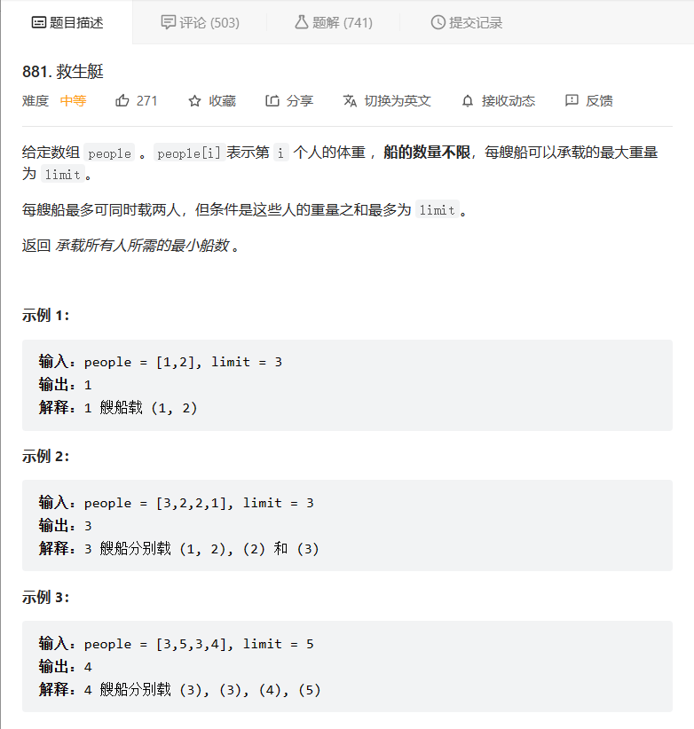
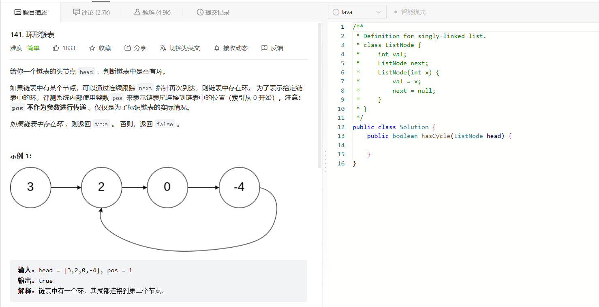

**双指针**，指的是在遍历对象的过程中，不是普通的使用单个指针进行访问，而是使用两个相同方向（快慢指针）或者相反方向（对撞指针）的指针进行扫描，从而达到相应的目的。

## 1 对撞指针

对撞指针是指在有序数组中，将指向最左侧的索引定义为左指针（left），最右侧的定义为右指针（right），然后从两头向中间进行数组遍历。

伪代码大致如下：

```
function fn (list) {
  var left = 0;
  var right = list.length - 1;

  //遍历数组
  while (left <= right) {
    left++;
    // 一些条件判断 和处理
    ... ...
    right--;
  }
}
```

### 例题

以leetcode 881救生艇问题为例：



由于本题只要求计算出`最小船数`，所以原数组是否被改变，和元素索引位置都不考虑在内，所以可以先对于给定数组进行排序，再从数组两侧向中间遍历。所以解题思路如下：

1. 对给定数组进行升序排序
2. 初始化左右指针
3. 每次都用一个”最重的“和一个”最轻的“进行配对，如果二人重量小于`Limit`，则此时的”最轻的“上船，即（`left++`）。不管”最轻的“是否上船，”最重的“都要上船，即（`right--`）并且所需船数量加一，即（`num++`）

代码如下：

```java
class Solution {
    public int numRescueBoats(int[] people, int limit) {
        // 对给定数组进行升序排序
        Arrays.sort(people);
        int num = 0;
        int left = 0;
        int right = people.length - 1;
        while (left <= right) {
            if ((people[left] + people[right]) <= limit) {
                // 如果2人重量小于limit，则最轻的上传
                left++;
            }
            // 不管最轻的是否上船，最重的都要上船
            right--;
            num++;
        }
        return num;
    }
}
```

## 2 快慢指针

**快慢指针**也是双指针，但是两个指针从同一侧开始遍历数组，将这两个指针分别定义为`快指针（fast）`和`慢指针（slow）`，两个指针以不同的策略移动，直到两个指针的值相等（或其他特殊条件）为止，如fast每次增长两个，slow每次增长一个。

### 例题

以leetcode 141.环形链表为例：



判断给定链表中是否存在环，可以定义快慢两个指针，快指针每次增长一个，而慢指针每次增长两个，最后两个指针指向节点的值相等，则说明有环。就好像一个环形跑道上有一快一慢两个运动员赛跑，如果时间足够长，跑得快的运动员一定会赶上慢的运动员。

伪代码如下：

```
var hasCycle = function(head) {
  if (head === null || head.next === null) {
    return false
  }

  let slow = head
  let fast = head.next

  while (slow !== fast) {
    if (fast === null || fast.next === null) {
      return false
    }
    slow = slow.next
    fast = fast.next.next
  }
  return true
};
```

真实代码：

```java
public class Solution {
    public boolean hasCycle(ListNode head) {
        if (head == null || head.next == null) {
            return false;
        }
        ListNode slow = head;
        ListNode fast = head.next;
        while (slow != fast) {
            if (fast == null || fast.next == null) {
                return false;
            }
            slow = slow.next;
            fast = fast.next.next;
        }
        return true;
    }
}
```

为什么我们要规定初始时慢指针在位置 head，快指针在位置 head.next，而不是两个指针都在位置 head？

- 观察下面的代码，我们使用的是 while 循环，循环条件先于循环体。由于循环条件一定是判断快慢指针是否重合，如果我们将两个指针初始都置于 head，那么 while 循环就不会执行。因此，我们可以假想一个在 head 之前的虚拟节点，慢指针从虚拟节点移动一步到达 head，快指针从虚拟节点移动两步到达 head.next，这样我们就可以使用 while 循环了。


- 当然，我们也可以使用 do-while 循环。此时，我们就可以把快慢指针的初始值都置为 head。
